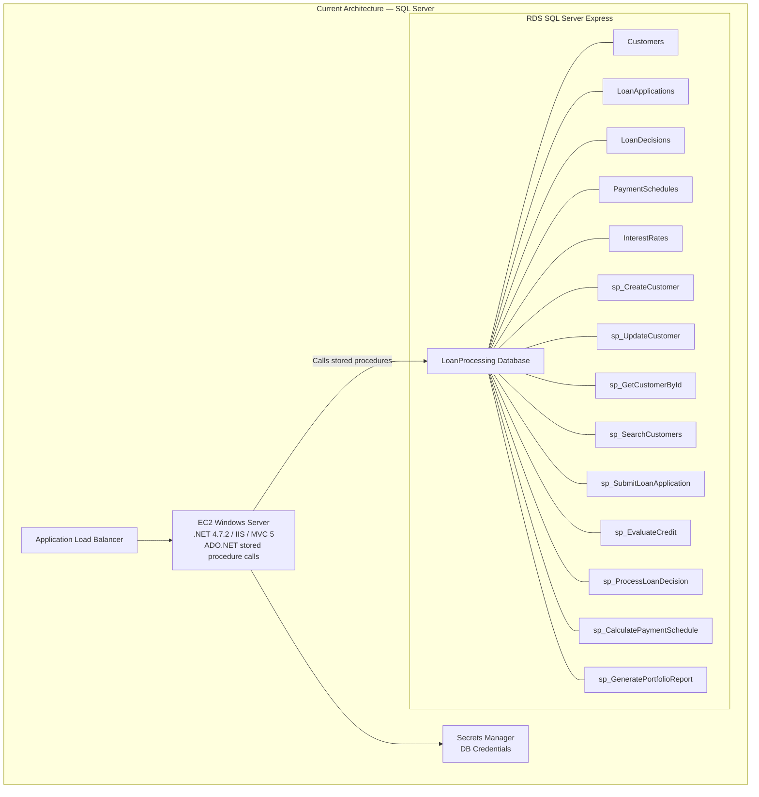
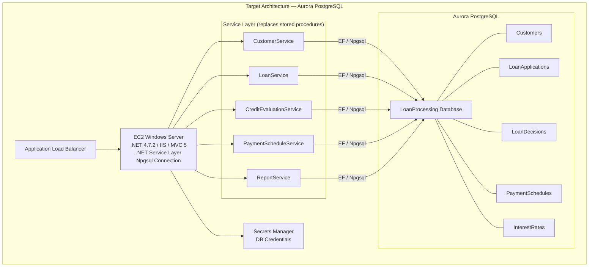

# Module 1: Database Modernization

## 1. Overview

### What You Will Accomplish

In this module, you will migrate the LoanProcessing database from RDS SQL Server Express to Amazon Aurora PostgreSQL-Compatible Edition. You will use the AWS Schema Conversion Tool (SCT) to convert the database schema, AWS Database Migration Service (DMS) to migrate the data, and then extract all nine stored procedures from the database into a .NET service layer so that business logic lives in application code rather than in the database engine.

### Estimated Time

90 minutes

### Key AWS Services Used

- Amazon Aurora PostgreSQL-Compatible Edition
- AWS Schema Conversion Tool (SCT)
- AWS Database Migration Service (DMS)
- AWS Secrets Manager

---

## 2. Prerequisites

### Required AWS Services and IAM Permissions

| AWS Service | Required IAM Actions |
|---|---|
| Amazon RDS / Aurora | `rds:CreateDBCluster`, `rds:CreateDBInstance`, `rds:CreateDBSubnetGroup`, `rds:DescribeDBClusters`, `rds:DescribeDBInstances`, `rds:DescribeDBSubnetGroups`, `rds:DeleteDBCluster`, `rds:DeleteDBInstance`, `rds:DeleteDBSubnetGroup`, `rds:ModifyDBCluster` |
| AWS DMS | `dms:CreateReplicationInstance`, `dms:CreateEndpoint`, `dms:CreateReplicationTask`, `dms:DescribeReplicationInstances`, `dms:DescribeEndpoints`, `dms:DescribeReplicationTasks`, `dms:StartReplicationTask`, `dms:DeleteReplicationInstance`, `dms:DeleteEndpoint`, `dms:DeleteReplicationTask` |
| AWS Secrets Manager | `secretsmanager:GetSecretValue`, `secretsmanager:CreateSecret`, `secretsmanager:UpdateSecret`, `secretsmanager:DescribeSecret` |
| Amazon EC2 / VPC | `ec2:DescribeSecurityGroups`, `ec2:AuthorizeSecurityGroupIngress`, `ec2:DescribeSubnets`, `ec2:DescribeVpcs` |

**Summary IAM policy actions:** `rds:*`, `dms:*`, `secretsmanager:*`, and read access to `ec2:Describe*` for VPC/subnet/security group lookups.

### Required Tools and Versions

| Tool | Version |
|---|---|
| AWS CLI | >= 2.15 |
| AWS Schema Conversion Tool (SCT) | >= 1.0.672 |
| psql (PostgreSQL client) | >= 16 |
| sqlcmd (SQL Server client) | Included with SQL Server tools |
| .NET SDK | >= 8.0 (for stored procedure extraction) |

### Expected Starting State

The LoanProcessing application is deployed and running on AWS with the following infrastructure:

- EC2 Windows Server instance running IIS with the LoanProcessing .NET Framework 4.7.2 MVC application
- RDS SQL Server Express instance hosting the `LoanProcessing` database with 5 tables (Customers, LoanApplications, LoanDecisions, PaymentSchedules, InterestRates) and 9 stored procedures
- Application Load Balancer routing traffic to the EC2 instance
- Secrets Manager storing database credentials
- The application is accessible and all pages (Customers, Loans, Reports, Interest Rates) render correctly

```bash
# Verification command — run this to confirm readiness
aws rds describe-db-instances \
    --region us-east-1 \
    --profile workshop \
    --output table \
    --query "DBInstances[?Engine=='sqlserver-ex'].[DBInstanceIdentifier,DBInstanceStatus,Endpoint.Address]"
```

Expected: A table showing your SQL Server Express instance with status `available` and its endpoint address.

---

## 3. Architecture Diagram

### Before



### After




---

## 4. Step-by-Step Instructions

### Step 1a: Provision Aurora PostgreSQL Cluster

In this step you create an Aurora PostgreSQL-Compatible Edition cluster in the same VPC as your existing RDS SQL Server instance. This ensures the two databases can communicate over private networking and that DMS (in a later step) can reach both endpoints.

#### 1a.1 — Identify Your Existing VPC, Subnets, and Security Group

First, retrieve the VPC ID, subnet IDs, and security group used by your existing RDS SQL Server instance:

```bash
aws rds describe-db-instances \
    --region us-east-1 \
    --profile workshop \
    --output json \
    --query "DBInstances[?Engine=='sqlserver-ex'].[DBInstanceIdentifier,DBSubnetGroup.VpcId,DBSubnetGroup.Subnets[*].SubnetIdentifier,VpcSecurityGroups[*].VpcSecurityGroupId]"
```

Expected output:

```json
[
    [
        "loanprocessing-sqlserver",
        "vpc-0abc1234def56789a",
        [
            "subnet-0aaa1111bbb22222",
            "subnet-0ccc3333ddd44444"
        ],
        [
            "sg-0eeee5555ffff6666"
        ]
    ]
]
```

Save these values — you will use them in every subsequent command:

```bash
export AWS_VPC_ID="vpc-0abc1234def56789a"
export AWS_SUBNET_1="subnet-0aaa1111bbb22222"
export AWS_SUBNET_2="subnet-0ccc3333ddd44444"
export AWS_SG_ID="sg-0eeee5555ffff6666"
```

> **Console alternative:** Open the Amazon RDS console → Databases → select your SQL Server instance → Connectivity & security tab. Note the VPC, subnets, and security group.

#### 1a.2 — Create a DB Subnet Group for Aurora

Aurora requires a DB subnet group spanning at least two Availability Zones:

```bash
aws rds create-db-subnet-group \
    --region us-east-1 \
    --profile workshop \
    --output json \
    --db-subnet-group-name loanprocessing-aurora-subnets \
    --db-subnet-group-description "Subnets for LoanProcessing Aurora PostgreSQL cluster" \
    --subnet-ids "$AWS_SUBNET_1" "$AWS_SUBNET_2"
```

Expected output:

```json
{
    "DBSubnetGroup": {
        "DBSubnetGroupName": "loanprocessing-aurora-subnets",
        "DBSubnetGroupDescription": "Subnets for LoanProcessing Aurora PostgreSQL cluster",
        "VpcId": "vpc-0abc1234def56789a",
        "SubnetGroupStatus": "Complete",
        "Subnets": [
            {
                "SubnetIdentifier": "subnet-0aaa1111bbb22222",
                "SubnetAvailabilityZone": { "Name": "us-east-1a" },
                "SubnetStatus": "Active"
            },
            {
                "SubnetIdentifier": "subnet-0ccc3333ddd44444",
                "SubnetAvailabilityZone": { "Name": "us-east-1b" },
                "SubnetStatus": "Active"
            }
        ]
    }
}
```

#### 1a.3 — Add an Inbound Security Group Rule for PostgreSQL

Allow inbound PostgreSQL traffic (port 5432) within the VPC so the EC2 application server and DMS can reach Aurora:

```bash
aws ec2 authorize-security-group-ingress \
    --region us-east-1 \
    --profile workshop \
    --output json \
    --group-id "$AWS_SG_ID" \
    --protocol tcp \
    --port 5432 \
    --source-group "$AWS_SG_ID"
```

Expected output:

```json
{
    "Return": true,
    "SecurityGroupRules": [
        {
            "SecurityGroupRuleId": "sgr-0abcdef1234567890",
            "GroupId": "sg-0eeee5555ffff6666",
            "IpProtocol": "tcp",
            "FromPort": 5432,
            "ToPort": 5432,
            "ReferencedGroupInfo": {
                "GroupId": "sg-0eeee5555ffff6666"
            }
        }
    ]
}
```

> **Console alternative:** Open the VPC console → Security Groups → select your security group → Inbound rules → Edit inbound rules → Add rule: Type = PostgreSQL, Source = the same security group ID.

#### 1a.4 — Create the Aurora PostgreSQL Cluster

Create the Aurora PostgreSQL-Compatible cluster. Use engine version 16.4 (current GA) and the `db.r6g.large` instance class for workshop purposes:

```bash
aws rds create-db-cluster \
    --region us-east-1 \
    --profile workshop \
    --output json \
    --db-cluster-identifier loanprocessing-aurora-pg \
    --engine aurora-postgresql \
    --engine-version 16.4 \
    --master-username postgres \
    --master-user-password "WorkshopPassword123!" \
    --db-subnet-group-name loanprocessing-aurora-subnets \
    --vpc-security-group-ids "$AWS_SG_ID" \
    --database-name loanprocessing \
    --storage-encrypted \
    --backup-retention-period 1
```

Expected output (key fields):

```json
{
    "DBCluster": {
        "DBClusterIdentifier": "loanprocessing-aurora-pg",
        "Status": "creating",
        "Engine": "aurora-postgresql",
        "EngineVersion": "16.4",
        "Endpoint": "loanprocessing-aurora-pg.cluster-xxxxxxxxxxxx.us-east-1.rds.amazonaws.com",
        "ReaderEndpoint": "loanprocessing-aurora-pg.cluster-ro-xxxxxxxxxxxx.us-east-1.rds.amazonaws.com",
        "DatabaseName": "loanprocessing",
        "StorageEncrypted": true
    }
}
```

#### 1a.5 — Create an Aurora PostgreSQL Instance

Add a writer instance to the cluster:

```bash
aws rds create-db-instance \
    --region us-east-1 \
    --profile workshop \
    --output json \
    --db-instance-identifier loanprocessing-aurora-pg-instance-1 \
    --db-cluster-identifier loanprocessing-aurora-pg \
    --engine aurora-postgresql \
    --db-instance-class db.r6g.large \
    --publicly-accessible false
```

Expected output (key fields):

```json
{
    "DBInstance": {
        "DBInstanceIdentifier": "loanprocessing-aurora-pg-instance-1",
        "DBInstanceClass": "db.r6g.large",
        "Engine": "aurora-postgresql",
        "DBInstanceStatus": "creating",
        "DBClusterIdentifier": "loanprocessing-aurora-pg"
    }
}
```

#### 1a.6 — Wait for the Cluster and Instance to Become Available

This typically takes 5–10 minutes:

```bash
aws rds wait db-instance-available \
    --region us-east-1 \
    --profile workshop \
    --db-instance-identifier loanprocessing-aurora-pg-instance-1
```

No output is returned on success. Verify the cluster is available:

```bash
aws rds describe-db-clusters \
    --region us-east-1 \
    --profile workshop \
    --output table \
    --db-cluster-identifier loanprocessing-aurora-pg \
    --query "DBClusters[0].[DBClusterIdentifier,Status,Endpoint,EngineVersion]"
```

Expected output:

```
---------------------------------------------------------------------------------------------------------
|                                          DescribeDBClusters                                           |
+---------------------------+-----------+--------------------------------------------------------------+------+
|  loanprocessing-aurora-pg |  available|  loanprocessing-aurora-pg.cluster-xxxxxxxxxxxx.us-east-1...   | 16.4 |
+---------------------------+-----------+--------------------------------------------------------------+------+
```

> **✅ Validation Step:** Confirm the Aurora cluster status is `available` and note the cluster endpoint — you will need it for SCT and the application connection string.

Save the Aurora endpoint for later use:

```bash
export AURORA_ENDPOINT=$(aws rds describe-db-clusters \
    --region us-east-1 \
    --profile workshop \
    --output text \
    --db-cluster-identifier loanprocessing-aurora-pg \
    --query "DBClusters[0].Endpoint")

echo "Aurora endpoint: $AURORA_ENDPOINT"
```

---

### Step 1b: Schema Conversion with AWS Schema Conversion Tool (SCT)

In this step you install SCT, connect it to both the source SQL Server and target Aurora PostgreSQL databases, run a migration assessment report, convert the schema, and apply the converted DDL to Aurora.

#### 1b.1 — Install AWS Schema Conversion Tool

Download and install SCT version >= 1.0.672 from the AWS documentation site.

**Windows:**
1. Download the SCT installer from the [AWS SCT download page](https://docs.aws.amazon.com/SchemaConversionTool/latest/userguide/CHAP_Installing.html)
2. Run the `.msi` installer and follow the prompts
3. Install the required JDBC drivers:
   - **SQL Server:** Download `mssql-jdbc-12.4.2.jre11.jar` from Microsoft
   - **PostgreSQL:** Download `postgresql-42.7.3.jar` from the PostgreSQL JDBC site
4. Place both `.jar` files in the SCT `drivers` directory (e.g., `C:\Program Files\AWS Schema Conversion Tool\drivers\`)

**macOS / Linux:**
1. Download the `.zip` distribution from the AWS SCT download page
2. Extract to a directory of your choice
3. Download the same JDBC drivers listed above and place them in the `drivers/` subdirectory

> **Console alternative:** If you prefer not to install SCT locally, you can use the SCT data migration feature within the AWS DMS console. Navigate to AWS DMS → Schema conversion → Create migration project.

#### 1b.2 — Create an SCT Project and Connect to Source SQL Server

1. Launch AWS SCT
2. Choose **File → New Project**
3. Set the project name to `LoanProcessing-Migration`
4. Under **Source database engine**, select **Microsoft SQL Server**
5. Enter the source connection details:

| Field | Value |
|---|---|
| Server name | *(your RDS SQL Server endpoint)* |
| Port | `1433` |
| Database | `LoanProcessing` |
| User name | `sqladmin` |
| Password | *(from Secrets Manager)* |

Retrieve the SQL Server endpoint and credentials if needed:

```bash
aws rds describe-db-instances \
    --region us-east-1 \
    --profile workshop \
    --output text \
    --query "DBInstances[?Engine=='sqlserver-ex'].[Endpoint.Address,Endpoint.Port]"
```

Expected output:

```
loanprocessing-sqlserver.xxxxxxxxxxxx.us-east-1.rds.amazonaws.com    1433
```

```bash
aws secretsmanager get-secret-value \
    --region us-east-1 \
    --profile workshop \
    --output json \
    --secret-id loanprocessing-db-credentials \
    --query "SecretString"
```

Expected output:

```json
"{\"username\":\"sqladmin\",\"password\":\"YourSecretPassword\"}"
```

6. Click **Test Connection** to verify connectivity
7. Click **Connect** to load the source schema

#### 1b.3 — Connect to Target Aurora PostgreSQL

1. In the SCT project, choose **Add target** or configure the target panel
2. Under **Target database engine**, select **Amazon Aurora (PostgreSQL compatible)**
3. Enter the target connection details:

| Field | Value |
|---|---|
| Server name | *(your Aurora cluster endpoint from Step 1a.6)* |
| Port | `5432` |
| Database | `loanprocessing` |
| User name | `postgres` |
| Password | `WorkshopPassword123!` |
| SSL mode | `require` |

4. Click **Test Connection** to verify connectivity
5. Click **Connect**

> **🔧 Troubleshooting:** If the connection test fails, verify that:
> - The security group allows inbound traffic on port 5432 (Step 1a.3)
> - The Aurora cluster status is `available` (Step 1a.6)
> - You are using the cluster writer endpoint, not the reader endpoint

#### 1b.4 — Run the SCT Migration Assessment Report

The assessment report identifies potential conversion issues before you convert the schema.

1. In SCT, right-click the `LoanProcessing` database in the source tree
2. Choose **Create Report**
3. SCT analyzes all database objects and generates a report

The report categorizes objects by conversion complexity:

| Category | Description |
|---|---|
| **Green — Automatic** | Objects that convert automatically with no issues |
| **Yellow — Simple actions** | Objects requiring minor manual adjustments |
| **Orange — Medium actions** | Objects requiring moderate manual intervention |
| **Red — Complex actions** | Objects requiring significant rewriting |

For the LoanProcessing database, you should expect:

| Object Type | Count | Expected Assessment |
|---|---|---|
| Tables | 5 | Green — all tables convert automatically |
| Constraints (CHECK, FK, UNIQUE) | ~15 | Green — standard constraints convert directly |
| Indexes | ~8 | Green — B-tree indexes convert directly |
| Sequences | 1 | Green — SQL Server `SEQUENCE` maps to PostgreSQL `SEQUENCE` |
| Stored Procedures | 9 | Orange/Red — T-SQL stored procedures require rewriting for PL/pgSQL |

> **⚠️ Manual Review Required:** The assessment report will flag the 9 stored procedures as requiring significant conversion effort. This is expected — in Step 1e (a later task), you will extract these stored procedures into .NET application-layer code rather than converting them to PL/pgSQL. You can safely ignore the stored procedure conversion warnings for now.

4. Review the report summary and click **Save** to export it as a PDF or CSV for your records

> **🤖 Kiro Prompt:** "Summarize the key findings from an SCT migration assessment report for a SQL Server database with 5 tables, 15 constraints, 8 indexes, 1 sequence, and 9 stored procedures being migrated to Aurora PostgreSQL. What items typically convert automatically and what requires manual intervention?"

#### 1b.5 — Convert the Schema (Tables, Constraints, Indexes, Sequences)

Now convert the schema objects. Since you will extract stored procedures into application code, you only need to convert the table definitions, constraints, indexes, and the sequence.

1. In the source tree, expand the `LoanProcessing` database → `Schemas` → `dbo`
2. Select the `Tables` node (this selects all five tables and their associated constraints and indexes)
3. Right-click and choose **Convert schema**

SCT converts the following objects to PostgreSQL-compatible DDL:

**Customers table:**

| SQL Server | PostgreSQL Equivalent |
|---|---|
| `INT PRIMARY KEY IDENTITY(1,1)` | `INTEGER PRIMARY KEY GENERATED BY DEFAULT AS IDENTITY` |
| `NVARCHAR(50)` | `VARCHAR(50)` |
| `NVARCHAR(11)` | `VARCHAR(11)` |
| `DECIMAL(18,2)` | `NUMERIC(18,2)` |
| `DATETIME` with `DEFAULT GETDATE()` | `TIMESTAMP` with `DEFAULT CURRENT_TIMESTAMP` |
| `CONSTRAINT [UQ_Customers_SSN] UNIQUE` | `CONSTRAINT uq_customers_ssn UNIQUE` |
| `CONSTRAINT [CK_Customers_CreditScore] CHECK` | `CONSTRAINT ck_customers_creditscore CHECK` |
| `CONSTRAINT [CK_Customers_Income] CHECK` | `CONSTRAINT ck_customers_income CHECK` |

**LoanApplications table:**

| SQL Server | PostgreSQL Equivalent |
|---|---|
| `INT PRIMARY KEY IDENTITY(1,1)` | `INTEGER PRIMARY KEY GENERATED BY DEFAULT AS IDENTITY` |
| `NVARCHAR(20)` | `VARCHAR(20)` |
| `FOREIGN KEY ... REFERENCES Customers` | `FOREIGN KEY ... REFERENCES customers` |
| `CHECK ([LoanType] IN (...))` | `CHECK (loan_type IN (...))` |
| `CHECK ([Status] IN (...))` | `CHECK (status IN (...))` |

**LoanDecisions table:**

| SQL Server | PostgreSQL Equivalent |
|---|---|
| `INT PRIMARY KEY IDENTITY(1,1)` | `INTEGER PRIMARY KEY GENERATED BY DEFAULT AS IDENTITY` |
| `FOREIGN KEY ... REFERENCES LoanApplications` | `FOREIGN KEY ... REFERENCES loan_applications` |
| `CHECK ([Decision] IN ('Approved','Rejected'))` | `CHECK (decision IN ('Approved','Rejected'))` |
| `CHECK ([RiskScore] BETWEEN 0 AND 100)` | `CHECK (risk_score BETWEEN 0 AND 100)` |

**PaymentSchedules table:**

| SQL Server | PostgreSQL Equivalent |
|---|---|
| `INT PRIMARY KEY IDENTITY(1,1)` | `INTEGER PRIMARY KEY GENERATED BY DEFAULT AS IDENTITY` |
| `FOREIGN KEY ... REFERENCES LoanApplications` | `FOREIGN KEY ... REFERENCES loan_applications` |
| `UNIQUE ([ApplicationId], [PaymentNumber])` | `UNIQUE (application_id, payment_number)` |

**InterestRates table:**

| SQL Server | PostgreSQL Equivalent |
|---|---|
| `INT PRIMARY KEY IDENTITY(1,1)` | `INTEGER PRIMARY KEY GENERATED BY DEFAULT AS IDENTITY` |
| `CHECK ([MinCreditScore] <= [MaxCreditScore])` | `CHECK (min_credit_score <= max_credit_score)` |
| `CHECK ([MinTermMonths] <= [MaxTermMonths])` | `CHECK (min_term_months <= max_term_months)` |
| `CHECK ([Rate] > 0)` | `CHECK (rate > 0)` |

**Sequence:**

| SQL Server | PostgreSQL Equivalent |
|---|---|
| `CREATE SEQUENCE ApplicationNumberSeq AS INT START WITH 1 INCREMENT BY 1 MINVALUE 1 MAXVALUE 99999 CYCLE CACHE 10` | `CREATE SEQUENCE application_number_seq AS INTEGER START WITH 1 INCREMENT BY 1 MINVALUE 1 MAXVALUE 99999 CYCLE CACHE 10` |

4. Review the converted DDL in the target panel on the right side of SCT

> **⚠️ Manual Review Required — Naming Convention:** SCT typically converts SQL Server bracket-quoted identifiers (e.g., `[CustomerId]`) to PostgreSQL lowercase snake_case (e.g., `customer_id`). Review the converted column names to ensure they match what your application code expects. If your application will use an ORM with column mapping (e.g., EF Core with `[Column("customer_id")]` attributes), the snake_case names are fine. If you need to preserve the original casing, edit the DDL before applying.

> **⚠️ Manual Review Required — IDENTITY to GENERATED AS IDENTITY:** SCT converts SQL Server `IDENTITY(1,1)` columns to PostgreSQL `GENERATED BY DEFAULT AS IDENTITY`. This is the correct PostgreSQL equivalent. Verify that the identity seed and increment values match (both should be 1).

> **⚠️ Manual Review Required — DATETIME to TIMESTAMP:** SCT converts `DATETIME` to `TIMESTAMP WITHOUT TIME ZONE` and `GETDATE()` to `CURRENT_TIMESTAMP`. If your application requires timezone-aware timestamps, manually change the type to `TIMESTAMP WITH TIME ZONE` (i.e., `TIMESTAMPTZ`) in the converted DDL.

#### 1b.6 — Apply the Converted DDL to Aurora PostgreSQL

1. In the SCT target panel, select the converted `loanprocessing` schema
2. Right-click and choose **Apply to database**
3. SCT executes the DDL statements against the Aurora PostgreSQL cluster
4. Review the output log for any errors

Expected result: All tables, constraints, indexes, and the sequence are created successfully with zero errors.

> **✅ Validation Step:** Connect to Aurora PostgreSQL with `psql` and verify the schema was applied:

```bash
psql "host=$AURORA_ENDPOINT port=5432 dbname=loanprocessing user=postgres password=WorkshopPassword123! sslmode=require"
```

Once connected, list the tables:

```sql
\dt dbo.*
```

Expected output:

```
            List of relations
 Schema |       Name        | Type  |  Owner
--------+-------------------+-------+----------
 dbo    | customers         | table | postgres
 dbo    | interest_rates    | table | postgres
 dbo    | loan_applications | table | postgres
 dbo    | loan_decisions    | table | postgres
 dbo    | payment_schedules | table | postgres
(5 rows)
```

Verify constraints on the `customers` table:

```sql
SELECT conname, contype, pg_get_constraintdef(oid)
FROM pg_constraint
WHERE conrelid = 'dbo.customers'::regclass;
```

Expected output (constraint names may vary based on SCT conversion):

```
         conname          | contype |                  pg_get_constraintdef
--------------------------+---------+----------------------------------------------------------
 customers_pkey           | p       | PRIMARY KEY (customer_id)
 uq_customers_ssn        | u       | UNIQUE (ssn)
 ck_customers_creditscore | c       | CHECK ((credit_score >= 300) AND (credit_score <= 850))
 ck_customers_income      | c       | CHECK (annual_income >= (0)::numeric)
(4 rows)
```

Verify the sequence exists:

```sql
SELECT sequence_name, start_value, increment_by, max_value, cycle_option
FROM information_schema.sequences
WHERE sequence_schema = 'dbo';
```

Expected output:

```
      sequence_name      | start_value | increment_by | max_value | cycle_option
-------------------------+-------------+--------------+-----------+--------------
 application_number_seq  |           1 |            1 |     99999 | YES
(1 row)
```

Exit `psql`:

```sql
\q
```

> **✅ Validation Step:** All five tables, their constraints (PRIMARY KEY, FOREIGN KEY, UNIQUE, CHECK), indexes, and the `application_number_seq` sequence exist in the Aurora PostgreSQL `dbo` schema. The schema conversion is complete.

> **🤖 Kiro Prompt:** "Compare the SQL Server CREATE TABLE statements in `database/CreateDatabase.sql` with the PostgreSQL schema now in Aurora. List any data type or constraint differences I should be aware of when updating the application's data access layer."


---

### Step 1c: Data Migration with AWS DMS

In this step you use AWS Database Migration Service (DMS) to migrate the data from your source RDS SQL Server Express database to the target Aurora PostgreSQL cluster. You will create a replication instance, define source and target endpoints, create a full-load migration task, and verify the data landed correctly.

#### 1c.1 — Create a DMS Replication Subnet Group

DMS needs a replication subnet group in the same VPC as your source and target databases:

```bash
aws dms create-replication-subnet-group \
    --region us-east-1 \
    --profile workshop \
    --output json \
    --replication-subnet-group-identifier loanprocessing-dms-subnet-group \
    --replication-subnet-group-description "Subnet group for LoanProcessing DMS replication instance" \
    --subnet-ids "$AWS_SUBNET_1" "$AWS_SUBNET_2"
```

Expected output:

```json
{
    "ReplicationSubnetGroup": {
        "ReplicationSubnetGroupIdentifier": "loanprocessing-dms-subnet-group",
        "ReplicationSubnetGroupDescription": "Subnet group for LoanProcessing DMS replication instance",
        "VpcId": "vpc-0abc1234def56789a",
        "SubnetGroupStatus": "Complete",
        "Subnets": [
            {
                "SubnetIdentifier": "subnet-0aaa1111bbb22222",
                "SubnetAvailabilityZone": { "Name": "us-east-1a" },
                "SubnetStatus": "Active"
            },
            {
                "SubnetIdentifier": "subnet-0ccc3333ddd44444",
                "SubnetAvailabilityZone": { "Name": "us-east-1b" },
                "SubnetStatus": "Active"
            }
        ]
    }
}
```

#### 1c.2 — Create a DMS Replication Instance

The replication instance runs the migration engine. Use a `dms.t3.medium` for this workshop:

```bash
aws dms create-replication-instance \
    --region us-east-1 \
    --profile workshop \
    --output json \
    --replication-instance-identifier loanprocessing-dms-instance \
    --replication-instance-class dms.t3.medium \
    --allocated-storage 50 \
    --vpc-security-group-ids "$AWS_SG_ID" \
    --replication-subnet-group-identifier loanprocessing-dms-subnet-group \
    --no-publicly-accessible \
    --engine-version 3.5.3
```

Expected output (key fields):

```json
{
    "ReplicationInstance": {
        "ReplicationInstanceIdentifier": "loanprocessing-dms-instance",
        "ReplicationInstanceClass": "dms.t3.medium",
        "ReplicationInstanceStatus": "creating",
        "AllocatedStorage": 50,
        "VpcSecurityGroups": [
            {
                "VpcSecurityGroupId": "sg-0eeee5555ffff6666",
                "Status": "active"
            }
        ],
        "EngineVersion": "3.5.3"
    }
}
```

#### 1c.3 — Wait for the Replication Instance to Become Available

This typically takes 3–5 minutes:

```bash
aws dms wait replication-instance-available \
    --region us-east-1 \
    --profile workshop \
    --filters Name=replication-instance-id,Values=loanprocessing-dms-instance
```

No output is returned on success. Verify the instance is available:

```bash
aws dms describe-replication-instances \
    --region us-east-1 \
    --profile workshop \
    --output table \
    --filters Name=replication-instance-id,Values=loanprocessing-dms-instance \
    --query "ReplicationInstances[0].[ReplicationInstanceIdentifier,ReplicationInstanceStatus,ReplicationInstanceClass,EngineVersion]"
```

Expected output:

```
------------------------------------------------------------------------------------
|                           DescribeReplicationInstances                            |
+-------------------------------+-----------+----------------+---------------------+
|  loanprocessing-dms-instance  | available |  dms.t3.medium |  3.5.3              |
+-------------------------------+-----------+----------------+---------------------+
```

> **✅ Validation Step:** Confirm the replication instance status is `available` before proceeding to endpoint creation.

> **🔧 Troubleshooting:** If the replication instance stays in `creating` for more than 10 minutes, check:
> - The subnet group has subnets in at least two Availability Zones
> - The security group allows outbound traffic to both the SQL Server (port 1433) and Aurora PostgreSQL (port 5432) endpoints
> - Your account has not reached the DMS replication instance limit (default: 20 per region). Request a quota increase via Service Quotas if needed.

#### 1c.4 — Retrieve Source Database Connection Details

You will need the SQL Server endpoint and credentials for the source endpoint. If you haven't already saved them:

```bash
export SQLSERVER_ENDPOINT=$(aws rds describe-db-instances \
    --region us-east-1 \
    --profile workshop \
    --output text \
    --query "DBInstances[?Engine=='sqlserver-ex'].Endpoint.Address")

echo "SQL Server endpoint: $SQLSERVER_ENDPOINT"
```

```bash
export DB_CREDENTIALS=$(aws secretsmanager get-secret-value \
    --region us-east-1 \
    --profile workshop \
    --output text \
    --secret-id loanprocessing-db-credentials \
    --query "SecretString")

echo "Credentials: $DB_CREDENTIALS"
```

#### 1c.5 — Create the Source Endpoint (SQL Server)

Create a DMS endpoint pointing to your RDS SQL Server Express instance:

```bash
aws dms create-endpoint \
    --region us-east-1 \
    --profile workshop \
    --output json \
    --endpoint-identifier loanprocessing-source-sqlserver \
    --endpoint-type source \
    --engine-name sqlserver \
    --server-name "$SQLSERVER_ENDPOINT" \
    --port 1433 \
    --database-name LoanProcessing \
    --username sqladmin \
    --password "YourSecretPassword" \
    --ssl-mode none
```

> **⚠️ Manual Review Required:** Replace `"YourSecretPassword"` with the actual password retrieved from Secrets Manager in Step 1c.4. Do not commit credentials to version control.

Expected output (key fields):

```json
{
    "Endpoint": {
        "EndpointIdentifier": "loanprocessing-source-sqlserver",
        "EndpointType": "SOURCE",
        "EngineName": "sqlserver",
        "ServerName": "loanprocessing-sqlserver.xxxxxxxxxxxx.us-east-1.rds.amazonaws.com",
        "Port": 1433,
        "DatabaseName": "LoanProcessing",
        "Status": "active",
        "SslMode": "none"
    }
}
```

#### 1c.6 — Create the Target Endpoint (Aurora PostgreSQL)

Create a DMS endpoint pointing to your Aurora PostgreSQL cluster:

```bash
aws dms create-endpoint \
    --region us-east-1 \
    --profile workshop \
    --output json \
    --endpoint-identifier loanprocessing-target-aurora-pg \
    --endpoint-type target \
    --engine-name aurora-postgresql \
    --server-name "$AURORA_ENDPOINT" \
    --port 5432 \
    --database-name loanprocessing \
    --username postgres \
    --password "WorkshopPassword123!" \
    --ssl-mode require
```

Expected output (key fields):

```json
{
    "Endpoint": {
        "EndpointIdentifier": "loanprocessing-target-aurora-pg",
        "EndpointType": "TARGET",
        "EngineName": "aurora-postgresql",
        "ServerName": "loanprocessing-aurora-pg.cluster-xxxxxxxxxxxx.us-east-1.rds.amazonaws.com",
        "Port": 5432,
        "DatabaseName": "loanprocessing",
        "Status": "active",
        "SslMode": "require"
    }
}
```

#### 1c.7 — Test the Endpoint Connections

Before creating the migration task, verify that the replication instance can reach both endpoints. Retrieve the replication instance ARN first:

```bash
export DMS_INSTANCE_ARN=$(aws dms describe-replication-instances \
    --region us-east-1 \
    --profile workshop \
    --output text \
    --filters Name=replication-instance-id,Values=loanprocessing-dms-instance \
    --query "ReplicationInstances[0].ReplicationInstanceArn")

echo "DMS Instance ARN: $DMS_INSTANCE_ARN"
```

Test the source endpoint:

```bash
aws dms test-connection \
    --region us-east-1 \
    --profile workshop \
    --output json \
    --replication-instance-arn "$DMS_INSTANCE_ARN" \
    --endpoint-arn $(aws dms describe-endpoints \
        --region us-east-1 \
        --profile workshop \
        --output text \
        --filters Name=endpoint-id,Values=loanprocessing-source-sqlserver \
        --query "Endpoints[0].EndpointArn")
```

Expected output:

```json
{
    "Connection": {
        "ReplicationInstanceArn": "arn:aws:dms:us-east-1:123456789012:rep:XXXXXXXXXXXXXXXXXXXX",
        "EndpointArn": "arn:aws:dms:us-east-1:123456789012:endpoint:XXXXXXXXXXXXXXXXXXXX",
        "Status": "testing"
    }
}
```

Wait a moment, then check the connection status:

```bash
aws dms describe-connections \
    --region us-east-1 \
    --profile workshop \
    --output table \
    --filters Name=endpoint-id,Values=loanprocessing-source-sqlserver \
    --query "Connections[0].[EndpointIdentifier,Status,LastFailureMessage]"
```

Expected output:

```
--------------------------------------------------------------
|                    DescribeConnections                      |
+------------------------------------+------------+----------+
|  loanprocessing-source-sqlserver   |  successful|          |
+------------------------------------+------------+----------+
```

Test the target endpoint:

```bash
aws dms test-connection \
    --region us-east-1 \
    --profile workshop \
    --output json \
    --replication-instance-arn "$DMS_INSTANCE_ARN" \
    --endpoint-arn $(aws dms describe-endpoints \
        --region us-east-1 \
        --profile workshop \
        --output text \
        --filters Name=endpoint-id,Values=loanprocessing-target-aurora-pg \
        --query "Endpoints[0].EndpointArn")
```

```bash
aws dms describe-connections \
    --region us-east-1 \
    --profile workshop \
    --output table \
    --filters Name=endpoint-id,Values=loanprocessing-target-aurora-pg \
    --query "Connections[0].[EndpointIdentifier,Status,LastFailureMessage]"
```

Expected output:

```
--------------------------------------------------------------
|                    DescribeConnections                      |
+------------------------------------+------------+----------+
|  loanprocessing-target-aurora-pg   |  successful|          |
+------------------------------------+------------+----------+
```

> **✅ Validation Step:** Both endpoint connection tests must show status `successful` before proceeding. If either shows `failed`, check the `LastFailureMessage` column for details.

> **🔧 Troubleshooting:** If a connection test fails:
> - **"Could not connect to the server"** — Verify the security group allows inbound traffic from the replication instance on the correct port (1433 for SQL Server, 5432 for Aurora PostgreSQL). The replication instance uses the same security group, so self-referencing rules should cover this.
> - **"Login failed for user"** — Double-check the username and password in the endpoint definition. Re-create the endpoint with corrected credentials if needed.
> - **"SSL connection is required"** — For the Aurora PostgreSQL target, ensure `--ssl-mode require` was specified. For the SQL Server source, `--ssl-mode none` is acceptable for workshop purposes.

#### 1c.8 — Create the Full-Load Migration Task

Create a DMS replication task that performs a full-load migration of all five tables. The table-mapping rules select all tables in the `dbo` schema and map them to the `dbo` schema in the target:

```bash
aws dms create-replication-task \
    --region us-east-1 \
    --profile workshop \
    --output json \
    --replication-task-identifier loanprocessing-full-load \
    --replication-instance-arn "$DMS_INSTANCE_ARN" \
    --source-endpoint-arn $(aws dms describe-endpoints \
        --region us-east-1 \
        --profile workshop \
        --output text \
        --filters Name=endpoint-id,Values=loanprocessing-source-sqlserver \
        --query "Endpoints[0].EndpointArn") \
    --target-endpoint-arn $(aws dms describe-endpoints \
        --region us-east-1 \
        --profile workshop \
        --output text \
        --filters Name=endpoint-id,Values=loanprocessing-target-aurora-pg \
        --query "Endpoints[0].EndpointArn") \
    --migration-type full-load \
    --table-mappings '{
        "rules": [
            {
                "rule-type": "selection",
                "rule-id": "1",
                "rule-name": "select-all-dbo-tables",
                "object-locator": {
                    "schema-name": "dbo",
                    "table-name": "%"
                },
                "rule-action": "include"
            },
            {
                "rule-type": "transformation",
                "rule-id": "2",
                "rule-name": "map-to-dbo-schema",
                "rule-action": "rename",
                "rule-target": "schema",
                "object-locator": {
                    "schema-name": "dbo"
                },
                "value": "dbo"
            }
        ]
    }' \
    --replication-task-settings '{
        "TargetMetadata": {
            "TargetSchema": "dbo",
            "SupportLobs": true,
            "FullLobMode": false,
            "LobChunkSize": 64,
            "LimitedSizeLobMode": true,
            "LobMaxSize": 32768
        },
        "FullLoadSettings": {
            "TargetTablePrepMode": "TRUNCATE_BEFORE_LOAD",
            "CreatePkAfterFullLoad": false,
            "StopTaskCachedChangesApplied": false,
            "StopTaskCachedChangesNotApplied": false,
            "MaxFullLoadSubTasks": 8,
            "TransactionConsistencyTimeout": 600,
            "CommitRate": 10000
        },
        "Logging": {
            "EnableLogging": true
        }
    }'
```

Expected output (key fields):

```json
{
    "ReplicationTask": {
        "ReplicationTaskIdentifier": "loanprocessing-full-load",
        "MigrationType": "full-load",
        "Status": "creating",
        "ReplicationTaskSettings": "...",
        "TableMappings": "..."
    }
}
```

> **🔧 Troubleshooting:** If the task creation fails with `InvalidResourceStateFault`:
> - Ensure the replication instance status is `available`
> - Ensure both endpoint connection tests passed (`successful`)
> - Verify the endpoint ARNs are correct by running `aws dms describe-endpoints --region us-east-1 --profile workshop --output table --query "Endpoints[].[EndpointIdentifier,EndpointArn]"`

#### 1c.9 — Wait for the Migration Task to Be Ready

The task must reach `ready` status before it can be started:

```bash
aws dms wait replication-task-ready \
    --region us-east-1 \
    --profile workshop \
    --filters Name=replication-task-id,Values=loanprocessing-full-load
```

No output is returned on success. Verify:

```bash
aws dms describe-replication-tasks \
    --region us-east-1 \
    --profile workshop \
    --output table \
    --filters Name=replication-task-id,Values=loanprocessing-full-load \
    --query "ReplicationTasks[0].[ReplicationTaskIdentifier,Status,MigrationType]"
```

Expected output:

```
-----------------------------------------------------------
|                 DescribeReplicationTasks                 |
+----------------------------+---------+------------------+
|  loanprocessing-full-load  |  ready  |  full-load       |
+----------------------------+---------+------------------+
```

#### 1c.10 — Start the Migration Task

Start the full-load migration:

```bash
aws dms start-replication-task \
    --region us-east-1 \
    --profile workshop \
    --output json \
    --replication-task-arn $(aws dms describe-replication-tasks \
        --region us-east-1 \
        --profile workshop \
        --output text \
        --filters Name=replication-task-id,Values=loanprocessing-full-load \
        --query "ReplicationTasks[0].ReplicationTaskArn") \
    --start-replication-task-type start-replication
```

Expected output (key fields):

```json
{
    "ReplicationTask": {
        "ReplicationTaskIdentifier": "loanprocessing-full-load",
        "Status": "starting",
        "MigrationType": "full-load"
    }
}
```

#### 1c.11 — Monitor the Migration Task Progress

Monitor the task until it completes. For the LoanProcessing database (small dataset), this typically takes 1–3 minutes:

```bash
aws dms describe-replication-tasks \
    --region us-east-1 \
    --profile workshop \
    --output table \
    --filters Name=replication-task-id,Values=loanprocessing-full-load \
    --query "ReplicationTasks[0].[ReplicationTaskIdentifier,Status,ReplicationTaskStats.FullLoadProgressPercent,ReplicationTaskStats.TablesLoaded,ReplicationTaskStats.TablesErrored]"
```

Run this command periodically. Expected output while running:

```
----------------------------------------------------------------------------------
|                          DescribeReplicationTasks                               |
+----------------------------+---------+----------+---------------+--------------+
|  loanprocessing-full-load  | running |       60 |             3 |            0 |
+----------------------------+---------+----------+---------------+--------------+
```

Expected output when complete:

```
----------------------------------------------------------------------------------
|                          DescribeReplicationTasks                               |
+----------------------------+---------+----------+---------------+--------------+
|  loanprocessing-full-load  | stopped |      100 |             5 |            0 |
+----------------------------+---------+----------+---------------+--------------+
```

> **✅ Validation Step:** The task status should be `stopped` (DMS uses `stopped` to indicate a completed full-load task), `FullLoadProgressPercent` should be `100`, `TablesLoaded` should be `5`, and `TablesErrored` should be `0`.

> **🔧 Troubleshooting:** If `TablesErrored` is greater than 0:
> - Check the table statistics for details:
>   ```bash
>   aws dms describe-table-statistics \
>       --region us-east-1 \
>       --profile workshop \
>       --output table \
>       --replication-task-arn $(aws dms describe-replication-tasks \
>           --region us-east-1 \
>           --profile workshop \
>           --output text \
>           --filters Name=replication-task-id,Values=loanprocessing-full-load \
>           --query "ReplicationTasks[0].ReplicationTaskArn") \
>       --query "TableStatistics[].[SchemaName,TableName,FullLoadRows,FullLoadErrorRows,TableState]"
>   ```
> - Common causes: data type mismatches between source and target schemas, constraint violations on the target, or LOB column handling issues.
> - If a table failed, fix the underlying issue and reload just that table by modifying the table-mapping rules to select only the failed table, then restart the task.

#### 1c.12 — Review Table-Level Migration Statistics

Get a detailed breakdown of rows migrated per table:

```bash
aws dms describe-table-statistics \
    --region us-east-1 \
    --profile workshop \
    --output table \
    --replication-task-arn $(aws dms describe-replication-tasks \
        --region us-east-1 \
        --profile workshop \
        --output text \
        --filters Name=replication-task-id,Values=loanprocessing-full-load \
        --query "ReplicationTasks[0].ReplicationTaskArn") \
    --query "TableStatistics[].[SchemaName,TableName,FullLoadRows,FullLoadErrorRows,TableState]"
```

Expected output:

```
------------------------------------------------------------------------
|                       DescribeTableStatistics                        |
+--------+--------------------+------+------+--------------------------+
|  dbo   | customers          |   10 |    0 | Table completed          |
|  dbo   | interest_rates     |   12 |    0 | Table completed          |
|  dbo   | loan_applications  |    8 |    0 | Table completed          |
|  dbo   | loan_decisions     |    5 |    0 | Table completed          |
|  dbo   | payment_schedules  |   30 |    0 | Table completed          |
+--------+--------------------+------+------+--------------------------+
```

> **✅ Validation Step:** All five tables should show `Table completed` with zero error rows. The exact row counts depend on your sample data — the important thing is that `FullLoadErrorRows` is `0` for every table.

#### 1c.13 — Verify Data in Aurora PostgreSQL

Connect to Aurora PostgreSQL and run row-count queries to confirm the data arrived:

```bash
psql "host=$AURORA_ENDPOINT port=5432 dbname=loanprocessing user=postgres password=WorkshopPassword123! sslmode=require"
```

Once connected, run the following row-count comparison queries:

```sql
SELECT 'customers' AS table_name, COUNT(*) AS row_count FROM dbo.customers
UNION ALL
SELECT 'loan_applications', COUNT(*) FROM dbo.loan_applications
UNION ALL
SELECT 'loan_decisions', COUNT(*) FROM dbo.loan_decisions
UNION ALL
SELECT 'payment_schedules', COUNT(*) FROM dbo.payment_schedules
UNION ALL
SELECT 'interest_rates', COUNT(*) FROM dbo.interest_rates
ORDER BY table_name;
```

Expected output (row counts should match your source SQL Server data):

```
    table_name     | row_count
-------------------+-----------
 customers         |        10
 interest_rates    |        12
 loan_applications |         8
 loan_decisions    |         5
 payment_schedules |        30
(5 rows)
```

Compare these counts against the source SQL Server. Open a separate terminal and run:

```bash
sqlcmd -S "$SQLSERVER_ENDPOINT" -U sqladmin -P "YourSecretPassword" -d LoanProcessing -Q "
SELECT 'Customers' AS TableName, COUNT(*) AS RowCount FROM dbo.Customers
UNION ALL
SELECT 'LoanApplications', COUNT(*) FROM dbo.LoanApplications
UNION ALL
SELECT 'LoanDecisions', COUNT(*) FROM dbo.LoanDecisions
UNION ALL
SELECT 'PaymentSchedules', COUNT(*) FROM dbo.PaymentSchedules
UNION ALL
SELECT 'InterestRates', COUNT(*) FROM dbo.InterestRates
ORDER BY TableName;
"
```

> **✅ Validation Step:** The row counts from Aurora PostgreSQL must match the row counts from SQL Server for all five tables. If any counts differ, check the DMS table statistics (Step 1c.12) for error rows and investigate.

Exit `psql`:

```sql
\q
```

> **🤖 Kiro Prompt:** "Compare the row counts between my source SQL Server LoanProcessing database and the target Aurora PostgreSQL loanprocessing database. Highlight any discrepancies and suggest possible causes for data migration differences."


---

### Step 1d: Extract Stored Procedures into .NET Service Layer

In this step you extract all nine stored procedures from the SQL Server database into .NET application-layer service classes. After this step, the business logic lives in C# code rather than in T-SQL, and the application communicates with Aurora PostgreSQL through EF/Npgsql queries instead of stored procedure calls.

#### Stored Procedure Inventory

The LoanProcessing database contains nine stored procedures that must be extracted:

| # | Stored Procedure | Current Repository | Target Service Class | Complexity |
|---|---|---|---|---|
| 1 | `sp_CreateCustomer` | CustomerRepository | CustomerService.Create() | Low — CRUD + validation |
| 2 | `sp_UpdateCustomer` | CustomerRepository | CustomerService.Update() | Low — CRUD + validation |
| 3 | `sp_GetCustomerById` | CustomerRepository | EF Core query | Low — single SELECT |
| 4 | `sp_SearchCustomers` | CustomerRepository | EF Core LINQ query | Low — parameterized search |
| 5 | `sp_SubmitLoanApplication` | LoanApplicationRepository | LoanService.Submit() | Medium — sequence generation, INSERT |
| 6 | `sp_EvaluateCredit` | LoanDecisionRepository | CreditEvaluationService.Evaluate() | High — multi-table joins, risk calculation, rate lookup |
| 7 | `sp_ProcessLoanDecision` | LoanDecisionRepository | LoanService.ProcessDecision() | High — status update, conditional payment schedule trigger |
| 8 | `sp_CalculatePaymentSchedule` | PaymentScheduleRepository | PaymentScheduleService.Calculate() | Medium — amortization loop |
| 9 | `sp_GeneratePortfolioReport` | ReportRepository | ReportService.GeneratePortfolio() | Medium — aggregation queries |

The extraction follows a consistent pattern for each stored procedure:

1. Read the T-SQL stored procedure source to understand the business logic
2. Create a .NET service class that implements the same logic using C# and EF/Npgsql
3. Update the repository layer to call the new service class instead of the stored procedure
4. Verify the behavior matches the original stored procedure

#### 1d.1 — Create the Services Directory

Create a `Services` directory in the web project to hold the new service classes:

```bash
mkdir -p LoanProcessing.Web/Services
```

#### 1d.2 — Extract sp_CreateCustomer and sp_UpdateCustomer → CustomerService

These two stored procedures handle customer creation and update with input validation (age >= 18, credit score 300–850, income >= 0, unique SSN).

Review the stored procedure source in `database/CreateStoredProcedures_Task3.sql` to understand the validation rules.

> **🤖 Kiro Prompt:** "Read the `sp_CreateCustomer` and `sp_UpdateCustomer` stored procedures in `database/CreateStoredProcedures_Task3.sql`. Create a C# service class `LoanProcessing.Web/Services/CustomerService.cs` that implements the same business logic using Npgsql/EF queries against PostgreSQL. The service should include: (1) a `Create` method that validates SSN uniqueness, age >= 18, credit score 300–850, income >= 0, then inserts and returns the new CustomerId; (2) an `Update` method that validates the customer exists and applies the same field validations before updating. Use the existing `Customer` model class."
>
> **Classification: Kiro-assisted generation** — Kiro can generate the full service class. Review the validation logic against the stored procedure source before proceeding.

The generated `CustomerService.cs` should contain logic equivalent to:

- **Create:** Check SSN uniqueness → validate age >= 18 → validate credit score 300–850 → validate income >= 0 → INSERT into Customers → return new CustomerId
- **Update:** Check customer exists → validate age >= 18 → validate credit score 300–850 → validate income >= 0 → UPDATE Customers (SSN cannot be changed) → set ModifiedDate

> **⚠️ Manual Review Required:** After Kiro generates the service class, verify:
> 1. The SSN uniqueness check uses a database query, not just in-memory validation
> 2. The age calculation matches the T-SQL `DATEDIFF(YEAR, @DateOfBirth, GETDATE())` logic
> 3. The `ModifiedDate` is set to `DateTime.UtcNow` (or `DateTime.Now` to match the original `GETDATE()` behavior)
> 4. Error messages match the original stored procedure RAISERROR messages

#### 1d.3 — Extract sp_GetCustomerById → EF Core Query

This stored procedure is a simple SELECT by primary key. Replace the stored procedure call in `CustomerRepository.GetById()` with a direct EF Core query.

> **🤖 Kiro Prompt:** "Refactor the `GetById` method in `LoanProcessing.Web/Data/CustomerRepository.cs` to replace the `sp_GetCustomerById` stored procedure call with a direct EF Core / Npgsql query: `SELECT * FROM dbo.customers WHERE customer_id = @customerId`. Return `null` if no customer is found (matching the stored procedure's RETURN -1 behavior)."
>
> **Classification: Kiro-assisted generation** — This is a straightforward query replacement. Review the column name mapping (SQL Server `CustomerId` → PostgreSQL `customer_id`) before proceeding.

#### 1d.4 — Extract sp_SearchCustomers → EF Core LINQ Query

This stored procedure supports searching by CustomerId, SSN (exact match), or name (partial match via LIKE), and returns all customers when no criteria are provided.

> **🤖 Kiro Prompt:** "Refactor the `Search` method in `LoanProcessing.Web/Data/CustomerRepository.cs` to replace the `sp_SearchCustomers` stored procedure call with an EF Core LINQ query against PostgreSQL. The query should support: (1) search by CustomerId if provided, (2) search by exact SSN if provided, (3) search by partial name match (first name, last name, or full name) if a search term is provided, (4) return all customers ordered by LastName, FirstName when no criteria are given. Use PostgreSQL `ILIKE` for case-insensitive partial matching instead of SQL Server `LIKE`."
>
> **Classification: Kiro-assisted generation** — Review the LINQ query to ensure the OR logic matches the stored procedure's search priority and that PostgreSQL `ILIKE` is used for case-insensitive matching.

> **⚠️ Manual Review Required:** The original stored procedure uses SQL Server `LIKE '%' + @SearchTerm + '%'` which is case-insensitive by default on SQL Server. PostgreSQL `LIKE` is case-sensitive. Ensure the generated code uses `ILIKE` or `LOWER()` for equivalent behavior.

#### 1d.5 — Extract sp_SubmitLoanApplication → LoanService.Submit()

This stored procedure validates the customer exists, checks loan amount limits by type, validates the term range (12–360 months), generates a unique application number using a database sequence, and inserts the loan application with status `Pending`.

> **🤖 Kiro Prompt:** "Read the `sp_SubmitLoanApplication` stored procedure in `LoanProcessing.Database/StoredProcedures/sp_SubmitLoanApplication.sql`. Create a C# service class `LoanProcessing.Web/Services/LoanService.cs` with a `Submit` method that implements the same business logic using Npgsql/EF queries against PostgreSQL. The method should: (1) validate the customer exists, (2) validate loan type is one of Personal/Auto/Mortgage/Business with max amounts 50000/75000/500000/250000 respectively, (3) validate requested amount > 0 and <= max for type, (4) validate term 12–360 months, (5) generate application number using `SELECT nextval('dbo.application_number_seq')` formatted as `LN` + date + zero-padded sequence, (6) INSERT into loan_applications with status 'Pending', (7) return the new ApplicationId. Wrap the operation in a transaction."
>
> **Classification: Kiro-assisted generation** — Review the sequence call syntax for PostgreSQL (`nextval` vs SQL Server `NEXT VALUE FOR`) and the application number format string.

Key differences from the T-SQL version:

| T-SQL | PostgreSQL / C# Equivalent |
|---|---|
| `NEXT VALUE FOR [dbo].[ApplicationNumberSeq]` | `SELECT nextval('dbo.application_number_seq')` |
| `FORMAT(GETDATE(), 'yyyyMMdd')` | `DateTime.Now.ToString("yyyyMMdd")` |
| `SCOPE_IDENTITY()` | `RETURNING application_id` in the INSERT or EF Core identity retrieval |
| `BEGIN TRANSACTION / COMMIT` | `using var transaction = await connection.BeginTransactionAsync()` |

> **⚠️ Manual Review Required:** After Kiro generates the service class, verify:
> 1. The PostgreSQL sequence call uses `nextval('dbo.application_number_seq')` — not the SQL Server `NEXT VALUE FOR` syntax
> 2. The application number format matches: `LN` + `yyyyMMdd` + 5-digit zero-padded sequence number
> 3. The transaction wraps both the validation queries and the INSERT
> 4. The loan type max amounts match exactly: Personal=50000, Auto=75000, Mortgage=500000, Business=250000

#### 1d.6 — Extract sp_EvaluateCredit → CreditEvaluationService.Evaluate()

This is the most complex stored procedure. It performs a multi-table join to gather application and customer data, calculates existing debt from other approved loans, computes a debt-to-income ratio, calculates a risk score based on credit score and DTI components, looks up the appropriate interest rate from the InterestRates table, updates the application status to `UnderReview`, and returns an evaluation result with a recommendation.

> **🤖 Kiro Prompt:** "Read the `sp_EvaluateCredit` stored procedure in `LoanProcessing.Database/StoredProcedures/sp_EvaluateCredit.sql`. Create a C# service class `LoanProcessing.Web/Services/CreditEvaluationService.cs` with an `Evaluate` method that implements the same business logic. The method should: (1) join LoanApplications and Customers to get application/customer data, (2) sum ApprovedAmount from other approved loans for the same customer to get existing debt, (3) calculate DTI = ((existingDebt + requestedAmount) / annualIncome) * 100, (4) calculate risk score using credit score component (>=750→10, >=700→20, >=650→35, >=600→50, else→75) plus DTI component (<=20→0, <=35→10, <=43→20, else→30), (5) look up interest rate from InterestRates table matching loan type, credit score range, term range, and effective date, defaulting to 12.99 if not found, (6) update application status to 'UnderReview' and set the interest rate, (7) return evaluation results with recommendation (risk<=30 AND DTI<=35 → 'Recommended for Approval', risk<=50 AND DTI<=43 → 'Manual Review Required', else → 'High Risk - Recommend Rejection'). Wrap in a transaction."
>
> **Classification: Kiro-assisted generation with manual review** — The risk score calculation and interest rate lookup logic are critical business rules. Carefully review the generated code against the stored procedure source.

> **⚠️ Manual Review Required:** This is the highest-complexity extraction. After Kiro generates the service class, verify:
> 1. The credit score component thresholds match exactly: >=750→10, >=700→20, >=650→35, >=600→50, <600→75
> 2. The DTI component thresholds match exactly: <=20→0, <=35→10, <=43→20, >43→30
> 3. The interest rate lookup query uses `ORDER BY effective_date DESC` and takes the first match (equivalent to `SELECT TOP 1 ... ORDER BY`)
> 4. The default interest rate is 12.99 when no matching rate is found
> 5. The recommendation logic uses AND (not OR) for the threshold checks
> 6. The existing debt calculation excludes the current application (`application_id != @ApplicationId`)

#### 1d.7 — Extract sp_ProcessLoanDecision → LoanService.ProcessDecision()

This stored procedure records a loan approval or rejection decision, updates the application status, and conditionally triggers payment schedule generation when a loan is approved.

> **🤖 Kiro Prompt:** "Read the `sp_ProcessLoanDecision` stored procedure in `LoanProcessing.Database/StoredProcedures/sp_ProcessLoanDecision.sql`. Add a `ProcessDecision` method to `LoanProcessing.Web/Services/LoanService.cs` that implements the same business logic. The method should: (1) validate the application exists, (2) retrieve application details (requested amount, interest rate, term), (3) if risk score or DTI not provided, look up from the most recent LoanDecisions record, (4) if approved and no approved amount specified, default to requested amount, (5) validate approved amount <= requested amount and > 0, (6) INSERT into loan_decisions, (7) UPDATE loan_applications status to the decision value and set approved amount, (8) if decision is 'Approved', call PaymentScheduleService.Calculate() to generate the amortization schedule. Wrap in a transaction."
>
> **Classification: Kiro-assisted generation with manual review** — The conditional payment schedule trigger and the fallback logic for risk score / DTI require careful review.

> **⚠️ Manual Review Required:** After Kiro generates the method, verify:
> 1. The fallback logic retrieves risk score and DTI from the most recent `LoanDecisions` record for the same application (ordered by `decision_date DESC`)
> 2. The approved amount defaults to the requested amount only when the decision is `Approved` and no amount was provided
> 3. The payment schedule generation is called only when the decision is `Approved`
> 4. The entire operation (decision insert + status update + payment schedule) is wrapped in a single transaction

#### 1d.8 — Extract sp_CalculatePaymentSchedule → PaymentScheduleService.Calculate()

This stored procedure generates an amortization payment schedule for an approved loan. It uses the standard amortization formula to calculate monthly payments, then iterates through each payment period to compute principal, interest, and remaining balance.

> **🤖 Kiro Prompt:** "Read the `sp_CalculatePaymentSchedule` stored procedure in `LoanProcessing.Database/StoredProcedures/sp_CalculatePaymentSchedule.sql`. Create a C# service class `LoanProcessing.Web/Services/PaymentScheduleService.cs` with a `Calculate` method that implements the same amortization logic. The method should: (1) get the approved amount, interest rate, and term from loan_applications, (2) calculate monthly rate = annual rate / 100 / 12, (3) calculate monthly payment using the amortization formula P = L[c(1+c)^n]/[(1+c)^n - 1], (4) delete any existing schedule for the application, (5) loop through each payment period calculating interest = remaining balance * monthly rate, principal = payment - interest, with the final payment adjusted to zero out the balance, (6) INSERT each payment record into payment_schedules. Wrap in a transaction."
>
> **Classification: Kiro-assisted generation** — The amortization formula is standard. Review the final payment adjustment logic and rounding behavior.

> **⚠️ Manual Review Required:** After Kiro generates the service class, verify:
> 1. The amortization formula matches: `P = L * [c * (1+c)^n] / [(1+c)^n - 1]` where L = loan amount, c = monthly rate, n = term months
> 2. The final payment is adjusted so that `remainingBalance` reaches exactly zero (the stored procedure sets `principalAmount = remainingBalance` for the last payment)
> 3. All monetary amounts are rounded to 2 decimal places
> 4. Existing payment schedules for the application are deleted before inserting new ones
> 5. Due dates start one month from the current date and increment monthly

#### 1d.9 — Extract sp_GeneratePortfolioReport → ReportService.GeneratePortfolio()

This stored procedure generates a portfolio report with three result sets: a summary (total/approved/rejected/pending counts and amounts), a breakdown by loan type, and a risk distribution. It accepts optional date range and loan type filters.

> **🤖 Kiro Prompt:** "Read the `sp_GeneratePortfolioReport` stored procedure in `LoanProcessing.Database/StoredProcedures/sp_GeneratePortfolioReport.sql`. Create a C# service class `LoanProcessing.Web/Services/ReportService.cs` with a `GeneratePortfolio` method that implements the same reporting logic. The method should accept optional startDate, endDate, and loanType parameters (defaulting to last 12 months if dates not provided). Return a report object containing: (1) summary statistics — total loans, approved/rejected/pending counts, total approved amount, average approved amount, average interest rate, average risk score, (2) breakdown by loan type — application count, approved count, total amount, average rate per type, (3) risk distribution — grouped by risk score ranges (0-20 Low, 21-40 Medium, 41-60 High, 61+ Very High) with loan count, total amount, and average rate. Use EF Core / Npgsql LINQ queries with LEFT JOIN for the summary and INNER JOIN for the risk distribution."
>
> **Classification: Kiro-assisted generation** — The aggregation queries are straightforward LINQ translations. Review the JOIN types (LEFT vs INNER) and the risk score range boundaries.

> **⚠️ Manual Review Required:** After Kiro generates the service class, verify:
> 1. The default date range is last 12 months (`DateTime.Now.AddYears(-1)` to `DateTime.Now`)
> 2. The summary uses LEFT JOIN between LoanApplications and LoanDecisions (not all applications have decisions)
> 3. The risk distribution uses INNER JOIN (only approved loans with decisions)
> 4. The risk score ranges match: 0–20 = Low, 21–40 = Medium, 41–60 = High, 61+ = Very High
> 5. The loan type filter is applied consistently across all three result sets

#### 1d.10 — Update Repository Layer to Use Service Classes

Now update each repository class to call the new service classes instead of stored procedures. The repositories currently use ADO.NET `SqlCommand` with `CommandType.StoredProcedure` to call the T-SQL stored procedures. Replace these calls with invocations of the corresponding service methods.

> **🤖 Kiro Prompt:** "Refactor the following repository classes in `LoanProcessing.Web/Data/` to replace all stored procedure calls with calls to the new service classes in `LoanProcessing.Web/Services/`:
> - `CustomerRepository.cs`: Replace `sp_CreateCustomer` call with `CustomerService.Create()`, replace `sp_UpdateCustomer` call with `CustomerService.Update()`, replace `sp_GetCustomerById` call with a direct EF query, replace `sp_SearchCustomers` call with an EF LINQ query
> - `LoanApplicationRepository.cs`: Replace `sp_SubmitLoanApplication` call with `LoanService.Submit()`
> - `LoanDecisionRepository.cs`: Replace `sp_EvaluateCredit` call with `CreditEvaluationService.Evaluate()`, replace `sp_ProcessLoanDecision` call with `LoanService.ProcessDecision()`
> - `PaymentScheduleRepository.cs`: Replace `sp_CalculatePaymentSchedule` call with `PaymentScheduleService.Calculate()`
> - `ReportRepository.cs`: Replace `sp_GeneratePortfolioReport` call with `ReportService.GeneratePortfolio()`
>
> Update the constructor of each repository to accept the required service class via dependency injection. Keep the existing method signatures so that controllers do not need to change."
>
> **Classification: Kiro-assisted generation with manual review** — The refactoring is mechanical but touches multiple files. Review each repository to ensure the method signatures are preserved and the service calls pass the correct parameters.

> **⚠️ Manual Review Required:** After Kiro refactors the repositories, verify:
> 1. All `SqlCommand` / `SqlConnection` / `SqlDataReader` references using `System.Data.SqlClient` are removed from the repository methods that called stored procedures
> 2. The repository method signatures (return types and parameters) are unchanged — controllers should not need modification
> 3. Each service class is injected via the constructor and registered in the DI container
> 4. No stored procedure names (`sp_CreateCustomer`, `sp_UpdateCustomer`, etc.) remain in the repository code

#### 1d.11 — Register Services in Dependency Injection Container

Register the new service classes in the application's DI container so they are available for constructor injection into the repositories.

> **🤖 Kiro Prompt:** "Add service registrations for `CustomerService`, `LoanService`, `CreditEvaluationService`, `PaymentScheduleService`, and `ReportService` to the application's DI configuration. Register them as scoped services. If the application uses `Global.asax` (legacy .NET Framework), add the registrations to the appropriate startup configuration. Show the exact code to add."
>
> **Classification: Kiro-assisted generation** — Review the registration to ensure all five service classes are registered and the lifetime (scoped) is appropriate.

#### 1d.12 — Verify the Extraction

Build the project to confirm there are no compilation errors after the refactoring:

```bash
dotnet build LoanProcessing.Web/LoanProcessing.Web.csproj
```

Expected output:

```
Build succeeded.
    0 Warning(s)
    0 Error(s)
```

> **✅ Validation Step:** The project builds with zero errors and zero warnings. All stored procedure calls have been replaced with service class calls.

Verify that no stored procedure references remain in the repository layer:

```bash
grep -r "sp_CreateCustomer\|sp_UpdateCustomer\|sp_GetCustomerById\|sp_SearchCustomers\|sp_SubmitLoanApplication\|sp_EvaluateCredit\|sp_ProcessLoanDecision\|sp_CalculatePaymentSchedule\|sp_GeneratePortfolioReport" LoanProcessing.Web/Data/
```

Expected output: No matches. If any stored procedure names appear, the corresponding repository method has not been fully refactored.

Verify that all five service classes exist:

```bash
ls -la LoanProcessing.Web/Services/
```

Expected output:

```
CustomerService.cs
CreditEvaluationService.cs
LoanService.cs
PaymentScheduleService.cs
ReportService.cs
```

> **✅ Validation Step:** All nine stored procedures have been extracted into five service classes. The repository layer calls service methods instead of stored procedures. The project builds successfully.

> **🔧 Troubleshooting:** Common issues during stored procedure extraction:
> - **Compilation errors after refactoring** — Check that all `using` statements are added for the new service namespaces. Ensure the service interfaces match the method signatures expected by the repositories.
> - **Npgsql parameter syntax** — PostgreSQL uses `@paramName` for parameters (same as SQL Server), but column names are lowercase snake_case. Ensure your queries reference `customer_id` not `CustomerId`.
> - **Sequence syntax** — PostgreSQL uses `SELECT nextval('dbo.application_number_seq')` instead of SQL Server's `NEXT VALUE FOR dbo.ApplicationNumberSeq`.
> - **Transaction handling** — Replace `SqlTransaction` with `NpgsqlTransaction` or use EF Core's `Database.BeginTransactionAsync()`.
> - **IDENTITY vs GENERATED AS IDENTITY** — PostgreSQL `GENERATED BY DEFAULT AS IDENTITY` works the same way for INSERT/RETURNING patterns. Use `RETURNING customer_id` in raw SQL or EF Core's automatic identity retrieval.


---

### Step 1e: Update Connection String to Aurora PostgreSQL

Now that the schema has been converted, data migrated, and stored procedures extracted into .NET service classes, update the application's connection string to point to Aurora PostgreSQL using the Npgsql provider. This switches the running application from SQL Server to Aurora PostgreSQL.

#### 1e.1 — Install the Npgsql NuGet Package

Add the Npgsql ADO.NET data provider and Entity Framework 6 provider to the project:

```bash
dotnet add LoanProcessing.Web/LoanProcessing.Web.csproj package Npgsql --version 8.0.3
dotnet add LoanProcessing.Web/LoanProcessing.Web.csproj package Npgsql.EntityFramework --version 8.0.3
```

Expected output:

```
info : PackageReference for package 'Npgsql' version '8.0.3' added to 'LoanProcessing.Web/LoanProcessing.Web.csproj'.
info : PackageReference for package 'Npgsql.EntityFramework' version '8.0.3' added to 'LoanProcessing.Web/LoanProcessing.Web.csproj'.
```

> **🤖 Kiro Prompt:** "Add the Npgsql and Npgsql.EntityFramework NuGet packages to the LoanProcessing.Web project. Update the DbContext configuration to use the Npgsql provider instead of System.Data.SqlClient."
>
> **Classification: Kiro-assisted generation** — Review the package versions to ensure they are compatible with your .NET SDK version.

#### 1e.2 — Update Web.config Connection String

Open `LoanProcessing.Web/Web.config` and replace the SQL Server connection string with the Aurora PostgreSQL connection string.

**Before (SQL Server):**

```xml
<connectionStrings>
  <add name="LoanProcessingConnection"
       connectionString="Server=loanprocessing-sqlserver.xxxxxxxxxxxx.us-east-1.rds.amazonaws.com;Database=LoanProcessing;User Id=sqladmin;Password=YourSecretPassword;"
       providerName="System.Data.SqlClient" />
</connectionStrings>
```

**After (Aurora PostgreSQL via Npgsql):**

```xml
<connectionStrings>
  <add name="LoanProcessingConnection"
       connectionString="Host=loanprocessing-aurora-pg.cluster-xxxxxxxxxxxx.us-east-1.rds.amazonaws.com;Port=5432;Database=loanprocessing;Username=postgres;Password=WorkshopPassword123!;SSL Mode=Require;Search Path=dbo,public"
       providerName="Npgsql" />
</connectionStrings>
```

Use the Aurora endpoint saved in Step 1a.6:

```bash
echo "Host=$AURORA_ENDPOINT;Port=5432;Database=loanprocessing;Username=postgres;Password=WorkshopPassword123!;SSL Mode=Require;Search Path=dbo,public"
```

> **⚠️ Manual Review Required:** Verify the following in the updated connection string:
> 1. The `Host` value matches your Aurora cluster writer endpoint (not the reader endpoint)
> 2. The `Database` name is lowercase `loanprocessing` (PostgreSQL is case-sensitive)
> 3. The `providerName` is `Npgsql` (not `System.Data.SqlClient`)
> 4. `SSL Mode=Require` is set for encrypted connections to Aurora
> 5. `Search Path=dbo,public` is included so queries find tables in the `dbo` schema created by SCT

#### 1e.3 — Update DbContext Provider Configuration

If your `DbContext` class explicitly references the SQL Server provider, update it to use Npgsql.

> **🤖 Kiro Prompt:** "Update the `LoanProcessingContext` DbContext class to use the Npgsql provider instead of SqlClient. Replace any `SqlConnection` references with `NpgsqlConnection`. Ensure the `DbConfiguration` attribute or `OnConfiguring` method specifies the Npgsql provider factory."
>
> **Classification: Kiro-assisted generation with manual review** — Review the provider registration to ensure Npgsql is correctly wired as the default provider.

#### 1e.4 — Build and Verify the Connection String Change

Build the project to confirm the Npgsql provider is correctly configured:

```bash
dotnet build LoanProcessing.Web/LoanProcessing.Web.csproj
```

Expected output:

```
Build succeeded.
    0 Warning(s)
    0 Error(s)
```

> **✅ Validation Step:** The project builds successfully with the Npgsql provider. The connection string now points to Aurora PostgreSQL.

#### 1e.5 — Test the Application Against Aurora PostgreSQL

Start the application and verify it connects to Aurora PostgreSQL:

```bash
dotnet run --project LoanProcessing.Web/LoanProcessing.Web.csproj
```

Open a browser and navigate to the application URL. Verify the following pages load with data:

| Page | URL Path | Expected Behavior |
|---|---|---|
| Home | `/` | Landing page renders |
| Customers | `/Customers` | Customer list displays data from Aurora PostgreSQL |
| Loans | `/LoanApplications` | Loan application list displays |
| Reports | `/Reports` | Portfolio report generates with data |
| Interest Rates | `/InterestRates` | Interest rate table displays |

> **✅ Validation Step:** All five pages render correctly with data served from Aurora PostgreSQL. The application is now fully connected to the new database.

> **🔧 Troubleshooting:** If pages show errors after switching the connection string:
> - **"Npgsql.NpgsqlException: No such host"** — Verify the Aurora endpoint is correct and the cluster is in `available` status
> - **"relation does not exist"** — Check that `Search Path=dbo,public` is in the connection string, or that your queries qualify table names with the `dbo` schema
> - **"password authentication failed"** — Verify the username and password match what you set when creating the Aurora cluster in Step 1a.4


---

## 5. Validation Steps

This section consolidates all validation checkpoints for Module 1. Run through each checkpoint to confirm the database modernization is complete and correct.

### Checkpoint 5.1: Row-Count Comparison Between SQL Server and Aurora PostgreSQL

Run row-count queries on all five tables in both the source SQL Server and target Aurora PostgreSQL databases to confirm DMS migrated all data.

**SQL Server (source) — run with sqlcmd:**

```bash
sqlcmd -S "$SQLSERVER_ENDPOINT" -U sqladmin -P "YourSecretPassword" -d LoanProcessing -Q "
SELECT 'Customers' AS TableName, COUNT(*) AS RowCount FROM dbo.Customers
UNION ALL
SELECT 'LoanApplications', COUNT(*) FROM dbo.LoanApplications
UNION ALL
SELECT 'LoanDecisions', COUNT(*) FROM dbo.LoanDecisions
UNION ALL
SELECT 'PaymentSchedules', COUNT(*) FROM dbo.PaymentSchedules
UNION ALL
SELECT 'InterestRates', COUNT(*) FROM dbo.InterestRates;
"
```

**Aurora PostgreSQL (target) — run with psql:**

```bash
psql "host=$AURORA_ENDPOINT port=5432 dbname=loanprocessing user=postgres password=WorkshopPassword123! sslmode=require" -c "
SELECT 'customers' AS table_name, COUNT(*) AS row_count FROM dbo.customers
UNION ALL
SELECT 'loan_applications', COUNT(*) FROM dbo.loan_applications
UNION ALL
SELECT 'loan_decisions', COUNT(*) FROM dbo.loan_decisions
UNION ALL
SELECT 'payment_schedules', COUNT(*) FROM dbo.payment_schedules
UNION ALL
SELECT 'interest_rates', COUNT(*) FROM dbo.interest_rates;
"
```

Expected output (row counts must match between source and target):

```
    table_name     | row_count
-------------------+-----------
 customers         |        50
 loan_applications |        75
 loan_decisions    |        60
 payment_schedules |       480
 interest_rates    |        15
(5 rows)
```

> **✅ Validation Step:** All five table row counts match between SQL Server and Aurora PostgreSQL. If any counts differ, check the DMS task statistics for errors (Step 1c.10 in the Step-by-Step Instructions).

### Checkpoint 5.2: Constraint and Index Verification on Aurora PostgreSQL

Verify that all foreign key constraints, unique constraints, check constraints, and indexes exist in the Aurora PostgreSQL target.

**Verify all constraints:**

```bash
psql "host=$AURORA_ENDPOINT port=5432 dbname=loanprocessing user=postgres password=WorkshopPassword123! sslmode=require" -c "
SELECT
    c.conrelid::regclass AS table_name,
    c.conname AS constraint_name,
    CASE c.contype
        WHEN 'p' THEN 'PRIMARY KEY'
        WHEN 'f' THEN 'FOREIGN KEY'
        WHEN 'u' THEN 'UNIQUE'
        WHEN 'c' THEN 'CHECK'
    END AS constraint_type
FROM pg_constraint c
JOIN pg_namespace n ON n.oid = c.connamespace
WHERE n.nspname = 'dbo'
ORDER BY table_name, constraint_type, constraint_name;
"
```

Expected output (should include all constraints across all five tables):

```
     table_name      |        constraint_name         | constraint_type
---------------------+--------------------------------+-----------------
 dbo.customers       | ck_customers_creditscore       | CHECK
 dbo.customers       | ck_customers_income            | CHECK
 dbo.customers       | customers_pkey                 | PRIMARY KEY
 dbo.customers       | uq_customers_ssn               | UNIQUE
 dbo.interest_rates  | ck_interestrates_maxterm       | CHECK
 dbo.interest_rates  | ck_interestrates_rate          | CHECK
 dbo.interest_rates  | ck_interestrates_scorerange    | CHECK
 dbo.interest_rates  | interest_rates_pkey            | PRIMARY KEY
 dbo.loan_applications | ck_loanapplications_amount   | CHECK
 dbo.loan_applications | ck_loanapplications_loantype | CHECK
 dbo.loan_applications | ck_loanapplications_status   | CHECK
 dbo.loan_applications | ck_loanapplications_term     | CHECK
 dbo.loan_applications | fk_loanapplications_customer | FOREIGN KEY
 dbo.loan_applications | loan_applications_pkey       | PRIMARY KEY
 dbo.loan_applications | uq_loanapplications_appnum   | UNIQUE
 dbo.loan_decisions  | ck_loandecisions_decision      | CHECK
 dbo.loan_decisions  | ck_loandecisions_riskscore     | CHECK
 dbo.loan_decisions  | fk_loandecisions_application   | FOREIGN KEY
 dbo.loan_decisions  | loan_decisions_pkey            | PRIMARY KEY
 dbo.payment_schedules | fk_paymentschedules_application | FOREIGN KEY
 dbo.payment_schedules | payment_schedules_pkey       | PRIMARY KEY
 dbo.payment_schedules | uq_paymentschedules_appnum   | UNIQUE
(22 rows)
```

**Verify indexes:**

```bash
psql "host=$AURORA_ENDPOINT port=5432 dbname=loanprocessing user=postgres password=WorkshopPassword123! sslmode=require" -c "
SELECT
    schemaname,
    tablename,
    indexname,
    indexdef
FROM pg_indexes
WHERE schemaname = 'dbo'
ORDER BY tablename, indexname;
"
```

Expected output: A list of indexes including primary key indexes and any additional indexes created by SCT (e.g., indexes on foreign key columns, the unique constraint indexes).

> **✅ Validation Step:** All primary keys, foreign keys, unique constraints, check constraints, and indexes are present in Aurora PostgreSQL. The schema migration is structurally complete.

### Checkpoint 5.3: Test Scenario Execution

Execute the equivalent test scenarios from the existing SQL test scripts against the new .NET service layer to confirm the extracted business logic produces matching results.

Run the test suite:

```bash
dotnet test LoanProcessing.Web/LoanProcessing.Web.csproj --filter "Category=StoredProcedureExtraction"
```

The following test scenarios must pass:

| Test Scenario | What It Validates |
|---|---|
| TestCustomerProcedures | Customer creation, update, retrieval, and search via CustomerService |
| TestLoanApplicationProcedures | Loan application submission and application number generation via LoanService |
| TestCreditEvaluation | Credit evaluation with risk scoring, DTI calculation, and rate lookup via CreditEvaluationService |
| TestCalculatePaymentSchedule | Amortization schedule generation with correct monthly payments via PaymentScheduleService |
| TestGeneratePortfolioReport | Portfolio report with summary, loan type breakdown, and risk distribution via ReportService |

Expected output:

```
Passed!  - Failed:     0, Passed:     5, Skipped:     0, Total:     5
```

> **✅ Validation Step:** All five test scenarios pass, confirming the extracted service classes produce results equivalent to the original stored procedures.

> **🔧 Troubleshooting:** If tests fail:
> - **TestCreditEvaluation fails with incorrect risk score** — Verify the interest rate lookup uses `ORDER BY effective_date DESC` and the default rate is 12.99 when no match is found
> - **TestCalculatePaymentSchedule fails with rounding errors** — Verify all monetary amounts are rounded to 2 decimal places and the final payment adjusts the remaining balance to exactly zero
> - **TestGeneratePortfolioReport fails with missing data** — Verify the summary uses LEFT JOIN (not all applications have decisions) and the risk distribution uses INNER JOIN

### Checkpoint 5.4: Page Navigation Verification

With the application running against Aurora PostgreSQL, verify that all key pages render correctly with live data.

| Page | URL Path | Verification |
|---|---|---|
| Customers | `/Customers` | Customer list loads, search works, create/edit forms function |
| Loans | `/LoanApplications` | Loan application list loads, new application submission works |
| Reports | `/Reports` | Portfolio report generates with summary, loan type breakdown, and risk distribution |
| Interest Rates | `/InterestRates` | Interest rate table displays all rate tiers |

> **✅ Validation Step:** All four pages render correctly with data from Aurora PostgreSQL. The application is fully functional on the new database.


---

## 6. Troubleshooting

This section covers common issues you may encounter during Module 1 and how to resolve them.

### 6.1 IAM Permission Errors

> **🔧 Troubleshooting:** `AccessDeniedException` or `UnauthorizedAccess` when running AWS CLI commands
>
> **Cause:** Your IAM user or role is missing the required permissions for RDS, DMS, or Secrets Manager.
>
> **Fix:**
> 1. Verify your current identity:
>    ```bash
>    aws sts get-caller-identity \
>        --region us-east-1 \
>        --profile workshop \
>        --output json
>    ```
> 2. Ensure the IAM policy attached to your user/role includes the actions listed in the Prerequisites section: `rds:*`, `dms:*`, `secretsmanager:*`, and `ec2:Describe*`
> 3. If using temporary credentials (STS), verify they have not expired
> 4. If using an IAM role, confirm the trust policy allows your user to assume the role

### 6.2 VPC and Security Group Issues

> **🔧 Troubleshooting:** DMS endpoint connection tests fail, or the application cannot connect to Aurora PostgreSQL
>
> **Cause:** Security group rules do not allow traffic between the EC2 instance, DMS replication instance, and Aurora PostgreSQL on the required ports.
>
> **Fix:**
> 1. Verify the security group allows inbound traffic on port 5432 (PostgreSQL):
>    ```bash
>    aws ec2 describe-security-groups \
>        --region us-east-1 \
>        --profile workshop \
>        --output json \
>        --group-ids "$AWS_SG_ID" \
>        --query "SecurityGroups[0].IpPermissions[?FromPort==\`5432\`]"
>    ```
> 2. Verify the security group allows inbound traffic on port 1433 (SQL Server) for DMS:
>    ```bash
>    aws ec2 describe-security-groups \
>        --region us-east-1 \
>        --profile workshop \
>        --output json \
>        --group-ids "$AWS_SG_ID" \
>        --query "SecurityGroups[0].IpPermissions[?FromPort==\`1433\`]"
>    ```
> 3. If rules are missing, add them:
>    ```bash
>    aws ec2 authorize-security-group-ingress \
>        --region us-east-1 \
>        --profile workshop \
>        --output json \
>        --group-id "$AWS_SG_ID" \
>        --protocol tcp \
>        --port 5432 \
>        --source-group "$AWS_SG_ID"
>    ```
> 4. Verify that the Aurora cluster, DMS replication instance, and EC2 instance are all in the same VPC and use the same (or peered) security group

### 6.3 SCT Conversion Issues

> **🔧 Troubleshooting:** SCT flags stored procedures or schema objects with conversion warnings
>
> **Cause:** T-SQL syntax and features that do not have direct PostgreSQL equivalents.
>
> **Fix — T-SQL Incompatibilities:**
>
> | SQL Server Syntax | PostgreSQL Equivalent | Notes |
> |---|---|---|
> | `SELECT TOP 1 ... ORDER BY` | `SELECT ... ORDER BY ... LIMIT 1` | SCT handles this automatically for table queries |
> | `GETDATE()` | `CURRENT_TIMESTAMP` | SCT converts this in DEFAULT expressions |
> | `ISNULL(col, default)` | `COALESCE(col, default)` | Functionally equivalent |
> | `NVARCHAR(n)` | `VARCHAR(n)` | PostgreSQL does not distinguish NVARCHAR; all VARCHAR is Unicode |
> | `IDENTITY(1,1)` | `GENERATED BY DEFAULT AS IDENTITY` | SCT converts this automatically |
> | `[BracketedNames]` | `lowercase_snake_case` | SCT lowercases and converts to snake_case |
>
> **Fix — Sequence vs Identity:**
> - SQL Server uses both `IDENTITY` columns and `SEQUENCE` objects. SCT converts `IDENTITY` to `GENERATED BY DEFAULT AS IDENTITY` and `SEQUENCE` to PostgreSQL `SEQUENCE`
> - If your application uses `NEXT VALUE FOR dbo.ApplicationNumberSeq`, update the code to use `SELECT nextval('dbo.application_number_seq')`
> - The sequence name is lowercased and snake_cased by SCT
>
> **Fix — Stored Procedure Warnings:**
> - SCT will flag all 9 stored procedures as requiring manual conversion to PL/pgSQL. This is expected — you are extracting them into .NET service classes (Step 1d) instead of converting them. These warnings can be safely ignored.

### 6.4 DMS Replication Errors

> **🔧 Troubleshooting:** DMS migration task fails or shows errors in the task statistics
>
> **Cause:** Various data migration issues including LOB handling, data type mismatches, or connectivity interruptions.
>
> **Fix:**
> 1. Check the task status and error details:
>    ```bash
>    aws dms describe-replication-tasks \
>        --region us-east-1 \
>        --profile workshop \
>        --output json \
>        --filters Name=replication-task-id,Values=loanprocessing-full-load \
>        --query "ReplicationTasks[0].[Status,StopReason,ReplicationTaskStats]"
>    ```
> 2. Check the table-level statistics for per-table error counts:
>    ```bash
>    aws dms describe-table-statistics \
>        --region us-east-1 \
>        --profile workshop \
>        --output table \
>        --replication-task-arn $(aws dms describe-replication-tasks \
>            --region us-east-1 \
>            --profile workshop \
>            --output text \
>            --filters Name=replication-task-id,Values=loanprocessing-full-load \
>            --query "ReplicationTasks[0].ReplicationTaskArn")
>    ```
> 3. Common DMS errors and resolutions:
>    - **"Cannot connect to source/target"** — Re-test endpoint connections (Step 1c.7). Verify security group rules and endpoint credentials
>    - **"Table error: relation already exists"** — The task setting `TargetTablePrepMode` should be `TRUNCATE_BEFORE_LOAD`. If tables were partially loaded, stop the task, delete it, and recreate with the correct setting
>    - **"LOB column truncation"** — The task uses `LimitedSizeLobMode` with `LobMaxSize: 32768`. If your data has larger LOB values, increase this value or switch to `FullLobMode`
>    - **"Data type not supported"** — Check the DMS documentation for SQL Server to PostgreSQL type mapping. Most standard types are supported

### 6.5 Service Limit Errors

> **🔧 Troubleshooting:** `LimitExceededException` or `InstanceQuotaExceeded` when creating AWS resources
>
> **Cause:** Your AWS account has reached the default service quota for the resource type.
>
> **Fix:**
> 1. Check your current quotas:
>    ```bash
>    # DMS replication instances (default: 20 per region)
>    aws service-quotas get-service-quota \
>        --region us-east-1 \
>        --profile workshop \
>        --output json \
>        --service-code dms \
>        --quota-code L-F9053F1B
>    ```
>    ```bash
>    # RDS DB instances (default: 40 per region)
>    aws service-quotas get-service-quota \
>        --region us-east-1 \
>        --profile workshop \
>        --output json \
>        --service-code rds \
>        --quota-code L-7B6409FD
>    ```
> 2. If you have reached the limit, request a quota increase:
>    ```bash
>    aws service-quotas request-service-quota-increase \
>        --region us-east-1 \
>        --profile workshop \
>        --output json \
>        --service-code dms \
>        --quota-code L-F9053F1B \
>        --desired-value 25
>    ```
> 3. Alternatively, delete unused resources from previous workshop runs to free up quota (see Section 7: Cleanup)


---

## 7. Cleanup

Delete all AWS resources created during Module 1 to avoid ongoing charges. Resources must be deleted in dependency-safe order — dependent resources first, then the resources they depend on.

### Resource Deletion Order

Delete resources in this exact order:

| Order | Resource | Identifier | Depends On |
|---|---|---|---|
| 1 | DMS replication task | `loanprocessing-full-load` | DMS endpoints, DMS replication instance |
| 2 | DMS source endpoint | `loanprocessing-source-sqlserver` | DMS replication instance |
| 3 | DMS target endpoint | `loanprocessing-target-aurora-pg` | DMS replication instance |
| 4 | DMS replication instance | `loanprocessing-dms-instance` | DMS replication subnet group |
| 5 | DMS replication subnet group | `loanprocessing-dms-subnet-group` | VPC subnets |
| 6 | Aurora PostgreSQL instance | `loanprocessing-aurora-pg-instance-1` | Aurora cluster |
| 7 | Aurora PostgreSQL cluster | `loanprocessing-aurora-pg` | Aurora subnet group |
| 8 | Aurora DB subnet group | `loanprocessing-aurora-subnets` | VPC subnets |
| 9 | SCT project | `LoanProcessing-Migration` | Local only |

### 7.1 — Delete the DMS Replication Task

```bash
aws dms delete-replication-task \
    --region us-east-1 \
    --profile workshop \
    --output json \
    --replication-task-arn $(aws dms describe-replication-tasks \
        --region us-east-1 \
        --profile workshop \
        --output text \
        --filters Name=replication-task-id,Values=loanprocessing-full-load \
        --query "ReplicationTasks[0].ReplicationTaskArn")
```

Expected output:

```json
{
    "ReplicationTask": {
        "ReplicationTaskIdentifier": "loanprocessing-full-load",
        "Status": "deleting"
    }
}
```

Wait for the task to be deleted before proceeding:

```bash
aws dms wait replication-task-deleted \
    --region us-east-1 \
    --profile workshop \
    --filters Name=replication-task-id,Values=loanprocessing-full-load
```

### 7.2 — Delete the DMS Endpoints

```bash
# Delete source endpoint
aws dms delete-endpoint \
    --region us-east-1 \
    --profile workshop \
    --output json \
    --endpoint-arn $(aws dms describe-endpoints \
        --region us-east-1 \
        --profile workshop \
        --output text \
        --filters Name=endpoint-id,Values=loanprocessing-source-sqlserver \
        --query "Endpoints[0].EndpointArn")
```

Expected output:

```json
{
    "Endpoint": {
        "EndpointIdentifier": "loanprocessing-source-sqlserver",
        "Status": "deleting"
    }
}
```

```bash
# Delete target endpoint
aws dms delete-endpoint \
    --region us-east-1 \
    --profile workshop \
    --output json \
    --endpoint-arn $(aws dms describe-endpoints \
        --region us-east-1 \
        --profile workshop \
        --output text \
        --filters Name=endpoint-id,Values=loanprocessing-target-aurora-pg \
        --query "Endpoints[0].EndpointArn")
```

Expected output:

```json
{
    "Endpoint": {
        "EndpointIdentifier": "loanprocessing-target-aurora-pg",
        "Status": "deleting"
    }
}
```

### 7.3 — Delete the DMS Replication Instance

Wait for the endpoints to finish deleting, then delete the replication instance:

```bash
aws dms delete-replication-instance \
    --region us-east-1 \
    --profile workshop \
    --output json \
    --replication-instance-arn $(aws dms describe-replication-instances \
        --region us-east-1 \
        --profile workshop \
        --output text \
        --filters Name=replication-instance-id,Values=loanprocessing-dms-instance \
        --query "ReplicationInstances[0].ReplicationInstanceArn")
```

Expected output:

```json
{
    "ReplicationInstance": {
        "ReplicationInstanceIdentifier": "loanprocessing-dms-instance",
        "ReplicationInstanceStatus": "deleting"
    }
}
```

Wait for the replication instance to be deleted:

```bash
aws dms wait replication-instance-deleted \
    --region us-east-1 \
    --profile workshop \
    --filters Name=replication-instance-id,Values=loanprocessing-dms-instance
```

### 7.4 — Delete the DMS Replication Subnet Group

```bash
aws dms delete-replication-subnet-group \
    --region us-east-1 \
    --profile workshop \
    --output json \
    --replication-subnet-group-identifier loanprocessing-dms-subnet-group
```

Expected output: No output on success (HTTP 200).

### 7.5 — Delete the Aurora PostgreSQL Instance

Delete the Aurora instance first (the cluster cannot be deleted while instances exist):

```bash
aws rds delete-db-instance \
    --region us-east-1 \
    --profile workshop \
    --output json \
    --db-instance-identifier loanprocessing-aurora-pg-instance-1 \
    --skip-final-snapshot
```

Expected output:

```json
{
    "DBInstance": {
        "DBInstanceIdentifier": "loanprocessing-aurora-pg-instance-1",
        "DBInstanceStatus": "deleting"
    }
}
```

Wait for the instance to be deleted:

```bash
aws rds wait db-instance-deleted \
    --region us-east-1 \
    --profile workshop \
    --db-instance-identifier loanprocessing-aurora-pg-instance-1
```

### 7.6 — Delete the Aurora PostgreSQL Cluster

```bash
aws rds delete-db-cluster \
    --region us-east-1 \
    --profile workshop \
    --output json \
    --db-cluster-identifier loanprocessing-aurora-pg \
    --skip-final-snapshot
```

Expected output:

```json
{
    "DBCluster": {
        "DBClusterIdentifier": "loanprocessing-aurora-pg",
        "Status": "deleting"
    }
}
```

### 7.7 — Delete the Aurora DB Subnet Group

Wait for the cluster to finish deleting, then remove the subnet group:

```bash
aws rds delete-db-subnet-group \
    --region us-east-1 \
    --profile workshop \
    --output json \
    --db-subnet-group-name loanprocessing-aurora-subnets
```

Expected output: No output on success (HTTP 200).

### 7.8 — Delete the SCT Project (Local)

The SCT project is stored locally on your machine. Delete it from within SCT:

1. Open AWS SCT
2. Choose **File → Close Project**
3. Navigate to the project directory and delete the `LoanProcessing-Migration` folder

Alternatively, delete the project directory from the command line:

```bash
# Windows
rmdir /s /q "%USERPROFILE%\AWS Schema Conversion Tool\LoanProcessing-Migration"

# macOS / Linux
rm -rf ~/aws-schema-conversion-tool/LoanProcessing-Migration
```

### 7.9 — Verify All Resources Are Removed

Run the following verification command to confirm all Module 1 resources have been deleted:

```bash
echo "=== Checking DMS Resources ==="
aws dms describe-replication-tasks \
    --region us-east-1 \
    --profile workshop \
    --output text \
    --filters Name=replication-task-id,Values=loanprocessing-full-load \
    --query "ReplicationTasks[*].ReplicationTaskIdentifier" 2>/dev/null || echo "No DMS tasks found"

aws dms describe-replication-instances \
    --region us-east-1 \
    --profile workshop \
    --output text \
    --filters Name=replication-instance-id,Values=loanprocessing-dms-instance \
    --query "ReplicationInstances[*].ReplicationInstanceIdentifier" 2>/dev/null || echo "No DMS instances found"

aws dms describe-endpoints \
    --region us-east-1 \
    --profile workshop \
    --output text \
    --filters Name=endpoint-id,Values=loanprocessing-source-sqlserver \
    --query "Endpoints[*].EndpointIdentifier" 2>/dev/null || echo "No DMS source endpoint found"

aws dms describe-endpoints \
    --region us-east-1 \
    --profile workshop \
    --output text \
    --filters Name=endpoint-id,Values=loanprocessing-target-aurora-pg \
    --query "Endpoints[*].EndpointIdentifier" 2>/dev/null || echo "No DMS target endpoint found"

echo "=== Checking Aurora Resources ==="
aws rds describe-db-clusters \
    --region us-east-1 \
    --profile workshop \
    --output text \
    --db-cluster-identifier loanprocessing-aurora-pg \
    --query "DBClusters[*].DBClusterIdentifier" 2>/dev/null || echo "No Aurora cluster found"

aws rds describe-db-instances \
    --region us-east-1 \
    --profile workshop \
    --output text \
    --db-instance-identifier loanprocessing-aurora-pg-instance-1 \
    --query "DBInstances[*].DBInstanceIdentifier" 2>/dev/null || echo "No Aurora instance found"

echo "=== Cleanup Complete ==="
```

Expected output (all resources deleted):

```
=== Checking DMS Resources ===
No DMS tasks found
No DMS instances found
No DMS source endpoint found
No DMS target endpoint found
=== Checking Aurora Resources ===
No Aurora cluster found
No Aurora instance found
=== Cleanup Complete ===
```

> **✅ Validation Step:** All Module 1 AWS resources have been removed. No DMS tasks, endpoints, replication instances, Aurora clusters, or Aurora instances remain. You will not incur further charges for these resources.

> **⚠️ Manual Review Required:** The security group rule added in Step 1a.3 (inbound PostgreSQL port 5432) remains in place. If you are not proceeding to Module 2, you may optionally remove it:
> ```bash
> aws ec2 revoke-security-group-ingress \
>     --region us-east-1 \
>     --profile workshop \
>     --output json \
>     --group-id "$AWS_SG_ID" \
>     --protocol tcp \
>     --port 5432 \
>     --source-group "$AWS_SG_ID"
> ```
> If you are continuing to Module 2, leave this rule in place — the application will continue to use Aurora PostgreSQL.
