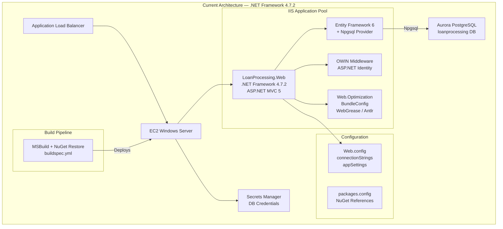
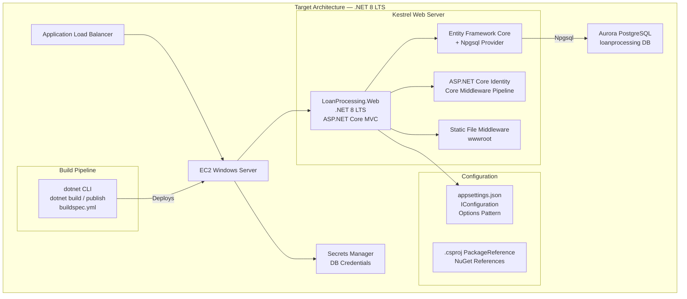

# Module 2: Application Stack Modernization

## 1. Overview

### What You Will Accomplish

In this module, you will modernize the LoanProcessing application from .NET Framework 4.7.2 (ASP.NET MVC 5) to .NET 8 LTS (ASP.NET Core MVC) using AWS Transform for automated analysis and transformation, followed by manual remediation of five intervention areas that require human attention. By the end of this module, the application will run on the Kestrel web server with Entity Framework Core and the Npgsql provider connecting to the Aurora PostgreSQL database provisioned in Module 1.

### Estimated Time

120 minutes

### Key AWS Services Used

- AWS Transform (application transformation and modernization analysis)

---

## 2. Prerequisites

### Required AWS Services and IAM Permissions

| AWS Service | Required IAM Actions |
|---|---|
| AWS Transform | `transform:CreateTransformJob`, `transform:DescribeTransformJob`, `transform:ListTransformJobs`, `transform:GetTransformJobArtifact`, `transform:StartTransformJob` |
| Amazon S3 (for Transform artifacts) | `s3:GetObject`, `s3:PutObject`, `s3:ListBucket`, `s3:CreateBucket` |
| AWS CodeConnections (for source repo) | `codeconnections:CreateConnection`, `codeconnections:GetConnection`, `codeconnections:UseConnection` |

**Summary IAM policy actions:** `transform:*`, `s3:*` on the Transform artifact bucket, and `codeconnections:*` for repository access.

### Required Tools and Versions

| Tool | Version |
|---|---|
| .NET SDK | >= 8.0 |
| AWS Transform | Latest (accessed via AWS Console or CLI) |
| Visual Studio 2022 | >= 17.8 (with ASP.NET Core workload) or VS Code with C# Dev Kit |
| AWS CLI | >= 2.15 |
| Git | >= 2.40 |

### Expected Starting State

You have completed Module 1 (Database Modernization) and the following infrastructure and application state is in place:

- Aurora PostgreSQL cluster is running and accessible with the `loanprocessing` database containing all five tables (Customers, LoanApplications, LoanDecisions, PaymentSchedules, InterestRates) with migrated data
- All nine stored procedures have been extracted into .NET service-layer classes (CustomerService, LoanService, CreditEvaluationService, PaymentScheduleService, ReportService)
- The application connection string has been updated to use the Npgsql provider pointing to Aurora PostgreSQL
- The application is running on EC2 with IIS and all pages (Customers, Loans, Reports, Interest Rates) render correctly with data from Aurora PostgreSQL

```bash
# Verification command — run this to confirm readiness
# 1. Verify Aurora PostgreSQL is available
aws rds describe-db-clusters \
    --region us-east-1 \
    --profile workshop \
    --output table \
    --db-cluster-identifier loanprocessing-aurora-pg \
    --query "DBClusters[0].[DBClusterIdentifier,Status,Endpoint,EngineVersion]"
```

Expected: A table showing `loanprocessing-aurora-pg` with status `available`, the cluster endpoint, and engine version `16.4`.

```bash
# 2. Verify the application connects to Aurora PostgreSQL via Npgsql
psql "host=$(aws rds describe-db-clusters \
    --region us-east-1 \
    --profile workshop \
    --output text \
    --db-cluster-identifier loanprocessing-aurora-pg \
    --query 'DBClusters[0].Endpoint') \
    port=5432 dbname=loanprocessing user=postgres password=WorkshopPassword123! sslmode=require" \
    -c "SELECT COUNT(*) AS customer_count FROM dbo.customers;"
```

Expected: A row count confirming data exists in the `customers` table (e.g., `customer_count` > 0).

```bash
# 3. Verify the .NET project builds successfully in its current state
dotnet build LoanProcessing.Web/LoanProcessing.Web.csproj
```

Expected: Build output showing `Build succeeded` with the current .NET Framework 4.7.2 project (or MSBuild equivalent).

---

## 3. Architecture Diagram

### Before



### After



---

## 4. Step-by-Step Instructions

### Step 2a: AWS Transform Analysis and Automated Transformation

In this step you connect the LoanProcessing GitHub repository to AWS Transform, run a compatibility assessment against the .NET Framework 4.7.2 codebase, review the findings, and then execute the automated transformation to .NET 8 LTS. AWS Transform handles the bulk of the mechanical conversion — project format, target framework, namespace changes, and NuGet package upgrades — while flagging areas that require your manual attention in subsequent steps.

#### 2a.1 — Create an AWS CodeConnections Connection to GitHub

AWS Transform accesses your source code through AWS CodeConnections. Create a connection to your GitHub repository:

```bash
aws codeconnections create-connection \
    --region us-east-1 \
    --profile workshop \
    --output json \
    --provider-type GitHub \
    --connection-name loanprocessing-github
```

Expected output:

```json
{
    "ConnectionArn": "arn:aws:codeconnections:us-east-1:123456789012:connection/abcd1234-ef56-7890-abcd-ef1234567890"
}
```

Save the connection ARN for later use:

```bash
export CODECONNECTION_ARN="arn:aws:codeconnections:us-east-1:123456789012:connection/abcd1234-ef56-7890-abcd-ef1234567890"
```

> **⚠️ Manual Review Required:** The connection is created in `PENDING` status. You must authorize it in the AWS Console before AWS Transform can access your repository.

Complete the authorization handshake:

1. Open the **AWS Developer Tools Console** → **Settings** → **Connections**
2. Select the `loanprocessing-github` connection (status: **Pending**)
3. Click **Update pending connection**
4. Authorize AWS to access your GitHub account and select the repository containing the LoanProcessing application
5. Click **Connect**

Verify the connection is now `AVAILABLE`:

```bash
aws codeconnections get-connection \
    --region us-east-1 \
    --profile workshop \
    --output json \
    --connection-arn "$CODECONNECTION_ARN"
```

Expected output:

```json
{
    "Connection": {
        "ConnectionName": "loanprocessing-github",
        "ConnectionArn": "arn:aws:codeconnections:us-east-1:123456789012:connection/abcd1234-ef56-7890-abcd-ef1234567890",
        "ProviderType": "GitHub",
        "ConnectionStatus": "AVAILABLE"
    }
}
```

> **✅ Validation Step:** Confirm the `ConnectionStatus` is `AVAILABLE`. If it still shows `PENDING`, repeat the console authorization steps above.

> **🔧 Troubleshooting:** If the connection fails to authorize, ensure your GitHub account has granted the AWS Connector for GitHub app access to the repository. Check GitHub → Settings → Applications → Authorized OAuth Apps.

#### 2a.2 — Create an AWS Transform Project

Create a Transform project that points to your LoanProcessing repository. This tells AWS Transform which source code to analyze:

> **Console alternative:** Open the **AWS Transform** console → **Projects** → **Create project**. Select the CodeConnections connection, choose your repository and branch, and set the target framework to `.NET 8`.

```bash
aws transform create-transform-job \
    --region us-east-1 \
    --profile workshop \
    --output json \
    --source-config '{
        "connectionArn": "'"$CODECONNECTION_ARN"'",
        "repository": "your-org/loan-processing",
        "branch": "main"
    }' \
    --transform-config '{
        "targetFramework": "net8.0",
        "language": "csharp"
    }' \
    --job-name "loanprocessing-dotnet8-transform"
```

Expected output:

```json
{
    "TransformJobId": "tj-0abc1234def56789",
    "JobName": "loanprocessing-dotnet8-transform",
    "Status": "CREATED"
}
```

Save the job ID:

```bash
export TRANSFORM_JOB_ID="tj-0abc1234def56789"
```

#### 2a.3 — Run the AWS Transform Assessment

Start the assessment phase. AWS Transform analyzes the codebase and produces a compatibility report identifying what can be automatically converted and what requires manual intervention:

```bash
aws transform start-transform-job \
    --region us-east-1 \
    --profile workshop \
    --output json \
    --transform-job-id "$TRANSFORM_JOB_ID"
```

Expected output:

```json
{
    "TransformJobId": "tj-0abc1234def56789",
    "Status": "IN_PROGRESS"
}
```

Monitor the job until it completes (typically 5–15 minutes):

```bash
aws transform describe-transform-job \
    --region us-east-1 \
    --profile workshop \
    --output table \
    --transform-job-id "$TRANSFORM_JOB_ID" \
    --query "[TransformJobId, Status, StatusMessage]"
```

Expected output when complete:

```
--------------------------------------------------------------
|                   DescribeTransformJob                     |
+------------------------+-----------------------------------+
|  tj-0abc1234def56789   |  COMPLETED                        |
|                        |  Transformation completed          |
+------------------------+-----------------------------------+
```

> **✅ Validation Step:** Confirm the `Status` is `COMPLETED`. If the status is `FAILED`, check the `StatusMessage` for details and refer to the Troubleshooting section.

> **🔧 Troubleshooting:** If the job fails with `SOURCE_ACCESS_ERROR`, verify that the CodeConnections connection is in `AVAILABLE` status and that the repository name and branch are correct. If it fails with `UNSUPPORTED_PROJECT_TYPE`, confirm the repository contains a `.csproj` file with `TargetFrameworkVersion` set to `v4.7.2`.

#### 2a.4 — Review the Compatibility Assessment Report

Download and review the assessment report. This report details every file, package, and API that AWS Transform analyzed:

```bash
aws transform get-transform-job-artifact \
    --region us-east-1 \
    --profile workshop \
    --output json \
    --transform-job-id "$TRANSFORM_JOB_ID" \
    --artifact-type ASSESSMENT_REPORT
```

Expected output (key fields):

```json
{
    "ArtifactUrl": "https://s3.amazonaws.com/aws-transform-artifacts-123456789012/tj-0abc1234def56789/assessment-report.json",
    "ArtifactType": "ASSESSMENT_REPORT"
}
```

Download and inspect the report:

```bash
curl -o assessment-report.json "$(aws transform get-transform-job-artifact \
    --region us-east-1 \
    --profile workshop \
    --output text \
    --transform-job-id "$TRANSFORM_JOB_ID" \
    --artifact-type ASSESSMENT_REPORT \
    --query 'ArtifactUrl')"
```

> **Console alternative:** Open the **AWS Transform** console → **Projects** → select your job → **Assessment** tab. The report is displayed inline with expandable sections for each finding category.

#### 2a.5 — Understand the Expected Assessment Findings

The assessment report for the LoanProcessing application categorizes items into two groups: **automatically convertible** and **requires manual intervention**.

**Automatically Convertible (AWS Transform handles these):**

| Item | Current | Target | Transform Action |
|---|---|---|---|
| Target framework | .NET Framework 4.7.2 | .NET 8 LTS | Updates `.csproj` `TargetFramework` |
| Project format | Legacy `.csproj` (MSBuild XML) | SDK-style `.csproj` | Converts to `<Project Sdk="Microsoft.NET.Sdk.Web">` |
| NuGet format | `packages.config` | `PackageReference` in `.csproj` | Migrates all package references |
| ASP.NET MVC | MVC 5 (`System.Web.Mvc`) | ASP.NET Core MVC | Updates controller base classes, namespaces |
| Razor views | MVC 5 Razor (`System.Web.Mvc.Razor`) | ASP.NET Core Razor | Updates `@model`, `@using`, tag helpers |
| Newtonsoft.Json | 13.0.3 | 13.0.3 (compatible) | Retains as `PackageReference` |
| MSTest | 2.2.10 | 2.2.10+ (compatible) | Retains as `PackageReference` |
| Entry point | `Global.asax` + `Global.asax.cs` | `Program.cs` with `WebApplication.CreateBuilder` | Generates new entry point |
| Configuration | `Web.config` (`connectionStrings`, `appSettings`) | `appsettings.json` + `IConfiguration` | Generates config file, injects `IConfiguration` |

**Requires Manual Intervention (flagged for human review):**

| Area | Flagged Items | Why Manual | Lab Guide Step |
|---|---|---|---|
| OWIN / ASP.NET Identity | `Microsoft.AspNet.Identity.Core` (2.2.4), `Identity.Owin` (2.2.4), `Identity.EntityFramework` (2.2.4), `Owin` (1.0) | OWIN middleware pipeline is architecturally different from ASP.NET Core middleware; no 1:1 automated mapping | Step 2c.1 |
| Entity Framework 6 → EF Core | `EntityFramework` (6.4.4), `EntityFramework.SqlServer` | EF6 and EF Core have different APIs, LINQ translation, and provider models; Npgsql provider swap needed | Step 2c.2 |
| Web.Optimization / Bundling | `Microsoft.AspNet.Web.Optimization` (1.1.3), `WebGrease` (1.6.0), `Antlr` (3.5.0.2) | No ASP.NET Core equivalent; must replace with static file middleware and `wwwroot` | Step 2c.3 |
| FsCheck tests in web project | `FsCheck` (2.16.6), `FSharp.Core` (4.2.3), `Moq` (4.18.4) in `LoanProcessing.Web.csproj` | Tests embedded in the web project (not a separate test project); needs restructuring | Step 2c.6 |
| `BundleConfig.cs` | `App_Start/BundleConfig.cs` | References `System.Web.Optimization` which has no Core equivalent | Step 2c.3 |

> **⚠️ Manual Review Required:** The five areas listed above will NOT be fully resolved by the automated transformation. AWS Transform generates placeholder comments or partial conversions for these items. You will address each one in Step 2c (Manual Remediation).

> **🤖 Kiro Prompt:** After reviewing the assessment report, you can ask Kiro to summarize the findings:
> ```
> Review the AWS Transform assessment report for the LoanProcessing.Web project.
> Summarize the items that were automatically converted and list the areas
> flagged for manual intervention. For each manual intervention area, explain
> what needs to change and why.
> ```
> **Classification:** Kiro-assisted review — use Kiro's summary to confirm your understanding of the report, but verify each finding against the actual assessment output.

#### 2a.6 — Download the Transformed Source Code

Download the transformed project that AWS Transform generated:

```bash
aws transform get-transform-job-artifact \
    --region us-east-1 \
    --profile workshop \
    --output json \
    --transform-job-id "$TRANSFORM_JOB_ID" \
    --artifact-type TRANSFORMED_CODE
```

Expected output:

```json
{
    "ArtifactUrl": "https://s3.amazonaws.com/aws-transform-artifacts-123456789012/tj-0abc1234def56789/transformed-source.zip",
    "ArtifactType": "TRANSFORMED_CODE"
}
```

Download and extract the transformed code:

```bash
curl -o transformed-source.zip "$(aws transform get-transform-job-artifact \
    --region us-east-1 \
    --profile workshop \
    --output text \
    --transform-job-id "$TRANSFORM_JOB_ID" \
    --artifact-type TRANSFORMED_CODE \
    --query 'ArtifactUrl')"

# Extract to a temporary directory for review before applying
mkdir -p transformed-output
unzip transformed-source.zip -d transformed-output/
```

Expected: The `transformed-output/` directory contains the converted project structure.

#### 2a.7 — Review the Generated Project Structure

Compare the original and transformed project structures to understand what AWS Transform changed:

**Original structure (.NET Framework 4.7.2):**

```
LoanProcessing.Web/
├── App_Start/
│   ├── BundleConfig.cs          ← Web.Optimization (flagged)
│   ├── FilterConfig.cs
│   └── RouteConfig.cs
├── Content/                     ← CSS files
├── Controllers/
├── Data/
├── fonts/
├── Models/
├── Properties/
│   └── AssemblyInfo.cs
├── Scripts/                     ← JavaScript files
├── Services/
├── Tests/                       ← FsCheck tests (flagged)
├── Views/
├── Global.asax                  ← Entry point (replaced)
├── Global.asax.cs               ← Entry point (replaced)
├── LoanProcessing.Web.csproj    ← Legacy format (converted)
├── packages.config              ← NuGet format (removed)
├── Web.config                   ← Configuration (replaced)
├── Web.Debug.config             ← Transform (removed)
└── Web.Release.config           ← Transform (removed)
```

**Transformed structure (.NET 8 LTS):**

```
LoanProcessing.Web/
├── Controllers/
│   ├── HomeController.cs        ← Updated namespaces, base class
│   ├── CustomerController.cs
│   ├── LoanController.cs
│   ├── ReportController.cs
│   └── InterestRateController.cs
├── Data/
│   ├── LoanProcessingContext.cs ← Partial conversion (needs EF Core rewrite)
│   ├── CustomerRepository.cs
│   ├── LoanApplicationRepository.cs
│   ├── LoanDecisionRepository.cs
│   ├── PaymentScheduleRepository.cs
│   ├── ReportRepository.cs
│   └── InterestRateRepository.cs
├── Models/                      ← Unchanged (POCOs are compatible)
├── Services/                    ← Unchanged (business logic is compatible)
├── Views/
│   ├── Shared/
│   │   └── _Layout.cshtml       ← Updated tag helpers, removed @Scripts.Render
│   ├── _ViewImports.cshtml      ← NEW: tag helper imports
│   ├── _ViewStart.cshtml
│   └── [all view folders]       ← Updated @using directives
├── wwwroot/                     ← NEW: static files directory
│   ├── css/
│   │   ├── bootstrap.min.css
│   │   └── site.css
│   ├── js/
│   │   ├── bootstrap.min.js
│   │   ├── jquery-3.4.1.min.js
│   │   ├── jquery.validate.min.js
│   │   └── jquery.validate.unobtrusive.min.js
│   └── lib/
├── Program.cs                   ← NEW: replaces Global.asax
├── Startup.cs                   ← NEW: service and middleware configuration
├── appsettings.json             ← NEW: replaces Web.config
├── appsettings.Development.json ← NEW: dev-specific overrides
└── LoanProcessing.Web.csproj   ← SDK-style with PackageReference
```

**Key changes to review in the transformed `.csproj`:**

```xml
<Project Sdk="Microsoft.NET.Sdk.Web">

  <PropertyGroup>
    <TargetFramework>net8.0</TargetFramework>
    <RootNamespace>LoanProcessing.Web</RootNamespace>
  </PropertyGroup>

  <ItemGroup>
    <PackageReference Include="Newtonsoft.Json" Version="13.0.3" />
    <PackageReference Include="Microsoft.AspNetCore.Identity.EntityFrameworkCore" Version="8.0.*" />
    <PackageReference Include="Microsoft.EntityFrameworkCore" Version="8.0.*" />
    <!-- NOTE: SqlServer provider retained — you will swap to Npgsql in Step 2c -->
    <PackageReference Include="Microsoft.EntityFrameworkCore.SqlServer" Version="8.0.*" />
  </ItemGroup>

</Project>
```

> **⚠️ Manual Review Required:** Notice that AWS Transform retained `EntityFrameworkCore.SqlServer` as the database provider. In Step 2c.2, you will replace this with `Npgsql.EntityFrameworkCore.PostgreSQL` to connect to Aurora PostgreSQL.

**Key changes to review in the generated `Program.cs`:**

```csharp
var builder = WebApplication.CreateBuilder(args);

// Services registered here — Identity and EF sections need manual review
builder.Services.AddControllersWithViews();

var app = builder.Build();

if (!app.Environment.IsDevelopment())
{
    app.UseExceptionHandler("/Home/Error");
    app.UseHsts();
}

app.UseHttpsRedirection();
app.UseStaticFiles();
app.UseRouting();
app.UseAuthorization();

app.MapControllerRoute(
    name: "default",
    pattern: "{controller=Home}/{action=Index}/{id?}");

app.Run();
```

**Key changes to review in the generated `appsettings.json`:**

```json
{
  "Logging": {
    "LogLevel": {
      "Default": "Information",
      "Microsoft.AspNetCore": "Warning"
    }
  },
  "AllowedHosts": "*",
  "ConnectionStrings": {
    "LoanProcessingConnection": "Data Source=(localdb)\\MSSQLLocalDB;Initial Catalog=LoanProcessing;Integrated Security=True"
  }
}
```

> **⚠️ Manual Review Required:** The connection string still points to SQL Server. In Step 2c.2, you will update this to the Aurora PostgreSQL connection string using the Npgsql format.

#### 2a.8 — Apply the Transformed Code to Your Working Branch

Once you have reviewed the transformed output, apply it to your repository:

```bash
# Create a feature branch for the modernization
git checkout -b feature/dotnet8-modernization

# Copy the transformed files over the original project
cp -r transformed-output/LoanProcessing.Web/* LoanProcessing.Web/

# Remove files that are no longer needed in .NET 8
rm -f LoanProcessing.Web/Global.asax
rm -f LoanProcessing.Web/Global.asax.cs
rm -f LoanProcessing.Web/packages.config
rm -f LoanProcessing.Web/Web.config
rm -f LoanProcessing.Web/Web.Debug.config
rm -f LoanProcessing.Web/Web.Release.config
rm -f LoanProcessing.Web/Properties/AssemblyInfo.cs

# Stage and review the changes
git add -A
git status
```

Expected output from `git status`:

```
On branch feature/dotnet8-modernization
Changes to be committed:
  deleted:    LoanProcessing.Web/Global.asax
  deleted:    LoanProcessing.Web/Global.asax.cs
  deleted:    LoanProcessing.Web/Web.config
  deleted:    LoanProcessing.Web/Web.Debug.config
  deleted:    LoanProcessing.Web/Web.Release.config
  deleted:    LoanProcessing.Web/packages.config
  deleted:    LoanProcessing.Web/Properties/AssemblyInfo.cs
  modified:   LoanProcessing.Web/LoanProcessing.Web.csproj
  modified:   LoanProcessing.Web/Controllers/HomeController.cs
  modified:   LoanProcessing.Web/Controllers/CustomerController.cs
  ...
  new file:   LoanProcessing.Web/Program.cs
  new file:   LoanProcessing.Web/Startup.cs
  new file:   LoanProcessing.Web/appsettings.json
  new file:   LoanProcessing.Web/appsettings.Development.json
  new file:   LoanProcessing.Web/Views/_ViewImports.cshtml
  new file:   LoanProcessing.Web/wwwroot/css/bootstrap.min.css
  new file:   LoanProcessing.Web/wwwroot/css/site.css
  new file:   LoanProcessing.Web/wwwroot/js/bootstrap.min.js
  ...
```

> **✅ Validation Step:** Verify the transformed project targets .NET 8 by checking the `.csproj`:
> ```bash
> grep -i "TargetFramework" LoanProcessing.Web/LoanProcessing.Web.csproj
> ```
> Expected: `<TargetFramework>net8.0</TargetFramework>`

> **✅ Validation Step:** Verify that `packages.config` has been removed and NuGet references are now `PackageReference` entries in the `.csproj`:
> ```bash
> # Should return "no such file"
> ls LoanProcessing.Web/packages.config
>
> # Should show PackageReference entries
> grep "PackageReference" LoanProcessing.Web/LoanProcessing.Web.csproj
> ```
> Expected: `packages.config` does not exist; `.csproj` contains `<PackageReference Include="..." Version="..." />` entries.

> **✅ Validation Step:** Attempt a build to see the current state. The build is expected to **fail** at this point because the manual intervention areas have not been addressed yet:
> ```bash
> dotnet build LoanProcessing.Web/LoanProcessing.Web.csproj
> ```
> Expected: Build output with errors related to OWIN/Identity references, EF6 APIs, and `System.Web.Optimization` — these are the items you will fix in Step 2c.

> **🔧 Troubleshooting:** If `dotnet build` fails with `NETSDK1045: The current .NET SDK does not support targeting .NET 8.0`, verify you have .NET SDK 8.0 or later installed:
> ```bash
> dotnet --list-sdks
> ```
> Install the .NET 8 SDK from https://dotnet.microsoft.com/download/dotnet/8.0 if needed.

Commit the transformed code as a checkpoint before starting manual remediation:

```bash
git commit -m "Apply AWS Transform automated conversion to .NET 8 LTS

- Converted project format from legacy .csproj to SDK-style
- Migrated packages.config to PackageReference
- Replaced Global.asax with Program.cs and Startup.cs
- Replaced Web.config with appsettings.json
- Moved static files to wwwroot/
- Updated controller namespaces and base classes
- Updated Razor views with tag helpers

Manual intervention still required:
- OWIN/Identity → ASP.NET Core Identity
- EF6 → EF Core + Npgsql
- Web.Optimization → static file middleware
- FsCheck test restructuring
- Connection string update to Aurora PostgreSQL"
```

> **🤖 Kiro Prompt:** After applying the transformed code, ask Kiro to review the diff:
> ```
> Review the changes from the AWS Transform automated conversion. Compare the
> original .NET Framework 4.7.2 project structure with the new .NET 8 structure.
> Identify any issues or incomplete conversions that need manual attention
> beyond what the assessment report flagged.
> ```
> **Classification:** Kiro-assisted review — use Kiro to catch any conversion artifacts that the assessment report may not have explicitly called out. Verify Kiro's findings against the actual code before making changes.


### Step 2c: Manual Remediation

In this step you address the five intervention areas that AWS Transform flagged for manual attention, plus restructure the FsCheck test files into a separate test project. Each subsection targets one area, provides the exact code changes, and includes a Kiro prompt callout with classification and review instructions.

> **⚠️ Manual Review Required:** The automated transformation left placeholder or partial conversions for these areas. Work through each subsection in order — later subsections assume earlier ones are complete.

---

#### 2c.1 — OWIN/Identity → ASP.NET Core Identity

The legacy application uses the OWIN middleware pipeline with `Microsoft.AspNet.Identity.Core`, `Identity.Owin`, and `Identity.EntityFramework` for authentication. The OWIN pipeline is architecturally different from the ASP.NET Core middleware pipeline and cannot be automatically converted. You will remove the OWIN packages and wire up ASP.NET Core Identity.

**Remove legacy OWIN and Identity packages from the `.csproj`:**

Open `LoanProcessing.Web/LoanProcessing.Web.csproj` and remove these `PackageReference` entries (if AWS Transform retained them):

```xml
<!-- REMOVE these lines -->
<PackageReference Include="Microsoft.AspNet.Identity.Core" Version="2.2.4" />
<PackageReference Include="Microsoft.AspNet.Identity.EntityFramework" Version="2.2.4" />
<PackageReference Include="Microsoft.AspNet.Identity.Owin" Version="2.2.4" />
<PackageReference Include="Owin" Version="1.0" />
```

**Add ASP.NET Core Identity packages:**

Add the following `PackageReference` entries to the `<ItemGroup>` in the `.csproj`:

```xml
<PackageReference Include="Microsoft.AspNetCore.Identity.EntityFrameworkCore" Version="8.0.11" />
<PackageReference Include="Microsoft.AspNetCore.Identity.UI" Version="8.0.11" />
```

Or use the dotnet CLI:

```bash
cd LoanProcessing.Web
dotnet add package Microsoft.AspNetCore.Identity.EntityFrameworkCore --version 8.0.11
dotnet add package Microsoft.AspNetCore.Identity.UI --version 8.0.11
```

**Update `Program.cs` (or `Startup.cs`) to register ASP.NET Core Identity services:**

Replace any OWIN-based identity configuration with the ASP.NET Core Identity middleware. In `Program.cs`, add the Identity service registration and middleware:

```csharp
using Microsoft.AspNetCore.Identity;
using Microsoft.EntityFrameworkCore;
using LoanProcessing.Web.Data;

var builder = WebApplication.CreateBuilder(args);

// Add ASP.NET Core Identity with EF Core stores
builder.Services.AddDefaultIdentity<IdentityUser>(options =>
    {
        options.SignIn.RequireConfirmedAccount = false;
        options.Password.RequiredLength = 8;
        options.Password.RequireDigit = true;
        options.Password.RequireUppercase = true;
    })
    .AddEntityFrameworkStores<LoanProcessingContext>();

builder.Services.AddControllersWithViews();

var app = builder.Build();

if (!app.Environment.IsDevelopment())
{
    app.UseExceptionHandler("/Home/Error");
    app.UseHsts();
}

app.UseHttpsRedirection();
app.UseStaticFiles();
app.UseRouting();

// Authentication and Authorization middleware — order matters
app.UseAuthentication();
app.UseAuthorization();

app.MapControllerRoute(
    name: "default",
    pattern: "{controller=Home}/{action=Index}/{id?}");
app.MapRazorPages(); // Required for Identity UI pages

app.Run();
```

**Migrate Identity model classes:**

If the legacy project defined a custom `ApplicationUser` class inheriting from `Microsoft.AspNet.Identity.EntityFramework.IdentityUser`, update it to inherit from `Microsoft.AspNetCore.Identity.IdentityUser`:

```csharp
// Before (EF6 Identity)
using Microsoft.AspNet.Identity.EntityFramework;
public class ApplicationUser : IdentityUser { }

// After (ASP.NET Core Identity)
using Microsoft.AspNetCore.Identity;
public class ApplicationUser : IdentityUser { }
```

**Remove OWIN startup class:**

Delete any `Startup.Auth.cs` or OWIN `OwinStartup` attribute class that configured the OWIN pipeline. The ASP.NET Core middleware pipeline in `Program.cs` replaces this entirely.

> **✅ Validation Step:** Verify that no OWIN references remain in the project:
> ```bash
> grep -ri "Owin\|Microsoft.AspNet.Identity" LoanProcessing.Web/ --include="*.cs" --include="*.csproj"
> ```
> Expected: No matches. All references should now use `Microsoft.AspNetCore.Identity`.

> **🔧 Troubleshooting:** If you see build errors like `The type or namespace name 'Owin' could not be found`, confirm that all four legacy packages were removed from the `.csproj` and that the `using` directives in all `.cs` files have been updated from `Microsoft.AspNet.Identity` to `Microsoft.AspNetCore.Identity`.

> **🤖 Kiro Prompt:** Ask Kiro to generate the Identity migration:
> ```
> Migrate the OWIN/ASP.NET Identity configuration in the LoanProcessing.Web
> project from Microsoft.AspNet.Identity (OWIN pipeline) to ASP.NET Core
> Identity. Update Program.cs to register Identity services with EF Core
> stores, add UseAuthentication() and UseAuthorization() middleware, and
> update any ApplicationUser or IdentityDbContext references to use the
> Microsoft.AspNetCore.Identity namespace. Remove all OWIN startup classes.
> ```
> **Classification:** Kiro-assisted generation — Kiro can generate the bulk of the Identity middleware wiring and namespace updates. **Review instruction:** Verify that the middleware order in `Program.cs` is correct (`UseAuthentication()` before `UseAuthorization()`), that the `IdentityUser` configuration matches your password policy requirements, and that no OWIN references remain in any `.cs` file.

---

#### 2c.2 — EF6 → EF Core + Npgsql

The legacy application uses Entity Framework 6 with `EntityFramework.SqlServer`. You need to replace this with Entity Framework Core and the Npgsql provider to connect to Aurora PostgreSQL. The EF6 and EF Core APIs differ significantly — `DbModelBuilder` becomes `ModelBuilder`, Fluent API methods change, and the connection is configured through dependency injection rather than a constructor string.

**Remove legacy EF6 packages from the `.csproj`:**

```xml
<!-- REMOVE these lines -->
<PackageReference Include="EntityFramework" Version="6.4.4" />
<PackageReference Include="Microsoft.EntityFrameworkCore.SqlServer" Version="8.0.*" />
```

> **⚠️ Manual Review Required:** AWS Transform may have replaced `EntityFramework` 6.4.4 with `Microsoft.EntityFrameworkCore.SqlServer`. You need to swap the SqlServer provider for Npgsql.

**Add EF Core with Npgsql packages:**

```bash
cd LoanProcessing.Web
dotnet add package Microsoft.EntityFrameworkCore --version 8.0.11
dotnet add package Npgsql.EntityFrameworkCore.PostgreSQL --version 8.0.11
dotnet add package Microsoft.EntityFrameworkCore.Tools --version 8.0.11
```

The `.csproj` should now contain:

```xml
<PackageReference Include="Microsoft.EntityFrameworkCore" Version="8.0.11" />
<PackageReference Include="Npgsql.EntityFrameworkCore.PostgreSQL" Version="8.0.11" />
<PackageReference Include="Microsoft.EntityFrameworkCore.Tools" Version="8.0.11" />
```

**Rewrite `LoanProcessingContext.cs` for EF Core:**

The existing `LoanProcessingContext` inherits from `System.Data.Entity.DbContext` (EF6). Rewrite it to use `Microsoft.EntityFrameworkCore.DbContext`:

```csharp
using Microsoft.EntityFrameworkCore;
using Microsoft.AspNetCore.Identity.EntityFrameworkCore;
using LoanProcessing.Web.Models;

namespace LoanProcessing.Web.Data
{
    /// <summary>
    /// EF Core DbContext for the Loan Processing application.
    /// Inherits from IdentityDbContext to support ASP.NET Core Identity tables.
    /// </summary>
    public class LoanProcessingContext : IdentityDbContext
    {
        public LoanProcessingContext(DbContextOptions<LoanProcessingContext> options)
            : base(options)
        {
        }

        public DbSet<Customer> Customers { get; set; }
        public DbSet<LoanApplication> LoanApplications { get; set; }
        public DbSet<LoanDecision> LoanDecisions { get; set; }
        public DbSet<PaymentSchedule> PaymentSchedules { get; set; }
        public DbSet<InterestRate> InterestRates { get; set; }

        protected override void OnModelCreating(ModelBuilder modelBuilder)
        {
            base.OnModelCreating(modelBuilder);

            // Set default schema to match Aurora PostgreSQL migration
            modelBuilder.HasDefaultSchema("dbo");

            // Configure Customer entity
            modelBuilder.Entity<Customer>(entity =>
            {
                entity.HasKey(c => c.CustomerId);
                entity.Property(c => c.CustomerId).ValueGeneratedOnAdd();
                entity.Property(c => c.FirstName).IsRequired().HasMaxLength(50);
                entity.Property(c => c.LastName).IsRequired().HasMaxLength(50);
                entity.Property(c => c.SSN).IsRequired().HasMaxLength(11);
                entity.HasIndex(c => c.SSN).IsUnique();
                entity.Property(c => c.Email).IsRequired().HasMaxLength(100);
                entity.Property(c => c.Phone).IsRequired().HasMaxLength(20);
                entity.Property(c => c.Address).IsRequired().HasMaxLength(200);
                entity.Property(c => c.AnnualIncome).HasPrecision(18, 2);
                entity.Property(c => c.CreatedDate).IsRequired();
            });

            // Configure LoanApplication entity
            modelBuilder.Entity<LoanApplication>(entity =>
            {
                entity.HasKey(l => l.ApplicationId);
                entity.Property(l => l.ApplicationId).ValueGeneratedOnAdd();
                entity.Property(l => l.ApplicationNumber).IsRequired().HasMaxLength(20);
                entity.HasIndex(l => l.ApplicationNumber).IsUnique();
                entity.Property(l => l.LoanType).IsRequired().HasMaxLength(20);
                entity.Property(l => l.RequestedAmount).HasPrecision(18, 2);
                entity.Property(l => l.ApprovedAmount).HasPrecision(18, 2);
                entity.Property(l => l.InterestRate).HasPrecision(5, 2);
                entity.Property(l => l.Purpose).IsRequired().HasMaxLength(500);
                entity.Property(l => l.Status).IsRequired().HasMaxLength(20);
                entity.Property(l => l.ApplicationDate).IsRequired();
                entity.HasOne(l => l.Customer)
                      .WithMany()
                      .HasForeignKey(l => l.CustomerId)
                      .OnDelete(DeleteBehavior.Restrict);
            });

            // Configure LoanDecision entity
            modelBuilder.Entity<LoanDecision>(entity =>
            {
                entity.HasKey(d => d.DecisionId);
                entity.Property(d => d.DecisionId).ValueGeneratedOnAdd();
                entity.Property(d => d.Decision).IsRequired().HasMaxLength(20);
                entity.Property(d => d.DecisionBy).IsRequired().HasMaxLength(100);
                entity.Property(d => d.Comments).HasMaxLength(1000);
                entity.Property(d => d.ApprovedAmount).HasPrecision(18, 2);
                entity.Property(d => d.InterestRate).HasPrecision(5, 2);
                entity.Property(d => d.DebtToIncomeRatio).HasPrecision(5, 2);
                entity.Property(d => d.DecisionDate).IsRequired();
                entity.HasOne(d => d.LoanApplication)
                      .WithMany()
                      .HasForeignKey(d => d.ApplicationId)
                      .OnDelete(DeleteBehavior.Restrict);
            });

            // Configure PaymentSchedule entity
            modelBuilder.Entity<PaymentSchedule>(entity =>
            {
                entity.HasKey(p => p.ScheduleId);
                entity.Property(p => p.ScheduleId).ValueGeneratedOnAdd();
                entity.Property(p => p.PaymentAmount).HasPrecision(18, 2);
                entity.Property(p => p.PrincipalAmount).HasPrecision(18, 2);
                entity.Property(p => p.InterestAmount).HasPrecision(18, 2);
                entity.Property(p => p.RemainingBalance).HasPrecision(18, 2);
                entity.Property(p => p.DueDate).IsRequired();
                entity.HasOne(p => p.LoanApplication)
                      .WithMany()
                      .HasForeignKey(p => p.ApplicationId)
                      .OnDelete(DeleteBehavior.Restrict);
                entity.HasIndex(p => new { p.ApplicationId, p.PaymentNumber }).IsUnique();
            });

            // Configure InterestRate entity
            modelBuilder.Entity<InterestRate>(entity =>
            {
                entity.HasKey(r => r.RateId);
                entity.Property(r => r.RateId).ValueGeneratedOnAdd();
                entity.Property(r => r.LoanType).IsRequired().HasMaxLength(20);
                entity.Property(r => r.Rate).HasPrecision(5, 2);
                entity.Property(r => r.EffectiveDate).IsRequired();
                entity.HasIndex(r => new { r.LoanType, r.MinCreditScore, r.MaxCreditScore, r.EffectiveDate });
            });
        }
    }
}
```

**Key EF6 → EF Core API changes to watch for:**

| EF6 API | EF Core Equivalent |
|---|---|
| `DbModelBuilder` | `ModelBuilder` |
| `HasDatabaseGeneratedOption(Identity)` | `ValueGeneratedOnAdd()` |
| `HasRequired(x).WithMany().HasForeignKey()` | `HasOne(x).WithMany().HasForeignKey()` |
| `WillCascadeOnDelete(false)` | `OnDelete(DeleteBehavior.Restrict)` |
| `HasPrecision(18, 2)` (EF6 extension) | `HasPrecision(18, 2)` (built-in) |
| `Configuration.LazyLoadingEnabled = false` | Lazy loading is off by default in EF Core |
| Constructor: `base("name=ConnectionString")` | Constructor injection: `DbContextOptions<T>` |

**Register the DbContext in `Program.cs`:**

Add the EF Core DbContext registration with the Npgsql provider before `builder.Services.AddControllersWithViews()`:

```csharp
builder.Services.AddDbContext<LoanProcessingContext>(options =>
    options.UseNpgsql(builder.Configuration.GetConnectionString("LoanProcessingConnection")));
```

**Update the connection string in `appsettings.json`:**

Replace the SQL Server connection string with the Aurora PostgreSQL Npgsql format:

```json
{
  "ConnectionStrings": {
    "LoanProcessingConnection": "Host=your-aurora-cluster-endpoint.us-east-1.rds.amazonaws.com;Port=5432;Database=loanprocessing;Username=postgres;Password=WorkshopPassword123!;SSL Mode=Require;Trust Server Certificate=true"
  }
}
```

> **⚠️ Manual Review Required:** Replace `your-aurora-cluster-endpoint.us-east-1.rds.amazonaws.com` with the actual Aurora PostgreSQL cluster endpoint from Module 1. You can retrieve it with:
> ```bash
> aws rds describe-db-clusters \
>     --region us-east-1 \
>     --profile workshop \
>     --output text \
>     --db-cluster-identifier loanprocessing-aurora-pg \
>     --query 'DBClusters[0].Endpoint'
> ```

**Review LINQ queries for EF Core translation differences:**

EF Core has a stricter LINQ-to-SQL translation engine than EF6. Queries that silently evaluated on the client in EF6 may throw `InvalidOperationException` in EF Core. Review all repository classes for:

1. **Client-side evaluation** — EF Core throws if it cannot translate a LINQ expression to SQL. Look for custom C# methods in `Where()` or `Select()` clauses.
2. **`Include()` behavior** — EF Core requires explicit `Include()` for related entities; there is no implicit lazy loading by default.
3. **`GroupBy` translation** — EF Core has limited `GroupBy` translation. Complex grouping may need to be rewritten as raw SQL or split into multiple queries.

Check each repository file in `LoanProcessing.Web/Data/`:

```bash
ls LoanProcessing.Web/Data/*Repository.cs
```

Expected: `CustomerRepository.cs`, `LoanApplicationRepository.cs`, `LoanDecisionRepository.cs`, `PaymentScheduleRepository.cs`, `ReportRepository.cs`, `InterestRateRepository.cs`

> **✅ Validation Step:** Verify the EF Core packages are correctly referenced and the SqlServer provider is removed:
> ```bash
> grep "PackageReference" LoanProcessing.Web/LoanProcessing.Web.csproj
> ```
> Expected: References to `Microsoft.EntityFrameworkCore`, `Npgsql.EntityFrameworkCore.PostgreSQL`, and `Microsoft.EntityFrameworkCore.Tools`. No reference to `EntityFramework` (6.x) or `EntityFrameworkCore.SqlServer`.

> **🔧 Troubleshooting:** If you see `System.InvalidOperationException: The LINQ expression could not be translated` at runtime, the query contains a C# expression that EF Core cannot convert to SQL. Options: (1) rewrite the LINQ to use only translatable operations, (2) add `.AsEnumerable()` before the non-translatable part to force client evaluation (use sparingly), or (3) use `FromSqlRaw()` for complex queries.

> **🤖 Kiro Prompt:** Ask Kiro to rewrite the DbContext and review LINQ queries:
> ```
> Rewrite LoanProcessing.Web/Data/LoanProcessingContext.cs from Entity
> Framework 6 (System.Data.Entity.DbContext) to Entity Framework Core
> (Microsoft.EntityFrameworkCore.DbContext) with the Npgsql PostgreSQL
> provider. Convert all Fluent API calls from EF6 syntax to EF Core syntax.
> The context should inherit from IdentityDbContext to support ASP.NET Core
> Identity. Then review all repository files in LoanProcessing.Web/Data/ for
> LINQ queries that may fail under EF Core's stricter translation rules.
> Flag any client-side evaluation, missing Include() calls, or untranslatable
> GroupBy expressions.
> ```
> **Classification:** Kiro-assisted generation for the DbContext rewrite; manual review required for LINQ query compatibility. **Review instruction:** After Kiro generates the rewritten DbContext, compare every Fluent API call against the original EF6 version to ensure no entity configuration was lost. For LINQ queries, test each repository method against the Aurora PostgreSQL database to confirm correct SQL translation.

---

#### 2c.3 — Web.Optimization → Static File Middleware

The legacy application uses `Microsoft.AspNet.Web.Optimization` with `WebGrease` and `Antlr` for CSS/JS bundling and minification. ASP.NET Core has no direct equivalent — it uses static file middleware serving files from the `wwwroot/` directory. AWS Transform should have already created the `wwwroot/` directory and moved static files, but you need to clean up the bundling references.

**Remove bundling packages from the `.csproj`:**

```xml
<!-- REMOVE these lines -->
<PackageReference Include="Microsoft.AspNet.Web.Optimization" Version="1.1.3" />
<PackageReference Include="WebGrease" Version="1.6.0" />
<PackageReference Include="Antlr" Version="3.5.0.2" />
```

Or use the dotnet CLI:

```bash
cd LoanProcessing.Web
dotnet remove package Microsoft.AspNet.Web.Optimization
dotnet remove package WebGrease
dotnet remove package Antlr
```

**Delete `App_Start/BundleConfig.cs`:**

This file references `System.Web.Optimization` which has no ASP.NET Core equivalent:

```bash
rm -f LoanProcessing.Web/App_Start/BundleConfig.cs
```

If the `App_Start/` directory is now empty (after AWS Transform removed `RouteConfig.cs` and `FilterConfig.cs`), delete it:

```bash
rmdir LoanProcessing.Web/App_Start/ 2>/dev/null || true
```

**Verify the `wwwroot/` directory structure:**

AWS Transform should have created `wwwroot/` and moved static files from `Content/` and `Scripts/`. Verify the structure:

```bash
ls -la LoanProcessing.Web/wwwroot/css/
ls -la LoanProcessing.Web/wwwroot/js/
```

Expected:

```
wwwroot/
├── css/
│   ├── bootstrap.min.css
│   └── site.css
├── js/
│   ├── bootstrap.min.js
│   ├── jquery-3.7.1.min.js
│   ├── jquery.validate.min.js
│   └── jquery.validate.unobtrusive.min.js
└── lib/
```

If the files were not moved by AWS Transform, copy them manually:

```bash
mkdir -p LoanProcessing.Web/wwwroot/css
mkdir -p LoanProcessing.Web/wwwroot/js

cp LoanProcessing.Web/Content/bootstrap.min.css LoanProcessing.Web/wwwroot/css/
cp LoanProcessing.Web/Content/Site.css LoanProcessing.Web/wwwroot/css/site.css
cp LoanProcessing.Web/Scripts/bootstrap.min.js LoanProcessing.Web/wwwroot/js/
cp LoanProcessing.Web/Scripts/jquery-3.7.1.min.js LoanProcessing.Web/wwwroot/js/
cp LoanProcessing.Web/Scripts/jquery.validate.min.js LoanProcessing.Web/wwwroot/js/
cp LoanProcessing.Web/Scripts/jquery.validate.unobtrusive.min.js LoanProcessing.Web/wwwroot/js/
```

**Update `Views/Shared/_Layout.cshtml`:**

Replace the `@Styles.Render()` and `@Scripts.Render()` bundle helpers with direct `<link>` and `<script>` tags referencing files in `wwwroot/`:

The current `_Layout.cshtml` uses these bundle references:

```html
<!-- In <head> — REMOVE these -->
@Styles.Render("~/Content/css")
@Scripts.Render("~/bundles/modernizr")

<!-- Before </body> — REMOVE these -->
@Scripts.Render("~/bundles/jquery")
@Scripts.Render("~/bundles/bootstrap")
```

Replace with direct static file references:

```html
<!-- In <head> — ADD these -->
<link rel="stylesheet" href="~/css/bootstrap.min.css" />
<link rel="stylesheet" href="~/css/site.css" />

<!-- Before </body> — ADD these -->
<script src="~/js/jquery-3.7.1.min.js"></script>
<script src="~/js/jquery.validate.min.js"></script>
<script src="~/js/jquery.validate.unobtrusive.min.js"></script>
<script src="~/js/bootstrap.min.js"></script>
```

> **⚠️ Manual Review Required:** The `modernizr` script bundle is no longer needed for .NET 8 applications targeting modern browsers. If your application requires Modernizr for specific feature detection, add it to `wwwroot/js/` and include a `<script>` tag. Otherwise, omit it.

**Verify `UseStaticFiles()` is in the middleware pipeline:**

Open `Program.cs` and confirm that `app.UseStaticFiles()` is present. AWS Transform should have added this, but verify:

```csharp
app.UseStaticFiles();  // Serves files from wwwroot/
```

This line must appear before `app.UseRouting()`.

**Remove legacy static file directories (optional cleanup):**

After confirming `wwwroot/` has all needed files, you can remove the legacy directories:

```bash
rm -rf LoanProcessing.Web/Content/
rm -rf LoanProcessing.Web/Scripts/
rm -rf LoanProcessing.Web/fonts/
```

> **✅ Validation Step:** Verify that no `System.Web.Optimization` references remain:
> ```bash
> grep -ri "System.Web.Optimization\|BundleConfig\|Styles.Render\|Scripts.Render\|WebGrease\|Antlr" \
>     LoanProcessing.Web/ --include="*.cs" --include="*.cshtml" --include="*.csproj"
> ```
> Expected: No matches.

> **✅ Validation Step:** Verify that `wwwroot/` contains the required static files:
> ```bash
> find LoanProcessing.Web/wwwroot -type f | sort
> ```
> Expected: At least `css/bootstrap.min.css`, `css/site.css`, `js/bootstrap.min.js`, `js/jquery-3.7.1.min.js`.

> **🔧 Troubleshooting:** If CSS or JavaScript files are not loading at runtime (pages appear unstyled), verify: (1) `app.UseStaticFiles()` is in `Program.cs` before `app.UseRouting()`, (2) files are in the `wwwroot/` directory (not `Content/` or `Scripts/`), (3) the `<link>` and `<script>` paths start with `~/` which resolves to `wwwroot/`.

> **🤖 Kiro Prompt:** Ask Kiro to update the layout file:
> ```
> Update LoanProcessing.Web/Views/Shared/_Layout.cshtml to replace all
> @Styles.Render() and @Scripts.Render() bundle helper calls with direct
> <link> and <script> tags pointing to files in wwwroot/. The CSS files are
> in wwwroot/css/ (bootstrap.min.css, site.css) and the JS files are in
> wwwroot/js/ (jquery-3.7.1.min.js, jquery.validate.min.js,
> jquery.validate.unobtrusive.min.js, bootstrap.min.js). Remove the
> modernizr bundle reference entirely.
> ```
> **Classification:** Kiro-assisted generation — this is a straightforward find-and-replace that Kiro can handle accurately. **Review instruction:** After Kiro updates the layout, open the file and verify that every `@Styles.Render` and `@Scripts.Render` call has been replaced, that the file paths match the actual filenames in `wwwroot/`, and that the script load order is correct (jQuery before jQuery Validate before Bootstrap).

---

#### 2c.4 — Web.config → appsettings.json

The legacy application stores all configuration in `Web.config` — connection strings, app settings, Entity Framework provider configuration, and assembly binding redirects. ASP.NET Core uses `appsettings.json` with the `IConfiguration` interface injected via dependency injection. AWS Transform should have generated an initial `appsettings.json`, but you need to verify the migration is complete and update code that reads configuration.

**Verify `appsettings.json` has the correct structure:**

Open `LoanProcessing.Web/appsettings.json` and ensure it contains the migrated settings:

```json
{
  "Logging": {
    "LogLevel": {
      "Default": "Information",
      "Microsoft.AspNetCore": "Warning"
    }
  },
  "AllowedHosts": "*",
  "ConnectionStrings": {
    "LoanProcessingConnection": "Host=your-aurora-cluster-endpoint.us-east-1.rds.amazonaws.com;Port=5432;Database=loanprocessing;Username=postgres;Password=WorkshopPassword123!;SSL Mode=Require;Trust Server Certificate=true"
  }
}
```

**Migrate `appSettings` key-value pairs:**

The legacy `Web.config` contained these `<appSettings>` entries:

```xml
<add key="webpages:Version" value="3.0.0.0" />
<add key="webpages:Enabled" value="false" />
<add key="ClientValidationEnabled" value="true" />
<add key="UnobtrusiveJavaScriptEnabled" value="true" />
```

These are ASP.NET MVC 5 / WebPages-specific settings and are **not needed** in ASP.NET Core. Client validation and unobtrusive JavaScript are configured through tag helpers and the `_ValidationScriptsPartial.cshtml` partial view in ASP.NET Core. No migration is required for these keys.

If your application has custom `appSettings` keys (e.g., feature flags, API URLs), migrate them to `appsettings.json`:

```json
{
  "AppSettings": {
    "YourCustomKey": "YourCustomValue"
  }
}
```

**Update code that uses `ConfigurationManager`:**

Search for any code that reads configuration using the legacy `System.Configuration.ConfigurationManager`:

```bash
grep -rn "ConfigurationManager" LoanProcessing.Web/ --include="*.cs"
```

Replace each occurrence with `IConfiguration` injection. For example:

```csharp
// Before (legacy)
using System.Configuration;
var connectionString = ConfigurationManager.ConnectionStrings["LoanProcessingConnection"].ConnectionString;
var settingValue = ConfigurationManager.AppSettings["MyKey"];

// After (ASP.NET Core)
// Inject IConfiguration in the constructor
public class MyService
{
    private readonly IConfiguration _configuration;

    public MyService(IConfiguration configuration)
    {
        _configuration = configuration;
    }

    public void DoWork()
    {
        var connectionString = _configuration.GetConnectionString("LoanProcessingConnection");
        var settingValue = _configuration["AppSettings:MyKey"];
    }
}
```

**Remove legacy configuration files:**

Confirm that these files have been removed (AWS Transform should have deleted them in Step 2a.8):

```bash
ls LoanProcessing.Web/Web.config LoanProcessing.Web/Web.Debug.config LoanProcessing.Web/Web.Release.config 2>/dev/null
```

Expected: `No such file or directory` for all three files.

> **⚠️ Manual Review Required:** The `Views/Web.config` file is a separate Razor configuration file, not the application `Web.config`. In ASP.NET Core, this is replaced by `_ViewImports.cshtml`. Verify that `Views/Web.config` has been removed and `_ViewImports.cshtml` exists:
> ```bash
> ls LoanProcessing.Web/Views/Web.config 2>/dev/null
> ls LoanProcessing.Web/Views/_ViewImports.cshtml
> ```

**Create `appsettings.Development.json` for local development:**

If not already created by AWS Transform, add a development-specific override file:

```json
{
  "Logging": {
    "LogLevel": {
      "Default": "Debug",
      "Microsoft.AspNetCore": "Information"
    }
  },
  "ConnectionStrings": {
    "LoanProcessingConnection": "Host=localhost;Port=5432;Database=loanprocessing;Username=postgres;Password=localdev;SSL Mode=Disable"
  }
}
```

> **✅ Validation Step:** Verify that no `ConfigurationManager` references remain in the codebase:
> ```bash
> grep -rn "ConfigurationManager\|System.Configuration" LoanProcessing.Web/ --include="*.cs"
> ```
> Expected: No matches. All configuration access should use `IConfiguration`.

> **✅ Validation Step:** Verify that `appsettings.json` is valid JSON:
> ```bash
> python3 -m json.tool LoanProcessing.Web/appsettings.json > /dev/null && echo "Valid JSON" || echo "Invalid JSON"
> ```
> Expected: `Valid JSON`

> **🔧 Troubleshooting:** If the application throws `System.InvalidOperationException: No service for type 'IConfiguration'` at runtime, ensure that `WebApplication.CreateBuilder(args)` is used in `Program.cs` — this automatically registers `IConfiguration` in the DI container. Do not manually register it.

> **🤖 Kiro Prompt:** Ask Kiro to find and replace ConfigurationManager usage:
> ```
> Search the LoanProcessing.Web project for all uses of
> System.Configuration.ConfigurationManager (both ConnectionStrings and
> AppSettings access). For each occurrence, refactor the class to accept
> IConfiguration through constructor injection and replace the
> ConfigurationManager call with the equivalent IConfiguration method.
> List every file changed and the before/after for each change.
> ```
> **Classification:** Kiro-assisted generation — Kiro can reliably find and refactor `ConfigurationManager` calls to `IConfiguration`. **Review instruction:** After Kiro makes the changes, verify that every refactored class is registered in the DI container in `Program.cs` and that the configuration key paths in `IConfiguration` match the structure in `appsettings.json` (e.g., `ConnectionStrings:LoanProcessingConnection`, not `LoanProcessingConnection`).

---

#### 2c.5 — packages.config → PackageReference

AWS Transform converts the NuGet package format from `packages.config` to `PackageReference` entries in the `.csproj` file as part of the automated transformation. This subsection verifies the conversion is complete and cleans up any stale references.

**Verify `packages.config` has been removed:**

```bash
ls LoanProcessing.Web/packages.config 2>/dev/null
```

Expected: `No such file or directory`. If the file still exists, delete it:

```bash
rm -f LoanProcessing.Web/packages.config
```

**Verify all needed packages are in the `.csproj` as `PackageReference`:**

Open `LoanProcessing.Web/LoanProcessing.Web.csproj` and review the `<ItemGroup>` containing package references. After completing Steps 2c.1–2c.4, the package references should look like this:

```xml
<ItemGroup>
  <!-- ASP.NET Core Identity -->
  <PackageReference Include="Microsoft.AspNetCore.Identity.EntityFrameworkCore" Version="8.0.11" />
  <PackageReference Include="Microsoft.AspNetCore.Identity.UI" Version="8.0.11" />

  <!-- Entity Framework Core with Npgsql -->
  <PackageReference Include="Microsoft.EntityFrameworkCore" Version="8.0.11" />
  <PackageReference Include="Npgsql.EntityFrameworkCore.PostgreSQL" Version="8.0.11" />
  <PackageReference Include="Microsoft.EntityFrameworkCore.Tools" Version="8.0.11" />

  <!-- JSON serialization -->
  <PackageReference Include="Newtonsoft.Json" Version="13.0.3" />
</ItemGroup>
```

**Remove stale or unnecessary package references:**

The following packages from the legacy `packages.config` should NOT be in the modernized `.csproj`. Remove them if AWS Transform retained any:

```xml
<!-- REMOVE if present — legacy ASP.NET MVC 5 packages -->
<PackageReference Include="Microsoft.AspNet.Mvc" Version="5.2.7" />
<PackageReference Include="Microsoft.AspNet.Razor" Version="3.2.7" />
<PackageReference Include="Microsoft.AspNet.WebPages" Version="3.2.7" />
<PackageReference Include="Microsoft.Web.Infrastructure" Version="1.0.0.0" />
<PackageReference Include="Microsoft.CodeDom.Providers.DotNetCompilerPlatform" Version="2.0.1" />

<!-- REMOVE if present — bundling packages (handled in Step 2c.3) -->
<PackageReference Include="Microsoft.AspNet.Web.Optimization" Version="1.1.3" />
<PackageReference Include="WebGrease" Version="1.6.0" />
<PackageReference Include="Antlr" Version="3.5.0.2" />

<!-- REMOVE if present — OWIN packages (handled in Step 2c.1) -->
<PackageReference Include="Microsoft.AspNet.Identity.Core" Version="2.2.4" />
<PackageReference Include="Microsoft.AspNet.Identity.EntityFramework" Version="2.2.4" />
<PackageReference Include="Microsoft.AspNet.Identity.Owin" Version="2.2.4" />
<PackageReference Include="Owin" Version="1.0" />

<!-- REMOVE if present — EF6 packages (handled in Step 2c.2) -->
<PackageReference Include="EntityFramework" Version="6.4.4" />
<PackageReference Include="Microsoft.EntityFrameworkCore.SqlServer" Version="8.0.*" />

<!-- REMOVE if present — client-side libraries managed via wwwroot -->
<PackageReference Include="bootstrap" Version="3.4.1" />
<PackageReference Include="jQuery" Version="3.7.1" />
<PackageReference Include="jQuery.Validation" Version="1.19.5" />
<PackageReference Include="Microsoft.jQuery.Unobtrusive.Validation" Version="3.2.11" />
<PackageReference Include="Modernizr" Version="2.8.3" />

<!-- REMOVE if present — test packages (moved to test project in Step 2c.6) -->
<PackageReference Include="FsCheck" Version="2.16.6" />
<PackageReference Include="FSharp.Core" Version="4.2.3" />
<PackageReference Include="Moq" Version="4.18.4" />
<PackageReference Include="MSTest.TestAdapter" Version="2.2.10" />
<PackageReference Include="MSTest.TestFramework" Version="2.2.10" />
<PackageReference Include="Castle.Core" Version="5.1.1" />

<!-- REMOVE if present — no longer needed in .NET 8 -->
<PackageReference Include="System.Runtime.CompilerServices.Unsafe" Version="4.5.3" />
<PackageReference Include="System.Threading.Tasks.Extensions" Version="4.5.4" />
```

**Restore packages to verify the `.csproj` is valid:**

```bash
dotnet restore LoanProcessing.Web/LoanProcessing.Web.csproj
```

Expected output:

```
  Determining projects to restore...
  Restored LoanProcessing.Web/LoanProcessing.Web.csproj (in XXX ms).
```

> **✅ Validation Step:** Verify the package reference format and count:
> ```bash
> grep -c "PackageReference" LoanProcessing.Web/LoanProcessing.Web.csproj
> ```
> Expected: A small number (approximately 5–7 packages). If the count is significantly higher, review for stale references from the legacy `packages.config`.

> **✅ Validation Step:** Verify that `packages.config` no longer exists and the project restores cleanly:
> ```bash
> test ! -f LoanProcessing.Web/packages.config && echo "packages.config removed" || echo "WARNING: packages.config still exists"
> dotnet restore LoanProcessing.Web/LoanProcessing.Web.csproj --verbosity minimal
> ```
> Expected: `packages.config removed` followed by a successful restore with no errors.

> **🔧 Troubleshooting:** If `dotnet restore` fails with `NU1101: Unable to find package`, the package may have been renamed or is not compatible with .NET 8. Search for the ASP.NET Core equivalent on [nuget.org](https://www.nuget.org). Common renames: `Microsoft.AspNet.Mvc` → included in `Microsoft.AspNetCore.App` framework reference (no explicit package needed), `EntityFramework` → `Microsoft.EntityFrameworkCore`.

> **🤖 Kiro Prompt:** Ask Kiro to audit the package references:
> ```
> Review the PackageReference entries in LoanProcessing.Web.csproj. Identify
> any packages that are legacy .NET Framework packages not compatible with
> .NET 8, any duplicate or redundant references, and any packages that should
> be removed because their functionality is now built into ASP.NET Core 8.
> List each package to remove with the reason.
> ```
> **Classification:** Kiro-assisted review — Kiro can identify stale packages, but you should verify each removal recommendation against the actual build output. **Review instruction:** After removing packages Kiro identifies, run `dotnet restore` and `dotnet build` to confirm no required packages were accidentally removed. If the build fails with missing type errors, add back the specific package that provides the missing type.

---

#### 2c.6 — FsCheck Test Restructuring

The legacy application has FsCheck property-based tests, MSTest, and Moq embedded directly in the web project (`LoanProcessing.Web/Tests/`). This is non-standard — test code should live in a separate test project. You will create a dedicated test project, move the test files, and add a project reference back to the web project.

**Create the test project:**

```bash
dotnet new mstest -n LoanProcessing.Tests -o LoanProcessing.Tests --framework net8.0
```

Expected output:

```
The template "MSTest Test Project" was created successfully.
```

**Add the test project to the solution (if using a solution file):**

```bash
dotnet sln add LoanProcessing.Tests/LoanProcessing.Tests.csproj
```

**Add required NuGet packages to the test project:**

```bash
cd LoanProcessing.Tests
dotnet add package FsCheck --version 2.16.6
dotnet add package FsCheck.Xunit --version 2.16.6
dotnet add package Moq --version 4.18.4
dotnet add package Microsoft.NET.Test.Sdk --version 17.11.1
dotnet add package MSTest.TestAdapter --version 3.6.3
dotnet add package MSTest.TestFramework --version 3.6.3
cd ..
```

**Add a project reference from the test project to the web project:**

```bash
dotnet add LoanProcessing.Tests/LoanProcessing.Tests.csproj reference LoanProcessing.Web/LoanProcessing.Web.csproj
```

**Verify the test project `.csproj`:**

The `LoanProcessing.Tests.csproj` should look like this:

```xml
<Project Sdk="Microsoft.NET.Sdk">

  <PropertyGroup>
    <TargetFramework>net8.0</TargetFramework>
    <IsPackable>false</IsPackable>
  </PropertyGroup>

  <ItemGroup>
    <PackageReference Include="FsCheck" Version="2.16.6" />
    <PackageReference Include="FsCheck.Xunit" Version="2.16.6" />
    <PackageReference Include="Microsoft.NET.Test.Sdk" Version="17.11.1" />
    <PackageReference Include="Moq" Version="4.18.4" />
    <PackageReference Include="MSTest.TestAdapter" Version="3.6.3" />
    <PackageReference Include="MSTest.TestFramework" Version="3.6.3" />
  </ItemGroup>

  <ItemGroup>
    <ProjectReference Include="..\LoanProcessing.Web\LoanProcessing.Web.csproj" />
  </ItemGroup>

</Project>
```

**Move test files from the web project to the test project:**

```bash
# Copy test files to the new test project
cp LoanProcessing.Web/Tests/PropertyTestBase.cs LoanProcessing.Tests/
cp LoanProcessing.Web/Tests/PropertyTestGenerators.cs LoanProcessing.Tests/
cp LoanProcessing.Web/Tests/SamplePropertyTests.cs LoanProcessing.Tests/

# Copy any additional test files
cp LoanProcessing.Web/Tests/*.cs LoanProcessing.Tests/ 2>/dev/null || true
```

**Update namespaces in the moved test files:**

The test files currently use the namespace `LoanProcessing.Web.Tests`. Update them to `LoanProcessing.Tests` and add a `using` directive for the web project:

```csharp
// Before
namespace LoanProcessing.Web.Tests
{
    // ...
}

// After
using LoanProcessing.Web.Models;
using LoanProcessing.Web.Services;
using LoanProcessing.Web.Data;

namespace LoanProcessing.Tests
{
    // ...
}
```

Apply this change to all moved test files:

- `PropertyTestBase.cs`
- `PropertyTestGenerators.cs`
- `SamplePropertyTests.cs`

**Remove test files and test packages from the web project:**

```bash
# Remove the Tests directory from the web project
rm -rf LoanProcessing.Web/Tests/
```

Verify that test-related packages were already removed from the web project `.csproj` in Step 2c.5 (FsCheck, FSharp.Core, Moq, MSTest.TestAdapter, MSTest.TestFramework, Castle.Core).

**Build and run the tests:**

```bash
# Build the test project
dotnet build LoanProcessing.Tests/LoanProcessing.Tests.csproj

# Run the tests
dotnet test LoanProcessing.Tests/LoanProcessing.Tests.csproj --verbosity normal
```

Expected output:

```
  Determining projects to restore...
  All projects are up-to-date for restore.
  LoanProcessing.Web -> .../LoanProcessing.Web/bin/Debug/net8.0/LoanProcessing.Web.dll
  LoanProcessing.Tests -> .../LoanProcessing.Tests/bin/Debug/net8.0/LoanProcessing.Tests.dll
Test run for .../LoanProcessing.Tests/bin/Debug/net8.0/LoanProcessing.Tests.dll (.NETCoreApp,Version=v8.0)
...
Passed!  - Failed:     0, Passed:     7, Skipped:     0, Total:     7
```

> **✅ Validation Step:** Verify that no test files remain in the web project:
> ```bash
> find LoanProcessing.Web/Tests -name "*.cs" 2>/dev/null | wc -l
> ```
> Expected: `0` (or `find` reports no such directory).

> **✅ Validation Step:** Verify that all tests pass in the new test project:
> ```bash
> dotnet test LoanProcessing.Tests/LoanProcessing.Tests.csproj --verbosity minimal
> ```
> Expected: All tests pass with zero failures.

> **🔧 Troubleshooting:** If tests fail with `System.IO.FileNotFoundException` for `FSharp.Core`, add an explicit `FSharp.Core` package reference to the test project:
> ```bash
> cd LoanProcessing.Tests
> dotnet add package FSharp.Core --version 8.0.301
> ```
> FsCheck depends on FSharp.Core, and the version may need to match the .NET 8 runtime.

> **🔧 Troubleshooting:** If tests fail with namespace errors after the move, verify that: (1) the namespace in each test file was updated from `LoanProcessing.Web.Tests` to `LoanProcessing.Tests`, (2) the `using` directives include `LoanProcessing.Web.Models` and any other namespaces referenced by the tests, (3) the project reference to `LoanProcessing.Web.csproj` is present in the test `.csproj`.

> **🤖 Kiro Prompt:** Ask Kiro to update the test file namespaces:
> ```
> Update all .cs files in the LoanProcessing.Tests project to use the
> namespace LoanProcessing.Tests instead of LoanProcessing.Web.Tests.
> Add using directives for LoanProcessing.Web.Models,
> LoanProcessing.Web.Services, and LoanProcessing.Web.Data as needed
> based on the types referenced in each file. Ensure all FsCheck and
> MSTest imports are correct for .NET 8.
> ```
> **Classification:** Kiro-assisted generation — namespace updates and using directive additions are mechanical changes that Kiro handles well. **Review instruction:** After Kiro updates the files, run `dotnet build LoanProcessing.Tests/LoanProcessing.Tests.csproj` to confirm zero build errors, then run `dotnet test` to confirm all property tests still pass. Pay attention to any FsCheck API changes between the .NET Framework and .NET 8 versions.

---

> **✅ Validation Step — Manual Remediation Complete:** After completing all six subsections (2c.1 through 2c.6), attempt a full build of the web project:
> ```bash
> dotnet build LoanProcessing.Web/LoanProcessing.Web.csproj
> ```
> Expected: `Build succeeded` with zero errors. Warnings are acceptable at this stage and will be addressed in Step 2d (Build Verification).

Commit the manual remediation changes:

```bash
git add -A
git commit -m "Complete manual remediation of five intervention areas

- 2c.1: Migrated OWIN/Identity to ASP.NET Core Identity
- 2c.2: Rewrote EF6 DbContext to EF Core with Npgsql provider
- 2c.3: Replaced Web.Optimization with static file middleware
- 2c.4: Migrated Web.config to appsettings.json with IConfiguration
- 2c.5: Cleaned up PackageReference entries in .csproj
- 2c.6: Moved FsCheck tests to separate LoanProcessing.Tests project"
```


### Step 2d: Build Verification

In this step you resolve any remaining build errors and warnings until the modernized project compiles cleanly with zero errors and zero warnings. A clean build confirms that all manual remediation from Step 2c was applied correctly and the project is ready for runtime testing.

#### 2d.1 — Run a Full Build

```bash
dotnet build LoanProcessing.Web/LoanProcessing.Web.csproj --configuration Release
```

Expected output:

```
Microsoft (R) Build Engine version 17.8.0+...
  Determining projects to restore...
  All projects are up-to-date for restore.
  LoanProcessing.Web -> .../LoanProcessing.Web/bin/Release/net8.0/LoanProcessing.Web.dll

Build succeeded.
    0 Warning(s)
    0 Error(s)

Time Elapsed 00:00:05.23
```

> **✅ Validation Step:** The build must complete with **zero errors and zero warnings**. If you see warnings, address them before proceeding — they often indicate deprecated APIs or missing nullable annotations that can cause runtime issues.

#### 2d.2 — Resolve Common Build Errors

If the build produces errors, work through them in this order:

**Missing namespace errors (`CS0246: The type or namespace name '...' could not be found`):**

These typically indicate a package reference was not updated in Step 2c. Check which namespace is missing and add the corresponding package:

| Missing Namespace | Resolution |
|---|---|
| `System.Web.Mvc` | Replace with `Microsoft.AspNetCore.Mvc` — verify controller `using` directives |
| `System.Web.Optimization` | Remove the reference — bundling was replaced in Step 2c.3 |
| `System.Data.Entity` | Replace with `Microsoft.EntityFrameworkCore` — verify DbContext `using` directives |
| `Microsoft.AspNet.Identity` | Replace with `Microsoft.AspNetCore.Identity` — verify Identity `using` directives |
| `System.Web.Configuration` | Replace with `Microsoft.Extensions.Configuration` — verify config access pattern |

**Ambiguous reference errors (`CS0104: '...' is an ambiguous reference`):**

If both legacy and modern namespaces are imported in the same file, remove the legacy `using` directive. For example, if a file has both `using System.Web.Mvc;` and `using Microsoft.AspNetCore.Mvc;`, remove the `System.Web.Mvc` line.

**API breaking changes (`CS1061: '...' does not contain a definition for '...'`):**

These indicate EF6 or MVC 5 APIs that have no direct equivalent in EF Core or ASP.NET Core MVC. Common examples:

| Legacy API | ASP.NET Core Equivalent |
|---|---|
| `HttpContext.Current` | Inject `IHttpContextAccessor` via DI |
| `Request.IsAjaxRequest()` | Check `Request.Headers["X-Requested-With"] == "XMLHttpRequest"` |
| `UrlHelper.Action()` (static) | Inject `IUrlHelper` via DI or use `Url.Action()` in controllers |
| `FilterConfig.RegisterGlobalFilters()` | Register filters in `Program.cs` via `builder.Services.AddControllersWithViews(options => ...)` |

> **🤖 Kiro Prompt:** If you have multiple build errors, ask Kiro to fix them in batch:
> ```
> Run `dotnet build LoanProcessing.Web/LoanProcessing.Web.csproj` and fix all
> build errors. For each error, apply the correct .NET 8 / ASP.NET Core
> equivalent. Replace System.Web.Mvc with Microsoft.AspNetCore.Mvc, replace
> System.Data.Entity with Microsoft.EntityFrameworkCore, and remove any
> remaining references to System.Web.Optimization or OWIN namespaces.
> ```
> **Classification:** Kiro-assisted generation — build error resolution is mechanical and Kiro handles it well. **Review instruction:** After Kiro fixes the errors, run `dotnet build` again to confirm zero errors. Review each changed file to ensure the replacement APIs are semantically correct, not just syntactically valid.

#### 2d.3 — Resolve Build Warnings

After resolving all errors, address any remaining warnings:

```bash
dotnet build LoanProcessing.Web/LoanProcessing.Web.csproj --configuration Release 2>&1 | grep -i "warning"
```

Common warnings and resolutions:

| Warning Code | Description | Resolution |
|---|---|---|
| `CS8618` | Non-nullable property not initialized | Add `= default!;` or make the property nullable (`string?`) |
| `CS0618` | Obsolete API usage | Replace with the recommended alternative shown in the warning message |
| `NU1701` | Package restored using fallback framework | Update the package to a version that explicitly targets `net8.0` |

> **✅ Validation Step:** Run the final clean build and confirm zero errors and zero warnings:
> ```bash
> dotnet build LoanProcessing.Web/LoanProcessing.Web.csproj --configuration Release
> ```
> Expected: `Build succeeded. 0 Warning(s) 0 Error(s)`

Commit the build-clean state:

```bash
git add -A
git commit -m "Resolve all build errors and warnings — zero errors, zero warnings

- Fixed remaining namespace references (System.Web.Mvc → Microsoft.AspNetCore.Mvc)
- Resolved EF Core API differences
- Addressed nullable reference type warnings
- Clean Release build confirmed"
```

---

### Step 2e: Runtime Verification

In this step you run the modernized application on the Kestrel web server and verify that all pages render correctly with data from Aurora PostgreSQL. This confirms that the code changes from Steps 2c and 2d produce a working application, not just a compiling one.

#### 2e.1 — Verify the Connection String

Before starting the application, confirm that `appsettings.json` contains the correct Aurora PostgreSQL connection string:

```bash
grep "LoanProcessingConnection" LoanProcessing.Web/appsettings.json
```

Expected: A connection string in Npgsql format pointing to your Aurora PostgreSQL cluster endpoint:

```
"LoanProcessingConnection": "Host=your-aurora-cluster-endpoint.us-east-1.rds.amazonaws.com;Port=5432;Database=loanprocessing;Username=postgres;Password=WorkshopPassword123!;SSL Mode=Require;Trust Server Certificate=true"
```

> **⚠️ Manual Review Required:** Replace `your-aurora-cluster-endpoint.us-east-1.rds.amazonaws.com` with the actual endpoint from Module 1:
> ```bash
> aws rds describe-db-clusters \
>     --region us-east-1 \
>     --profile workshop \
>     --output text \
>     --db-cluster-identifier loanprocessing-aurora-pg \
>     --query 'DBClusters[0].Endpoint'
> ```

#### 2e.2 — Start the Application on Kestrel

Run the application using the dotnet CLI. ASP.NET Core uses Kestrel as the default web server — no IIS configuration is needed:

```bash
cd LoanProcessing.Web
dotnet run --configuration Release
```

Expected output:

```
info: Microsoft.Hosting.Lifetime[14]
      Now listening on: https://localhost:5001
info: Microsoft.Hosting.Lifetime[14]
      Now listening on: http://localhost:5000
info: Microsoft.Hosting.Lifetime[0]
      Application started. Press Ctrl+C to shut down.
info: Microsoft.Hosting.Lifetime[0]
      Hosting environment: Production
info: Microsoft.Hosting.Lifetime[0]
      Content root path: .../LoanProcessing.Web
```

> **🔧 Troubleshooting:** If the application fails to start with a database connection error, verify:
> 1. The Aurora PostgreSQL cluster is running (`aws rds describe-db-clusters --region us-east-1 --profile workshop --output table --db-cluster-identifier loanprocessing-aurora-pg`)
> 2. The security group allows inbound traffic on port 5432 from your current IP
> 3. The connection string in `appsettings.json` matches the cluster endpoint exactly

#### 2e.3 — Navigate All Pages

Open a browser and navigate to each page to verify correct rendering and data display:

| Page | URL | What to Verify |
|---|---|---|
| Home | `https://localhost:5001/` | Home page renders with navigation menu, no errors |
| Customers | `https://localhost:5001/Customer` | Customer list displays data from Aurora PostgreSQL |
| Loans | `https://localhost:5001/Loan` | Loan application list displays with status and amounts |
| Reports | `https://localhost:5001/Report` | Portfolio report renders with aggregated data |
| Interest Rates | `https://localhost:5001/InterestRate` | Interest rate table displays current rates by loan type |

> **✅ Validation Step:** Verify each page loads without errors:
> ```bash
> # Test each endpoint (run in a separate terminal while the app is running)
> curl -s -o /dev/null -w "%{http_code}" https://localhost:5001/ --insecure
> curl -s -o /dev/null -w "%{http_code}" https://localhost:5001/Customer --insecure
> curl -s -o /dev/null -w "%{http_code}" https://localhost:5001/Loan --insecure
> curl -s -o /dev/null -w "%{http_code}" https://localhost:5001/Report --insecure
> curl -s -o /dev/null -w "%{http_code}" https://localhost:5001/InterestRate --insecure
> ```
> Expected: Each command returns `200`.

> **✅ Validation Step:** Verify that the Customers page displays actual data from Aurora PostgreSQL (not an empty table):
> ```bash
> curl -s https://localhost:5001/Customer --insecure | grep -c "<tr>"
> ```
> Expected: A count greater than 1 (the header row plus at least one data row).

> **🔧 Troubleshooting:** If pages return `500 Internal Server Error`, check the application logs in the terminal where `dotnet run` is executing. Common causes:
> - **`Npgsql.NpgsqlException: Failed to connect`** — The Aurora PostgreSQL endpoint is unreachable. Verify VPC security group rules and that the cluster is in `available` status.
> - **`InvalidOperationException: The LINQ expression could not be translated`** — An EF Core LINQ translation issue. See Step 2c.2 troubleshooting for resolution options.
> - **`NullReferenceException` in a view** — A model property is null. Check that the controller action is passing the correct model to the view and that EF Core `Include()` calls load related entities.

Stop the application with `Ctrl+C` after verifying all pages.

> **🤖 Kiro Prompt:** If any page returns an error, ask Kiro to diagnose:
> ```
> The LoanProcessing.Web application is running on Kestrel (.NET 8) but the
> [PageName] page returns a 500 error. Here is the exception from the console
> output: [paste exception]. Diagnose the root cause and provide the fix.
> The application uses EF Core with Npgsql connecting to Aurora PostgreSQL.
> ```
> **Classification:** Kiro-assisted diagnosis — Kiro can analyze stack traces and suggest fixes. **Review instruction:** Verify Kiro's suggested fix against the EF Core and Npgsql documentation before applying. Test the fix by restarting the application and re-navigating to the affected page.

---

### Step 2f: CI/CD Pipeline Update

In this step you update the `buildspec.yml` file to use the dotnet CLI for build and publish instead of the legacy MSBuild and NuGet commands. The modernized pipeline uses `dotnet restore`, `dotnet build`, and `dotnet publish` — the standard build workflow for .NET 8 applications.

#### 2f.1 — Review the Current buildspec.yml

The current `buildspec.yml` uses MSBuild and NuGet for the .NET Framework build:

```yaml
version: 0.2

phases:
  install:
    commands:
      - echo "Installing build dependencies..."
      - choco install nuget.commandline -y
      - $env:Path = [System.Environment]::GetEnvironmentVariable("Path","Machine") + ";" + [System.Environment]::GetEnvironmentVariable("Path","User")

  pre_build:
    commands:
      - echo "Restoring NuGet packages..."
      - nuget restore LoanProcessing.Web\LoanProcessing.Web.csproj -PackagesDirectory packages

  build:
    commands:
      - echo "Building solution in Release configuration..."
      - msbuild LoanProcessing.Web\LoanProcessing.Web.csproj /p:Configuration=Release /p:Platform="AnyCPU" /p:DeployOnBuild=false /v:minimal

  post_build:
    commands:
      - echo "Packaging application for deployment..."
      - mkdir deployment-package
      # ... copies bin/, Content/, Scripts/, Views/, Global.asax, Web.config
```

This buildspec has several issues for the modernized application:
- **`choco install nuget.commandline`** — Not needed; `dotnet restore` handles package restoration
- **`nuget restore`** — Replaced by `dotnet restore`
- **`msbuild`** — Replaced by `dotnet build` and `dotnet publish`
- **Copies `Global.asax`, `Web.config`, `Content/`, `Scripts/`** — These files no longer exist in the .NET 8 project
- **Windows-specific commands (`xcopy`, `mkdir`)** — Can be replaced with cross-platform alternatives

#### 2f.2 — Replace buildspec.yml with dotnet CLI Commands

Replace the entire `buildspec.yml` with the modernized version:

```yaml
version: 0.2

phases:
  install:
    runtime-versions:
      dotnet: 8.0
    commands:
      - echo "Verifying .NET SDK version..."
      - dotnet --version

  pre_build:
    commands:
      - echo "Restoring NuGet packages..."
      - dotnet restore LoanProcessing.Web/LoanProcessing.Web.csproj

  build:
    commands:
      - echo "Building application in Release configuration..."
      - dotnet build LoanProcessing.Web/LoanProcessing.Web.csproj --configuration Release --no-restore

  post_build:
    commands:
      - echo "Publishing application for deployment..."
      - dotnet publish LoanProcessing.Web/LoanProcessing.Web.csproj --configuration Release --no-build --output ./deployment-package/app

      # Copy database scripts
      - echo "Copying database scripts..."
      - cp -r database/ deployment-package/database/ || true

      # Copy deployment scripts (CodeDeploy lifecycle hooks)
      - echo "Copying deployment scripts..."
      - cp aws-deployment/codedeploy/*.ps1 deployment-package/scripts/ || true
      - mkdir -p deployment-package/scripts

      # Copy appspec.yml
      - echo "Copying appspec.yml..."
      - cp aws-deployment/appspec.yml deployment-package/

      - echo "Build and packaging completed successfully"

artifacts:
  files:
    - '**/*'
  base-directory: deployment-package
  name: loan-processing-$CODEBUILD_RESOLVED_SOURCE_VERSION

cache:
  paths:
    - '~/.nuget/packages'
```

**Key changes in the modernized buildspec:**

| Aspect | Before (Legacy) | After (Modernized) |
|---|---|---|
| Runtime | Not specified (Windows AMI with .NET Framework) | `dotnet: 8.0` runtime version |
| Package restore | `nuget restore` with `packages/` directory | `dotnet restore` with NuGet cache |
| Build | `msbuild /p:Configuration=Release` | `dotnet build --configuration Release` |
| Publish | Manual `xcopy` of individual directories | `dotnet publish --output ./deployment-package/app` |
| Static files | Copies `Content/`, `Scripts/`, `fonts/` | Included in publish output (from `wwwroot/`) |
| Entry point | Copies `Global.asax` | Not needed — `Program.cs` compiled into DLL |
| Configuration | Copies `Web.config` | Not needed — `appsettings.json` included in publish output |
| Cache | `packages/**/*` (NuGet packages folder) | `~/.nuget/packages` (global NuGet cache) |

> **✅ Validation Step:** Verify the updated `buildspec.yml` is valid YAML:
> ```bash
> python3 -c "import yaml; yaml.safe_load(open('buildspec.yml'))" && echo "Valid YAML" || echo "Invalid YAML"
> ```
> Expected: `Valid YAML`

> **✅ Validation Step:** Test the build commands locally to confirm they work before pushing to the CI/CD pipeline:
> ```bash
> dotnet restore LoanProcessing.Web/LoanProcessing.Web.csproj
> dotnet build LoanProcessing.Web/LoanProcessing.Web.csproj --configuration Release --no-restore
> dotnet publish LoanProcessing.Web/LoanProcessing.Web.csproj --configuration Release --no-build --output ./test-publish-output
> ls test-publish-output/
> ```
> Expected: The `test-publish-output/` directory contains `LoanProcessing.Web.dll`, `appsettings.json`, `wwwroot/` directory, and all dependency DLLs.

Clean up the test output:

```bash
rm -rf test-publish-output/
```

> **🔧 Troubleshooting:** If CodeBuild fails with `COMMAND_EXECUTION_ERROR` on `dotnet restore`, verify that the CodeBuild project uses a build image that includes the .NET 8 SDK. Use the `aws/codebuild/standard:7.0` image or later, which includes .NET 8 support. Update the CodeBuild project:
> ```bash
> aws codebuild update-project \
>     --region us-east-1 \
>     --profile workshop \
>     --output json \
>     --name loanprocessing-build \
>     --environment '{
>         "type": "LINUX_CONTAINER",
>         "image": "aws/codebuild/standard:7.0",
>         "computeType": "BUILD_GENERAL1_SMALL"
>     }'
> ```

> **🤖 Kiro Prompt:** Ask Kiro to review the buildspec:
> ```
> Review the updated buildspec.yml for the modernized .NET 8 LoanProcessing
> application. Verify that the dotnet CLI commands are correct, the publish
> output includes all necessary files, and the artifact packaging is complete.
> Compare against the original buildspec.yml and confirm nothing critical was
> missed in the migration.
> ```
> **Classification:** Kiro-assisted review — use Kiro to catch any missing deployment artifacts. **Review instruction:** Verify that the `appspec.yml` and CodeDeploy lifecycle scripts are still compatible with the .NET 8 application structure.

Commit the CI/CD update:

```bash
git add buildspec.yml
git commit -m "Update buildspec.yml to use dotnet CLI for .NET 8

- Replaced nuget restore with dotnet restore
- Replaced msbuild with dotnet build
- Replaced manual xcopy packaging with dotnet publish
- Added dotnet 8.0 runtime version specification
- Updated NuGet cache path to global cache
- Removed legacy file copies (Global.asax, Web.config, Content/, Scripts/)"
```

---

## 5. Validation Steps

This section consolidates the key checkpoints for Module 2. Each checkpoint confirms a critical milestone in the application modernization process.

### Checkpoint 2.1: AWS Transform Completed Successfully

> **✅ Validation Step:** Confirm the AWS Transform job completed and produced a transformed .NET 8 project:
> ```bash
> aws transform describe-transform-job \
>     --region us-east-1 \
>     --profile workshop \
>     --output table \
>     --transform-job-id "$TRANSFORM_JOB_ID" \
>     --query "[TransformJobId, Status]"
> ```
> Expected: Status is `COMPLETED`.

> **✅ Validation Step:** Confirm the project targets .NET 8:
> ```bash
> grep "TargetFramework" LoanProcessing.Web/LoanProcessing.Web.csproj
> ```
> Expected: `<TargetFramework>net8.0</TargetFramework>`

### Checkpoint 2.2: Build Success — Zero Errors, Zero Warnings

> **✅ Validation Step:** Run a clean Release build:
> ```bash
> dotnet build LoanProcessing.Web/LoanProcessing.Web.csproj --configuration Release
> ```
> Expected: `Build succeeded. 0 Warning(s) 0 Error(s)`

### Checkpoint 2.3: All Pages Render Correctly

> **✅ Validation Step:** Start the application and verify all five pages return HTTP 200:
> ```bash
> # Start the app in the background
> cd LoanProcessing.Web && dotnet run --configuration Release &
> sleep 5
>
> # Test each page
> for page in "" "Customer" "Loan" "Report" "InterestRate"; do
>     status=$(curl -s -o /dev/null -w "%{http_code}" "https://localhost:5001/$page" --insecure)
>     echo "$page: $status"
> done
>
> # Stop the app
> kill %1
> ```
> Expected:
> ```
> : 200
> Customer: 200
> Loan: 200
> Report: 200
> InterestRate: 200
> ```

### Checkpoint 2.4: CI/CD Pipeline Runs Successfully

> **✅ Validation Step:** Verify the updated `buildspec.yml` works by triggering a CodeBuild build:
> ```bash
> aws codebuild start-build \
>     --region us-east-1 \
>     --profile workshop \
>     --output json \
>     --project-name loanprocessing-build \
>     --query "build.[id,buildStatus]"
> ```
> Expected: Build starts successfully. Monitor with:
> ```bash
> aws codebuild batch-get-builds \
>     --region us-east-1 \
>     --profile workshop \
>     --output table \
>     --ids "<build-id-from-above>" \
>     --query "builds[0].[id,buildStatus,currentPhase]"
> ```
> Expected: `buildStatus` transitions from `IN_PROGRESS` to `SUCCEEDED`.

---

## 6. Troubleshooting

This section covers common issues encountered during the .NET Framework to .NET 8 modernization process.

### 6.1 Missing Package References

> **🔧 Troubleshooting:** Build fails with `error CS0246: The type or namespace name 'X' could not be found`
>
> **Cause:** A NuGet package was not migrated from `packages.config` to `PackageReference`, or a legacy package was removed without adding its .NET 8 replacement.
>
> **Fix:** Identify the missing namespace and add the correct package:
> ```bash
> # Search for the package on NuGet
> dotnet package search <PackageName> --take 5
>
> # Add the package
> cd LoanProcessing.Web
> dotnet add package <PackageName> --version <Version>
> ```
>
> Common missing packages after migration:
>
> | Missing Type | Package to Add |
> |---|---|
> | `IdentityUser`, `IdentityDbContext` | `Microsoft.AspNetCore.Identity.EntityFrameworkCore` |
> | `DbContext`, `DbSet<T>` | `Microsoft.EntityFrameworkCore` |
> | `UseNpgsql()` | `Npgsql.EntityFrameworkCore.PostgreSQL` |
> | `JsonConvert` | `Newtonsoft.Json` |

### 6.2 Namespace Changes

> **🔧 Troubleshooting:** Build fails with references to `System.Web.Mvc`, `System.Web.Optimization`, or `System.Data.Entity`
>
> **Cause:** Legacy ASP.NET MVC 5 and EF6 namespaces are not available in .NET 8. AWS Transform updates most references, but some may be missed in views, helpers, or custom code.
>
> **Fix:** Find and replace legacy namespaces across the project:
>
> | Legacy Namespace | .NET 8 Replacement |
> |---|---|
> | `System.Web.Mvc` | `Microsoft.AspNetCore.Mvc` |
> | `System.Web.Mvc.Html` | `Microsoft.AspNetCore.Mvc.Rendering` |
> | `System.Web.Routing` | `Microsoft.AspNetCore.Routing` |
> | `System.Web.Optimization` | Remove — use static file middleware |
> | `System.Data.Entity` | `Microsoft.EntityFrameworkCore` |
> | `System.Data.Entity.Infrastructure` | `Microsoft.EntityFrameworkCore.Infrastructure` |
> | `Microsoft.AspNet.Identity` | `Microsoft.AspNetCore.Identity` |
> | `Microsoft.AspNet.Identity.EntityFramework` | `Microsoft.AspNetCore.Identity.EntityFrameworkCore` |
> | `System.Web.Configuration` | `Microsoft.Extensions.Configuration` |
>
> ```bash
> # Find all remaining legacy namespace references
> grep -rn "System\.Web\.\|System\.Data\.Entity\|Microsoft\.AspNet\." \
>     LoanProcessing.Web/ --include="*.cs" --include="*.cshtml"
> ```

### 6.3 API Breaking Changes Between .NET Framework and .NET Core

> **🔧 Troubleshooting:** Build or runtime errors from APIs that exist in .NET Framework but were removed or changed in .NET 8
>
> **Cause:** Some .NET Framework APIs have no direct equivalent in .NET 8. These are not namespace issues — the API itself has changed.
>
> **Fix:** Common API replacements:
>
> | Legacy API | Issue | .NET 8 Replacement |
> |---|---|---|
> | `HttpContext.Current` | Removed — no static accessor | Inject `IHttpContextAccessor` via DI |
> | `Request.IsAjaxRequest()` | Extension method removed | `Request.Headers["X-Requested-With"] == "XMLHttpRequest"` |
> | `Server.MapPath("~/path")` | Removed | Inject `IWebHostEnvironment`, use `env.WebRootPath` |
> | `MvcHtmlString` | Removed | `IHtmlContent` or `HtmlString` |
> | `SelectList` constructor overloads | Some overloads changed | Use `new SelectList(items, "ValueField", "TextField")` |
> | `JsonRequestBehavior.AllowGet` | Removed | Return `Json(data)` directly — GET is allowed by default |
> | `Content(string)` return type | Changed | Returns `ContentResult` — same usage, different type |
> | `[ValidateAntiForgeryToken]` | Still exists | Add `@Html.AntiForgeryToken()` in forms or use `[AutoValidateAntiforgeryToken]` globally |

### 6.4 OWIN Migration Errors

> **🔧 Troubleshooting:** Build errors referencing `IOwinContext`, `IAppBuilder`, `OwinStartup`, or `Microsoft.Owin`
>
> **Cause:** OWIN middleware classes and interfaces do not exist in ASP.NET Core. The OWIN pipeline is replaced entirely by the ASP.NET Core middleware pipeline configured in `Program.cs`.
>
> **Fix:**
> 1. Delete any `Startup.Auth.cs` or `App_Start/Startup.Auth.cs` file that configures the OWIN pipeline
> 2. Remove the `[assembly: OwinStartup(...)]` attribute from any file (often in `Startup.cs` or `AssemblyInfo.cs`)
> 3. Remove all `using Microsoft.Owin;` and `using Owin;` directives
> 4. Ensure Identity is configured in `Program.cs` using `builder.Services.AddDefaultIdentity<IdentityUser>()` as shown in Step 2c.1
> 5. Verify the middleware pipeline order in `Program.cs`:
>    ```csharp
>    app.UseAuthentication();  // Must come before UseAuthorization
>    app.UseAuthorization();
>    ```
>
> ```bash
> # Verify no OWIN references remain
> grep -rn "Owin\|IAppBuilder\|IOwinContext" LoanProcessing.Web/ --include="*.cs"
> ```
> Expected: No matches.

### 6.5 EF Core LINQ Translation Differences

> **🔧 Troubleshooting:** Runtime exception `System.InvalidOperationException: The LINQ expression '...' could not be translated`
>
> **Cause:** EF Core has a stricter LINQ-to-SQL translation engine than EF6. Queries that silently evaluated on the client in EF6 will throw in EF Core if they contain C# expressions that cannot be converted to SQL.
>
> **Fix:** Three approaches, in order of preference:
>
> **Option 1 — Rewrite the LINQ query** (preferred):
> ```csharp
> // Before (EF6 — silently evaluates custom method on client)
> var results = context.Customers
>     .Where(c => FormatName(c.FirstName, c.LastName).Contains(searchTerm))
>     .ToList();
>
> // After (EF Core — use translatable expressions)
> var results = context.Customers
>     .Where(c => (c.FirstName + " " + c.LastName).Contains(searchTerm))
>     .ToList();
> ```
>
> **Option 2 — Split into server and client evaluation:**
> ```csharp
> // Fetch data from server, then apply client-side logic
> var serverResults = context.Customers
>     .Where(c => c.CreditScore >= minScore)
>     .ToList();  // Executes SQL here
>
> var clientResults = serverResults
>     .Where(c => FormatName(c.FirstName, c.LastName).Contains(searchTerm))
>     .ToList();  // Client-side evaluation
> ```

> **Option 3 — Use raw SQL for complex queries:**
> ```csharp
> var results = context.Customers
>     .FromSqlRaw("SELECT * FROM dbo.customers WHERE credit_score >= {0}", minScore)
>     .ToList();
> ```
>
> **Common EF Core translation limitations:**
>
> | Pattern | EF6 Behavior | EF Core Behavior |
> |---|---|---|
> | Custom C# methods in `Where()` | Client evaluation (silent) | Throws `InvalidOperationException` |
> | `GroupBy` with complex selectors | Client evaluation | Limited translation — may throw |
> | `string.Format()` in queries | Client evaluation | Not translated — use string concatenation |
> | `DateTime` arithmetic | Partial translation | Use `EF.Functions.DateDiffDay()` or similar |
> | Conditional `Include()` | Not supported in EF6 | Use `AsSplitQuery()` for complex includes |

---

## 7. Cleanup

Module 2 performs an in-place transformation of the existing application code. Unlike Module 1 (which provisioned Aurora PostgreSQL and DMS resources), this module does **not** create new persistent AWS infrastructure resources.

### 7.1 Resources Created During This Module

| Resource | Type | Persistent? | Action |
|---|---|---|---|
| AWS CodeConnections connection (`loanprocessing-github`) | CodeConnections | Yes — remains until deleted | Delete if no longer needed |
| AWS Transform job and artifacts (S3) | Transform + S3 | Yes — artifacts stored in S3 | Delete Transform job and S3 artifacts |
| Updated `buildspec.yml` | Code file | Yes — committed to repository | No cleanup needed (intentional change) |
| Feature branch `feature/dotnet8-modernization` | Git branch | Yes — in repository | Merge to `main` or delete if not needed |
| `transformed-output/` directory | Local files | No — temporary | Delete after applying changes |

### 7.2 Delete AWS CodeConnections Connection

If you no longer need the CodeConnections connection to GitHub (it was used only for AWS Transform), delete it:

```bash
aws codeconnections delete-connection \
    --region us-east-1 \
    --profile workshop \
    --output json \
    --connection-arn "$CODECONNECTION_ARN"
```

Expected output:

```json
{}
```

Verify the connection was deleted:

```bash
aws codeconnections list-connections \
    --region us-east-1 \
    --profile workshop \
    --output table \
    --query "Connections[?ConnectionName=='loanprocessing-github'].[ConnectionName,ConnectionStatus]"
```

Expected: Empty table (no results).

### 7.3 Delete AWS Transform Job and Artifacts

Delete the Transform job and its associated S3 artifacts:

```bash
# Delete the Transform job
aws transform delete-transform-job \
    --region us-east-1 \
    --profile workshop \
    --output json \
    --transform-job-id "$TRANSFORM_JOB_ID"
```

Expected output:

```json
{}
```

Delete the S3 artifacts bucket if it was created specifically for this Transform job:

```bash
# List Transform artifact buckets
aws s3 ls \
    --region us-east-1 \
    --profile workshop | grep "aws-transform-artifacts"

# Delete the artifacts (replace with your actual bucket name)
aws s3 rb s3://aws-transform-artifacts-<account-id> \
    --region us-east-1 \
    --profile workshop \
    --force
```

Expected output:

```
remove_bucket: aws-transform-artifacts-<account-id>
```

### 7.4 Clean Up Local Temporary Files

Remove the temporary directories created during the transformation:

```bash
rm -rf transformed-output/
rm -f transformed-source.zip
rm -f assessment-report.json
```

### 7.5 Note About Updated buildspec.yml

The `buildspec.yml` file was intentionally updated as part of this module to use `dotnet restore`, `dotnet build`, and `dotnet publish` instead of `nuget restore` and `msbuild`. This change is permanent and required for the modernized .NET 8 application. Do **not** revert this file.

### 7.6 Cleanup Verification

> **✅ Validation Step:** Verify that all Module 2 temporary resources have been removed:
> ```bash
> # Verify CodeConnections connection is deleted
> aws codeconnections list-connections \
>     --region us-east-1 \
>     --profile workshop \
>     --output text \
>     --query "Connections[?ConnectionName=='loanprocessing-github'].ConnectionName"
> ```
> Expected: Empty output (no connection found).
>
> ```bash
> # Verify Transform job is deleted
> aws transform list-transform-jobs \
>     --region us-east-1 \
>     --profile workshop \
>     --output text \
>     --query "TransformJobs[?JobName=='loanprocessing-dotnet8-transform'].TransformJobId"
> ```
> Expected: Empty output (no Transform job found).
>
> ```bash
> # Verify local temporary files are removed
> ls transformed-output/ transformed-source.zip assessment-report.json 2>/dev/null
> ```
> Expected: `No such file or directory` for all three.

> **✅ Validation Step:** Confirm the modernized application still builds and runs after cleanup:
> ```bash
> dotnet build LoanProcessing.Web/LoanProcessing.Web.csproj --configuration Release
> ```
> Expected: `Build succeeded. 0 Warning(s) 0 Error(s)`