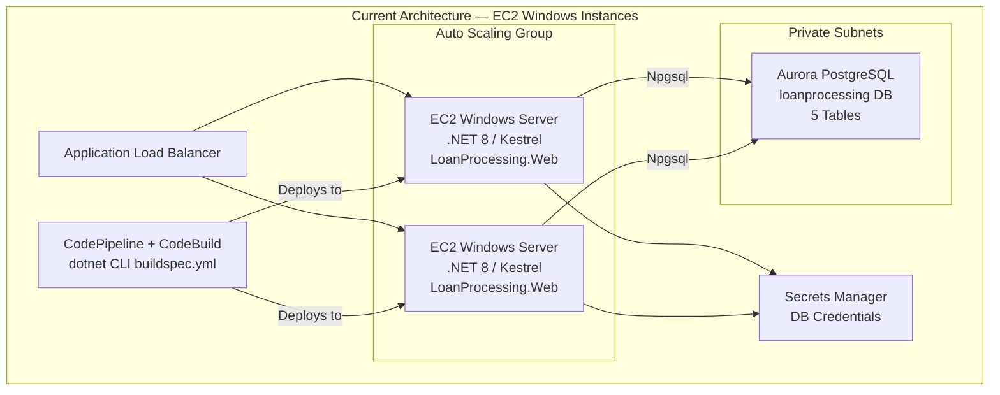
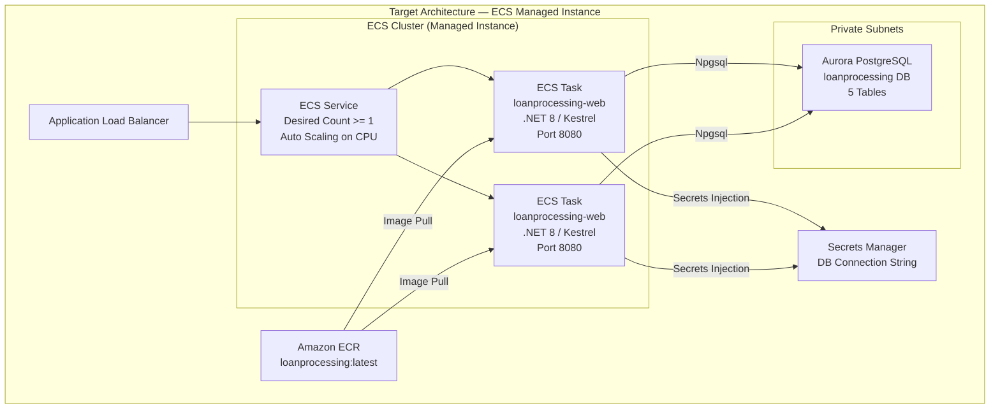
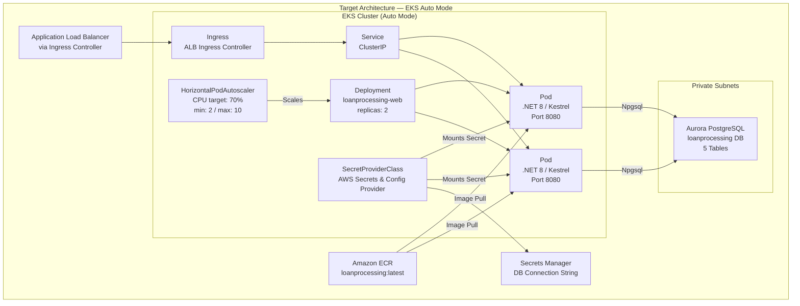

# Module 3: Compute Modernization

## 1. Overview

### What You Will Accomplish

In this module, you will containerize the modernized .NET 8 LoanProcessing application and deploy it to a container-based compute platform on AWS. You will create a Dockerfile, build and test the container image locally, push it to Amazon Elastic Container Registry (ECR), and then deploy the containerized application using one of two paths: Amazon ECS with Managed Instance capacity or Amazon EKS with Auto Mode. By the end of this module, the application will run as a Linux container behind the existing Application Load Balancer, replacing the EC2 Windows instances.

### Estimated Time

90 minutes (containerization + one deployment path)
120 minutes (containerization + both deployment paths)

### Key AWS Services Used

- Amazon Elastic Container Registry (ECR)
- Amazon Elastic Container Service (ECS)
- Amazon Elastic Kubernetes Service (EKS)
- Docker
- AWS Secrets Manager

---

## 2. Prerequisites

### Required AWS Services and IAM Permissions

| AWS Service | Required IAM Actions |
|---|---|
| Amazon ECR | `ecr:CreateRepository`, `ecr:DescribeRepositories`, `ecr:GetAuthorizationToken`, `ecr:BatchCheckLayerAvailability`, `ecr:PutImage`, `ecr:InitiateLayerUpload`, `ecr:UploadLayerPart`, `ecr:CompleteLayerUpload`, `ecr:BatchDeleteImage`, `ecr:DeleteRepository` |
| Amazon ECS | `ecs:CreateCluster`, `ecs:DescribeClusters`, `ecs:DeleteCluster`, `ecs:RegisterTaskDefinition`, `ecs:DeregisterTaskDefinition`, `ecs:CreateService`, `ecs:UpdateService`, `ecs:DeleteService`, `ecs:DescribeServices`, `ecs:DescribeTasks`, `ecs:ListTasks` |
| Amazon EKS | `eks:CreateCluster`, `eks:DescribeCluster`, `eks:DeleteCluster`, `eks:CreateNodegroup`, `eks:DeleteNodegroup`, `eks:DescribeNodegroup`, `eks:ListClusters`, `eks:TagResource` |
| Elastic Load Balancing | `elasticloadbalancing:DescribeLoadBalancers`, `elasticloadbalancing:DescribeTargetGroups`, `elasticloadbalancing:RegisterTargets`, `elasticloadbalancing:DeregisterTargets`, `elasticloadbalancing:CreateTargetGroup`, `elasticloadbalancing:DeleteTargetGroup`, `elasticloadbalancing:ModifyListener` |
| AWS Secrets Manager | `secretsmanager:GetSecretValue`, `secretsmanager:DescribeSecret`, `secretsmanager:CreateSecret` |
| Amazon EC2 / Auto Scaling | `ec2:DescribeInstances`, `ec2:DescribeSecurityGroups`, `ec2:DescribeSubnets`, `ec2:DescribeVpcs`, `autoscaling:DescribeAutoScalingGroups`, `autoscaling:UpdateAutoScalingGroup`, `autoscaling:DeleteAutoScalingGroup`, `ec2:DeleteLaunchTemplate` |
| Application Auto Scaling (ECS) | `application-autoscaling:RegisterScalableTarget`, `application-autoscaling:PutScalingPolicy`, `application-autoscaling:DescribeScalableTargets`, `application-autoscaling:DeregisterScalableTarget`, `application-autoscaling:DeleteScalingPolicy` |
| IAM (service roles) | `iam:CreateRole`, `iam:AttachRolePolicy`, `iam:PassRole`, `iam:GetRole`, `iam:DeleteRole`, `iam:DetachRolePolicy`, `iam:CreateServiceLinkedRole` |

**Summary IAM policy actions:** `ecr:*`, `ecs:*`, `eks:*`, `elasticloadbalancing:*`, `secretsmanager:*`, `application-autoscaling:*`, `iam:CreateRole`, `iam:AttachRolePolicy`, `iam:PassRole`, and read access to `ec2:Describe*`, `autoscaling:Describe*` for VPC/subnet/security group and ASG lookups.

### Required Tools and Versions

| Tool | Version |
|---|---|
| Docker | >= 24.0 |
| AWS CLI | >= 2.15 |
| kubectl | >= 1.28 |
| eksctl | >= 0.167 |
| .NET SDK | >= 8.0 (for local build verification) |
| Git | >= 2.40 |

### Expected Starting State

You have completed Module 2 (Application Stack Modernization) and the following infrastructure and application state is in place:

- The LoanProcessing application has been modernized to .NET 8 LTS with ASP.NET Core MVC, Entity Framework Core, and the Npgsql provider
- The application runs on the Kestrel web server (verified with `dotnet run` in Module 2)
- Aurora PostgreSQL cluster is running and accessible with the `loanprocessing` database containing all five tables with migrated data
- The application connection string uses the Npgsql format pointing to Aurora PostgreSQL
- All application pages (Home, Customers, Loans, Reports, Interest Rates) render correctly
- The CI/CD pipeline (buildspec.yml) has been updated to use `dotnet` CLI commands
- EC2 Windows instances in an Auto Scaling Group behind the Application Load Balancer are still serving the application

```bash
# Verification command — run this to confirm readiness
# 1. Verify the .NET 8 application builds successfully
dotnet build LoanProcessing.Web/LoanProcessing.Web.csproj
```

Expected: Build output showing `Build succeeded` with zero errors and zero warnings targeting `net8.0`.

```bash
# 2. Verify Aurora PostgreSQL is available
aws rds describe-db-clusters \
    --region us-east-1 \
    --profile workshop \
    --output table \
    --db-cluster-identifier loanprocessing-aurora-pg \
    --query "DBClusters[0].[DBClusterIdentifier,Status,Endpoint,EngineVersion]"
```

Expected: A table showing `loanprocessing-aurora-pg` with status `available`, the cluster endpoint, and engine version `16.4`.

```bash
# 3. Verify the EC2 Auto Scaling Group is still running (this is what you will replace)
aws autoscaling describe-auto-scaling-groups \
    --region us-east-1 \
    --profile workshop \
    --output table \
    --query "AutoScalingGroups[?contains(AutoScalingGroupName, 'loanprocessing')].[AutoScalingGroupName,DesiredCapacity,Instances[0].InstanceId]"
```

Expected: A table showing the LoanProcessing Auto Scaling Group with at least one running instance.

```bash
# 4. Verify Docker is installed and running
docker --version
docker info --format '{{.ServerVersion}}'
```

Expected: Docker version >= 24.0 and a running Docker daemon.

---

## 3. Architecture Diagram

### Before



### After (ECS Managed Instance Path)



### After (EKS Auto Mode Path)




---

## 4. Step-by-Step Instructions

### Step 3a: Containerization and ECR Push (Shared Steps)

These steps are shared between the ECS Managed Instance and EKS Auto Mode deployment paths. You will create a Dockerfile for the modernized .NET 8 application, build and test the container image locally, store the database connection string in AWS Secrets Manager, and push the image to Amazon Elastic Container Registry (ECR).

#### 3a.1 — Create the Dockerfile

Create a multi-stage Dockerfile in the repository root. The first stage uses the .NET SDK image to restore, build, and publish the application. The second stage uses the smaller ASP.NET runtime image to run it. The container listens on port 8080.

> **🤖 Kiro Prompt:** Ask Kiro to generate the Dockerfile:
> ```
> Create a multi-stage Dockerfile in the repository root for the LoanProcessing.Web
> .NET 8 application. Use mcr.microsoft.com/dotnet/sdk:8.0 for the build stage and
> mcr.microsoft.com/dotnet/aspnet:8.0 for the runtime stage. Copy the .csproj first
> and run dotnet restore, then copy the rest of the source and run dotnet publish.
> Expose port 8080 and set the entrypoint to dotnet LoanProcessing.Web.dll.
> ```
>
> **Classification: Kiro-assisted generation** — Kiro can generate the full Dockerfile. Review the COPY paths and WORKDIR values against your project structure before proceeding.

Create the file `Dockerfile` in the repository root with the following content:

```dockerfile
# Stage 1: Build
FROM mcr.microsoft.com/dotnet/sdk:8.0 AS build
WORKDIR /src
COPY ["LoanProcessing.Web/LoanProcessing.Web.csproj", "LoanProcessing.Web/"]
RUN dotnet restore "LoanProcessing.Web/LoanProcessing.Web.csproj"
COPY . .
WORKDIR "/src/LoanProcessing.Web"
RUN dotnet publish -c Release -o /app/publish

# Stage 2: Runtime
FROM mcr.microsoft.com/dotnet/aspnet:8.0 AS final
WORKDIR /app
EXPOSE 8080
ENV ASPNETCORE_URLS=http://+:8080
COPY --from=build /app/publish .
ENTRYPOINT ["dotnet", "LoanProcessing.Web.dll"]
```

> **⚠️ Manual Review Required:** Verify the `.csproj` path matches your project structure. If your solution has additional project references (e.g., a shared library), add corresponding `COPY` and `restore` lines for each referenced project before the full `COPY . .` step.

Create a `.dockerignore` file in the repository root to keep the build context small:

```
**/.git
**/.vs
**/bin
**/obj
**/node_modules
**/.terraform
**/terraform.tfstate*
aws-deployment/
LoanProcessing.Database/
database/
docs/
```

#### 3a.2 — Build the Container Image Locally

Build the Docker image from the repository root. Tag it as `loanprocessing:latest`:

```bash
docker build -t loanprocessing:latest .
```

Expected output (final lines):

```
 => [final 3/3] COPY --from=build /app/publish .
 => exporting to image
 => => naming to docker.io/library/loanprocessing:latest
```

The build should complete in 1–3 minutes depending on your machine and network speed (the SDK image is ~800 MB on first pull).

> **✅ Validation Step:** Confirm the image was created:
> ```bash
> docker images loanprocessing:latest
> ```
> Expected: A single row showing `loanprocessing` with tag `latest` and a size of approximately 220–280 MB (the ASP.NET runtime base image plus your published application).

> **🔧 Troubleshooting:** If the build fails at the `dotnet restore` step with package resolution errors, verify that your `.csproj` file uses `PackageReference` format (completed in Module 2) and that your Docker daemon has internet access to reach `nuget.org`. If you are behind a corporate proxy, configure Docker's proxy settings in `~/.docker/config.json`.

#### 3a.3 — Test the Container Locally with an Environment Variable Connection String

Run the container locally, passing the Aurora PostgreSQL connection string as an environment variable. ASP.NET Core automatically maps environment variables with double-underscore (`__`) separators to the configuration hierarchy, so `ConnectionStrings__LoanProcessingConnection` maps to `ConnectionStrings:LoanProcessingConnection` in `appsettings.json`.

```bash
docker run -d \
    --name loanprocessing-test \
    -p 8080:8080 \
    -e "ConnectionStrings__LoanProcessingConnection=Host=<aurora-endpoint>;Database=loanprocessing;Username=postgres;Password=WorkshopPassword123!;SSL Mode=Require" \
    loanprocessing:latest
```

Replace `<aurora-endpoint>` with your Aurora PostgreSQL cluster endpoint from Module 1. Retrieve it if needed:

```bash
aws rds describe-db-clusters \
    --region us-east-1 \
    --profile workshop \
    --output text \
    --db-cluster-identifier loanprocessing-aurora-pg \
    --query "DBClusters[0].Endpoint"
```

Wait a few seconds for the application to start, then check the container logs:

```bash
docker logs loanprocessing-test
```

Expected output (key lines):

```
info: Microsoft.Hosting.Lifetime[14]
      Now listening on: http://[::]:8080
info: Microsoft.Hosting.Lifetime[0]
      Application started. Press Ctrl+C to shut down.
```

> **🔧 Troubleshooting:** If the container exits immediately, check the logs with `docker logs loanprocessing-test`. Common issues:
> - `Unhandled exception. Npgsql.NpgsqlException: Failed to connect` — The container cannot reach Aurora PostgreSQL. If running on your local machine, ensure your IP is allowed in the Aurora security group or use an SSH tunnel through your EC2 instance.
> - `System.InvalidOperationException: The ConnectionString property has not been initialized` — The environment variable name is incorrect. Verify you used double underscores: `ConnectionStrings__LoanProcessingConnection` (not single underscores or colons).
> - Port conflict — If port 8080 is already in use, map to a different host port: `-p 9090:8080` and adjust the URLs below accordingly.

#### 3a.4 — Verify All Application Pages from the Container

Open a browser or use `curl` to verify each page renders correctly from the containerized application:

```bash
# Home page
curl -s -o /dev/null -w "%{http_code}" http://localhost:8080/

# Customers page
curl -s -o /dev/null -w "%{http_code}" http://localhost:8080/Customers

# Loans page
curl -s -o /dev/null -w "%{http_code}" http://localhost:8080/LoanApplications

# Reports page
curl -s -o /dev/null -w "%{http_code}" http://localhost:8080/Reports

# Interest Rates page
curl -s -o /dev/null -w "%{http_code}" http://localhost:8080/InterestRates
```

Each command should return `200`.

> **✅ Validation Step:** All five pages return HTTP 200. Open `http://localhost:8080` in a browser and navigate to each page to confirm data from Aurora PostgreSQL is displayed correctly:
>
> | Page | URL | Expected Content |
> |---|---|---|
> | Home | `http://localhost:8080/` | Welcome page renders |
> | Customers | `http://localhost:8080/Customers` | Customer list with data from Aurora PostgreSQL |
> | Loans | `http://localhost:8080/LoanApplications` | Loan application list displays |
> | Reports | `http://localhost:8080/Reports` | Portfolio report renders with aggregated data |
> | Interest Rates | `http://localhost:8080/InterestRates` | Interest rate table displays all rate tiers |

Stop and remove the test container after verification:

```bash
docker stop loanprocessing-test
docker rm loanprocessing-test
```

#### 3a.5 — Store the Connection String in AWS Secrets Manager

Store the Aurora PostgreSQL connection string in Secrets Manager so that ECS tasks and EKS pods can retrieve it securely at runtime instead of embedding it in configuration files or environment variable definitions.

```bash
aws secretsmanager create-secret \
    --region us-east-1 \
    --profile workshop \
    --output json \
    --name loanprocessing-db-connection \
    --description "Aurora PostgreSQL connection string for LoanProcessing application" \
    --secret-string "Host=<aurora-endpoint>;Database=loanprocessing;Username=postgres;Password=WorkshopPassword123!;SSL Mode=Require"
```

Replace `<aurora-endpoint>` with your Aurora cluster endpoint.

Expected output:

```json
{
    "ARN": "arn:aws:secretsmanager:us-east-1:123456789012:secret:loanprocessing-db-connection-AbCdEf",
    "Name": "loanprocessing-db-connection",
    "VersionId": "a1b2c3d4-e5f6-7890-abcd-ef1234567890"
}
```

Save the secret ARN — you will need it when configuring the ECS task definition or EKS SecretProviderClass:

```bash
export SECRET_ARN=$(aws secretsmanager describe-secret \
    --region us-east-1 \
    --profile workshop \
    --output text \
    --secret-id loanprocessing-db-connection \
    --query "ARN")
echo $SECRET_ARN
```

> **✅ Validation Step:** Verify the secret was created and contains the correct value:
> ```bash
> aws secretsmanager get-secret-value \
>     --region us-east-1 \
>     --profile workshop \
>     --output text \
>     --secret-id loanprocessing-db-connection \
>     --query "SecretString"
> ```
> Expected: The connection string you stored, starting with `Host=` and ending with `SSL Mode=Require`.

> **🔧 Troubleshooting:** If you receive `ResourceExistsException`, a secret with this name already exists. Either delete it first with `aws secretsmanager delete-secret --region us-east-1 --profile workshop --secret-id loanprocessing-db-connection --force-delete-without-recovery` and recreate, or update the existing secret with `aws secretsmanager update-secret --region us-east-1 --profile workshop --secret-id loanprocessing-db-connection --secret-string "<new-value>"`.

#### 3a.6 — Create an ECR Repository

Create an Amazon ECR private repository to store the container image:

```bash
aws ecr create-repository \
    --region us-east-1 \
    --profile workshop \
    --output json \
    --repository-name loanprocessing \
    --image-scanning-configuration scanOnPush=true \
    --encryption-configuration encryptionType=AES256
```

Expected output:

```json
{
    "repository": {
        "repositoryArn": "arn:aws:ecr:us-east-1:123456789012:repository/loanprocessing",
        "registryId": "123456789012",
        "repositoryName": "loanprocessing",
        "repositoryUri": "123456789012.dkr.ecr.us-east-1.amazonaws.com/loanprocessing",
        "createdAt": "2024-01-15T10:30:00+00:00",
        "imageTagMutability": "MUTABLE",
        "imageScanningConfiguration": {
            "scanOnPush": true
        },
        "encryptionConfiguration": {
            "encryptionType": "AES256"
        }
    }
}
```

Save the repository URI for tagging and pushing:

```bash
export ECR_REPO_URI=$(aws ecr describe-repositories \
    --region us-east-1 \
    --profile workshop \
    --output text \
    --repository-names loanprocessing \
    --query "repositories[0].repositoryUri")
echo $ECR_REPO_URI
```

> **Console alternative:** Open the Amazon ECR console → Repositories → Create repository. Set the repository name to `loanprocessing`, enable scan on push, and use AES256 encryption.

#### 3a.7 — Authenticate Docker to ECR

Retrieve an authentication token from ECR and log in your Docker client. The token is valid for 12 hours:

```bash
aws ecr get-login-password \
    --region us-east-1 \
    --profile workshop \
| docker login \
    --username AWS \
    --password-stdin \
    "$ECR_REPO_URI"
```

Expected output:

```
Login Succeeded
```

> **🔧 Troubleshooting:** If you receive `Error saving credentials: error storing credentials`, your Docker credential helper may be misconfigured. Try running the full command on one line, or set `"credsStore": ""` in `~/.docker/config.json` to use the default file-based credential store. If you receive `AccessDeniedException`, verify your IAM user/role has the `ecr:GetAuthorizationToken` permission.

#### 3a.8 — Tag and Push the Image to ECR

Tag the local image with the ECR repository URI and push it:

```bash
# Tag the image
docker tag loanprocessing:latest "$ECR_REPO_URI:latest"

# Push the image
docker push "$ECR_REPO_URI:latest"
```

Expected output (final lines):

```
latest: digest: sha256:abc123... size: 1234
```

The push uploads each layer individually. The first push takes 1–3 minutes depending on your upload bandwidth. Subsequent pushes are faster because unchanged layers are cached.

> **✅ Validation Step:** Verify the image is in ECR:
> ```bash
> aws ecr describe-images \
>     --region us-east-1 \
>     --profile workshop \
>     --output table \
>     --repository-name loanprocessing \
>     --query "imageDetails[*].[imageTags[0],imageSizeInBytes,imagePushedAt]"
> ```
> Expected: A table showing the `latest` tag, the image size (approximately 100–150 MB compressed), and the push timestamp.

> **🔧 Troubleshooting:** If the push fails with `denied: Your authorization token has expired`, re-run the authentication command from Step 3a.7. ECR tokens expire after 12 hours. If you receive `name unknown: The repository with name 'loanprocessing' does not exist`, verify the repository was created in the correct region (`us-east-1`) and that the `ECR_REPO_URI` variable is set correctly.

---

You now have a tested container image in ECR and a connection string stored in Secrets Manager. Continue with either **Step 3b (ECS Managed Instance path)** or **Step 3c (EKS Auto Mode path)** to deploy the containerized application.


### Step 3b: Deploy to ECS Managed Instance

In this path, you will create an Amazon ECS cluster with managed instance capacity, register a task definition that pulls the container image from ECR and injects the Aurora PostgreSQL connection string from Secrets Manager, deploy the application as an ECS service behind the existing Application Load Balancer, configure auto-scaling, and decommission the legacy EC2 Auto Scaling Group.

#### 3b.1 — Capture Environment Variables

Before creating ECS resources, capture the VPC, subnet, security group, and ALB identifiers you will need throughout this section. These values come from the existing infrastructure provisioned in earlier modules.

```bash
# Get the VPC ID
export VPC_ID=$(aws ec2 describe-vpcs \
    --region us-east-1 \
    --profile workshop \
    --output text \
    --filters "Name=tag:Name,Values=*loanprocessing*" \
    --query "Vpcs[0].VpcId")
echo "VPC_ID=$VPC_ID"
```

Expected output: A VPC ID such as `vpc-0abc123def456789a`.

```bash
# Get the private subnet IDs (comma-separated for later use)
export PRIVATE_SUBNETS=$(aws ec2 describe-subnets \
    --region us-east-1 \
    --profile workshop \
    --output text \
    --filters "Name=vpc-id,Values=$VPC_ID" "Name=tag:Name,Values=*private*" \
    --query "Subnets[*].SubnetId" | tr '\t' ',')
echo "PRIVATE_SUBNETS=$PRIVATE_SUBNETS"
```

Expected output: Two or more subnet IDs separated by commas, e.g., `subnet-0aaa111bbb222ccc3,subnet-0ddd444eee555fff6`.

```bash
# Get the application security group ID
export APP_SG=$(aws ec2 describe-security-groups \
    --region us-east-1 \
    --profile workshop \
    --output text \
    --filters "Name=vpc-id,Values=$VPC_ID" "Name=group-name,Values=*loanprocessing*app*" \
    --query "SecurityGroups[0].GroupId")
echo "APP_SG=$APP_SG"
```

Expected output: A security group ID such as `sg-0abc123def456789a`.

```bash
# Get the ALB ARN and DNS name
export ALB_ARN=$(aws elbv2 describe-load-balancers \
    --region us-east-1 \
    --profile workshop \
    --output text \
    --query "LoadBalancers[?contains(LoadBalancerName, 'loanprocessing')].LoadBalancerArn | [0]")
export ALB_DNS=$(aws elbv2 describe-load-balancers \
    --region us-east-1 \
    --profile workshop \
    --output text \
    --query "LoadBalancers[?contains(LoadBalancerName, 'loanprocessing')].DNSName | [0]")
echo "ALB_ARN=$ALB_ARN"
echo "ALB_DNS=$ALB_DNS"
```

Expected output: An ALB ARN (e.g., `arn:aws:elasticloadbalancing:us-east-1:123456789012:loadbalancer/app/loanprocessing-alb/abc123`) and a DNS name (e.g., `loanprocessing-alb-123456789.us-east-1.elb.amazonaws.com`).

```bash
# Get the ALB listener ARN (HTTP on port 80)
export LISTENER_ARN=$(aws elbv2 describe-listeners \
    --region us-east-1 \
    --profile workshop \
    --output text \
    --load-balancer-arn "$ALB_ARN" \
    --query "Listeners[?Port==\`80\`].ListenerArn | [0]")
echo "LISTENER_ARN=$LISTENER_ARN"
```

Expected output: A listener ARN such as `arn:aws:elasticloadbalancing:us-east-1:123456789012:listener/app/loanprocessing-alb/abc123/def456`.

```bash
# Get your AWS account ID
export ACCOUNT_ID=$(aws sts get-caller-identity \
    --region us-east-1 \
    --profile workshop \
    --output text \
    --query "Account")
echo "ACCOUNT_ID=$ACCOUNT_ID"
```

Expected output: A 12-digit AWS account ID such as `123456789012`.

> **✅ Validation Step:** Confirm all environment variables are set:
> ```bash
> echo "VPC_ID=$VPC_ID"
> echo "PRIVATE_SUBNETS=$PRIVATE_SUBNETS"
> echo "APP_SG=$APP_SG"
> echo "ALB_ARN=$ALB_ARN"
> echo "ALB_DNS=$ALB_DNS"
> echo "LISTENER_ARN=$LISTENER_ARN"
> echo "ACCOUNT_ID=$ACCOUNT_ID"
> echo "ECR_REPO_URI=$ECR_REPO_URI"
> echo "SECRET_ARN=$SECRET_ARN"
> ```
> Expected: All nine variables display non-empty values. If any variable is empty, re-run the corresponding command above and check the filter values match your resource naming convention.

#### 3b.2 — Create the ECS Cluster with Managed Instance Capacity Provider

Create an ECS cluster that uses the default managed instance capacity provider. ECS manages the underlying EC2 instances automatically, scaling them based on the tasks you deploy.

```bash
aws ecs create-cluster \
    --region us-east-1 \
    --profile workshop \
    --output json \
    --cluster-name loanprocessing-ecs \
    --capacity-providers FARGATE FARGATE_SPOT \
    --default-capacity-provider-strategy capacityProvider=FARGATE,weight=1,base=1 \
    --settings name=containerInsights,value=enabled
```

Expected output:

```json
{
    "cluster": {
        "clusterArn": "arn:aws:ecs:us-east-1:123456789012:cluster/loanprocessing-ecs",
        "clusterName": "loanprocessing-ecs",
        "status": "ACTIVE",
        "registeredContainerInstancesCount": 0,
        "runningTasksCount": 0,
        "pendingTasksCount": 0,
        "activeServicesCount": 0,
        "capacityProviders": [
            "FARGATE",
            "FARGATE_SPOT"
        ],
        "defaultCapacityProviderStrategy": [
            {
                "capacityProvider": "FARGATE",
                "weight": 1,
                "base": 1
            }
        ],
        "settings": [
            {
                "name": "containerInsights",
                "value": "enabled"
            }
        ]
    }
}
```

> **✅ Validation Step:** Verify the cluster is active:
> ```bash
> aws ecs describe-clusters \
>     --region us-east-1 \
>     --profile workshop \
>     --output table \
>     --clusters loanprocessing-ecs \
>     --query "clusters[0].[clusterName,status,activeServicesCount,runningTasksCount]"
> ```
> Expected: A table showing `loanprocessing-ecs` with status `ACTIVE`, 0 active services, and 0 running tasks.

> **🔧 Troubleshooting:** If you receive `ClusterAlreadyExistsException`, a cluster with this name already exists. Either use the existing cluster or delete it first with `aws ecs delete-cluster --region us-east-1 --profile workshop --cluster loanprocessing-ecs` and recreate. If you receive `InvalidParameterException` related to capacity providers, verify your account has the ECS service-linked role by running `aws iam create-service-linked-role --aws-service-name ecs.amazonaws.com --region us-east-1 --profile workshop` (ignore the error if it already exists).

#### 3b.3 — Create the ECS Task Execution IAM Role

The task execution role allows ECS to pull the container image from ECR and retrieve the connection string from Secrets Manager on behalf of your tasks.

Create the trust policy document:

```bash
cat > ecs-task-execution-trust-policy.json << 'EOF'
{
    "Version": "2012-10-17",
    "Statement": [
        {
            "Effect": "Allow",
            "Principal": {
                "Service": "ecs-tasks.amazonaws.com"
            },
            "Action": "sts:AssumeRole"
        }
    ]
}
EOF
```

Create the IAM role:

```bash
aws iam create-role \
    --region us-east-1 \
    --profile workshop \
    --output json \
    --role-name loanprocessing-ecs-task-execution-role \
    --assume-role-policy-document file://ecs-task-execution-trust-policy.json \
    --description "ECS task execution role for LoanProcessing — allows ECR pull and Secrets Manager access"
```

Expected output:

```json
{
    "Role": {
        "Path": "/",
        "RoleName": "loanprocessing-ecs-task-execution-role",
        "RoleId": "...",
        "Arn": "arn:aws:iam::123456789012:role/loanprocessing-ecs-task-execution-role",
        "CreateDate": "2024-01-15T12:00:00+00:00",
        "AssumeRolePolicyDocument": {
            "Version": "2012-10-17",
            "Statement": [
                {
                    "Effect": "Allow",
                    "Principal": {
                        "Service": "ecs-tasks.amazonaws.com"
                    },
                    "Action": "sts:AssumeRole"
                }
            ]
        }
    }
}
```

Attach the managed policy for ECR image pull access:

```bash
aws iam attach-role-policy \
    --region us-east-1 \
    --profile workshop \
    --role-name loanprocessing-ecs-task-execution-role \
    --policy-arn arn:aws:iam::aws:policy/service-role/AmazonECSTaskExecutionRolePolicy
```

Expected output: No output (exit code 0 indicates success).

Create and attach an inline policy for Secrets Manager access:

```bash
cat > ecs-secrets-policy.json << EOF
{
    "Version": "2012-10-17",
    "Statement": [
        {
            "Effect": "Allow",
            "Action": [
                "secretsmanager:GetSecretValue"
            ],
            "Resource": "$SECRET_ARN"
        }
    ]
}
EOF

aws iam put-role-policy \
    --region us-east-1 \
    --profile workshop \
    --role-name loanprocessing-ecs-task-execution-role \
    --policy-name LoanProcessingSecretsAccess \
    --policy-document file://ecs-secrets-policy.json
```

Expected output: No output (exit code 0 indicates success).

> **✅ Validation Step:** Verify the role exists and has both policies attached:
> ```bash
> aws iam list-attached-role-policies \
>     --region us-east-1 \
>     --profile workshop \
>     --output table \
>     --role-name loanprocessing-ecs-task-execution-role
> ```
> Expected: A table showing `AmazonECSTaskExecutionRolePolicy` attached to the role.
>
> ```bash
> aws iam list-role-policies \
>     --region us-east-1 \
>     --profile workshop \
>     --output table \
>     --role-name loanprocessing-ecs-task-execution-role
> ```
> Expected: A table showing `LoanProcessingSecretsAccess` as an inline policy.

> **🔧 Troubleshooting:** If you receive `EntityAlreadyExists` when creating the role, the role already exists from a previous attempt. Either use it as-is (verify the policies are attached) or delete it first with `aws iam detach-role-policy --region us-east-1 --profile workshop --role-name loanprocessing-ecs-task-execution-role --policy-arn arn:aws:iam::aws:policy/service-role/AmazonECSTaskExecutionRolePolicy && aws iam delete-role-policy --region us-east-1 --profile workshop --role-name loanprocessing-ecs-task-execution-role --policy-name LoanProcessingSecretsAccess && aws iam delete-role --region us-east-1 --profile workshop --role-name loanprocessing-ecs-task-execution-role` and recreate.

#### 3b.4 — Register the ECS Task Definition

Create the task definition JSON file. This definition uses `awsvpc` network mode, allocates 512 CPU units (0.5 vCPU) and 1024 MiB of memory, and injects the Aurora PostgreSQL connection string from Secrets Manager as an environment variable.

```bash
cat > ecs-task-definition.json << EOF
{
    "family": "loanprocessing",
    "networkMode": "awsvpc",
    "requiresCompatibilities": ["FARGATE"],
    "cpu": "512",
    "memory": "1024",
    "executionRoleArn": "arn:aws:iam::${ACCOUNT_ID}:role/loanprocessing-ecs-task-execution-role",
    "containerDefinitions": [
        {
            "name": "loanprocessing-web",
            "image": "${ECR_REPO_URI}:latest",
            "essential": true,
            "portMappings": [
                {
                    "containerPort": 8080,
                    "protocol": "tcp"
                }
            ],
            "secrets": [
                {
                    "name": "ConnectionStrings__LoanProcessingConnection",
                    "valueFrom": "${SECRET_ARN}"
                }
            ],
            "logConfiguration": {
                "logDriver": "awslogs",
                "options": {
                    "awslogs-group": "/ecs/loanprocessing",
                    "awslogs-region": "us-east-1",
                    "awslogs-stream-prefix": "web",
                    "awslogs-create-group": "true"
                }
            },
            "healthCheck": {
                "command": ["CMD-SHELL", "curl -f http://localhost:8080/ || exit 1"],
                "interval": 30,
                "timeout": 5,
                "retries": 3,
                "startPeriod": 60
            }
        }
    ]
}
EOF
```

> **⚠️ Manual Review Required:** Before registering the task definition, open `ecs-task-definition.json` and verify:
> - The `image` field contains your ECR repository URI (the `$ECR_REPO_URI` variable should have been expanded)
> - The `valueFrom` field in `secrets` contains your Secrets Manager ARN (the `$SECRET_ARN` variable should have been expanded)
> - The `executionRoleArn` contains your account ID (the `$ACCOUNT_ID` variable should have been expanded)
>
> If the variables were not expanded (you see literal `${...}` text), use `envsubst` or manually replace them.

Register the task definition:

```bash
aws ecs register-task-definition \
    --region us-east-1 \
    --profile workshop \
    --output json \
    --cli-input-json file://ecs-task-definition.json
```

Expected output:

```json
{
    "taskDefinition": {
        "taskDefinitionArn": "arn:aws:ecs:us-east-1:123456789012:task-definition/loanprocessing:1",
        "family": "loanprocessing",
        "revision": 1,
        "status": "ACTIVE",
        "networkMode": "awsvpc",
        "cpu": "512",
        "memory": "1024",
        "containerDefinitions": [
            {
                "name": "loanprocessing-web",
                "image": "123456789012.dkr.ecr.us-east-1.amazonaws.com/loanprocessing:latest",
                "portMappings": [
                    {
                        "containerPort": 8080,
                        "protocol": "tcp"
                    }
                ],
                "secrets": [
                    {
                        "name": "ConnectionStrings__LoanProcessingConnection",
                        "valueFrom": "arn:aws:secretsmanager:us-east-1:123456789012:secret:loanprocessing-db-connection-AbCdEf"
                    }
                ]
            }
        ]
    }
}
```

> **✅ Validation Step:** Verify the task definition is registered:
> ```bash
> aws ecs describe-task-definition \
>     --region us-east-1 \
>     --profile workshop \
>     --output table \
>     --task-definition loanprocessing \
>     --query "taskDefinition.[family,revision,status,cpu,memory]"
> ```
> Expected: A table showing `loanprocessing`, revision `1`, status `ACTIVE`, CPU `512`, and memory `1024`.

> **🔧 Troubleshooting:** If you receive `ClientException: No Fargate configuration exists for given values` when tasks launch later, verify the CPU/memory combination is valid. For Fargate, 512 CPU supports 1024, 2048, 3072, or 4096 MiB memory. If you receive `InvalidParameterException` about the execution role, verify the role ARN is correct and the role has the `ecs-tasks.amazonaws.com` trust policy.

#### 3b.5 — Create an ALB Target Group for ECS

Create a new target group that the ECS service will register its tasks into. The target type must be `ip` because ECS tasks using `awsvpc` network mode register by IP address, not by instance ID.

```bash
aws elbv2 create-target-group \
    --region us-east-1 \
    --profile workshop \
    --output json \
    --name loanprocessing-ecs-tg \
    --protocol HTTP \
    --port 8080 \
    --vpc-id "$VPC_ID" \
    --target-type ip \
    --health-check-protocol HTTP \
    --health-check-path "/" \
    --health-check-interval-seconds 30 \
    --health-check-timeout-seconds 5 \
    --healthy-threshold-count 2 \
    --unhealthy-threshold-count 3 \
    --matcher HttpCode=200
```

Expected output:

```json
{
    "TargetGroups": [
        {
            "TargetGroupArn": "arn:aws:elasticloadbalancing:us-east-1:123456789012:targetgroup/loanprocessing-ecs-tg/abc123def456",
            "TargetGroupName": "loanprocessing-ecs-tg",
            "Protocol": "HTTP",
            "Port": 8080,
            "VpcId": "vpc-0abc123def456789a",
            "HealthCheckProtocol": "HTTP",
            "HealthCheckPort": "traffic-port",
            "HealthCheckEnabled": true,
            "HealthCheckIntervalSeconds": 30,
            "HealthCheckTimeoutSeconds": 5,
            "HealthyThresholdCount": 2,
            "UnhealthyThresholdCount": 3,
            "HealthCheckPath": "/",
            "Matcher": {
                "HttpCode": "200"
            },
            "TargetType": "ip"
        }
    ]
}
```

Save the target group ARN:

```bash
export ECS_TG_ARN=$(aws elbv2 describe-target-groups \
    --region us-east-1 \
    --profile workshop \
    --output text \
    --names loanprocessing-ecs-tg \
    --query "TargetGroups[0].TargetGroupArn")
echo "ECS_TG_ARN=$ECS_TG_ARN"
```

Expected output: A target group ARN such as `arn:aws:elasticloadbalancing:us-east-1:123456789012:targetgroup/loanprocessing-ecs-tg/abc123def456`.

Update the ALB listener to forward traffic to the new ECS target group. This replaces the existing EC2-based target group as the default action:

```bash
aws elbv2 modify-listener \
    --region us-east-1 \
    --profile workshop \
    --output json \
    --listener-arn "$LISTENER_ARN" \
    --default-actions Type=forward,TargetGroupArn="$ECS_TG_ARN"
```

Expected output:

```json
{
    "Listeners": [
        {
            "ListenerArn": "arn:aws:elasticloadbalancing:us-east-1:123456789012:listener/app/loanprocessing-alb/abc123/def456",
            "LoadBalancerArn": "arn:aws:elasticloadbalancing:us-east-1:123456789012:loadbalancer/app/loanprocessing-alb/abc123",
            "Port": 80,
            "Protocol": "HTTP",
            "DefaultActions": [
                {
                    "Type": "forward",
                    "TargetGroupArn": "arn:aws:elasticloadbalancing:us-east-1:123456789012:targetgroup/loanprocessing-ecs-tg/abc123def456"
                }
            ]
        }
    ]
}
```

> **⚠️ Manual Review Required:** After modifying the listener, the ALB will start routing traffic to the ECS target group. Since no ECS tasks are running yet, the ALB will return HTTP 503 until the ECS service is created and tasks pass health checks in the next step. This is expected — do not revert the listener change.

#### 3b.6 — Create the ECS Service Behind the ALB

Create an ECS service that runs the task definition behind the ALB. The service maintains a desired count of at least 1 task and automatically registers task IPs with the target group.

```bash
aws ecs create-service \
    --region us-east-1 \
    --profile workshop \
    --output json \
    --cluster loanprocessing-ecs \
    --service-name loanprocessing-web \
    --task-definition loanprocessing \
    --desired-count 2 \
    --launch-type FARGATE \
    --platform-version LATEST \
    --network-configuration "awsvpcConfiguration={subnets=[$PRIVATE_SUBNETS],securityGroups=[$APP_SG],assignPublicIp=DISABLED}" \
    --load-balancers "targetGroupArn=$ECS_TG_ARN,containerName=loanprocessing-web,containerPort=8080" \
    --health-check-grace-period-seconds 120 \
    --scheduling-strategy REPLICA \
    --deployment-configuration "maximumPercent=200,minimumHealthyPercent=100"
```

Expected output:

```json
{
    "service": {
        "serviceArn": "arn:aws:ecs:us-east-1:123456789012:service/loanprocessing-ecs/loanprocessing-web",
        "serviceName": "loanprocessing-web",
        "clusterArn": "arn:aws:ecs:us-east-1:123456789012:cluster/loanprocessing-ecs",
        "taskDefinition": "arn:aws:ecs:us-east-1:123456789012:task-definition/loanprocessing:1",
        "desiredCount": 2,
        "runningCount": 0,
        "status": "ACTIVE",
        "launchType": "FARGATE",
        "platformVersion": "LATEST",
        "networkConfiguration": {
            "awsvpcConfiguration": {
                "subnets": ["subnet-0aaa111bbb222ccc3", "subnet-0ddd444eee555fff6"],
                "securityGroups": ["sg-0abc123def456789a"],
                "assignPublicIp": "DISABLED"
            }
        },
        "loadBalancers": [
            {
                "targetGroupArn": "arn:aws:elasticloadbalancing:us-east-1:123456789012:targetgroup/loanprocessing-ecs-tg/abc123def456",
                "containerName": "loanprocessing-web",
                "containerPort": 8080
            }
        ],
        "healthCheckGracePeriodSeconds": 120
    }
}
```

Wait for the service to reach a steady state. This typically takes 2–4 minutes as ECS pulls the image, starts the containers, and waits for health checks to pass:

```bash
aws ecs wait services-stable \
    --region us-east-1 \
    --profile workshop \
    --cluster loanprocessing-ecs \
    --services loanprocessing-web
```

Expected output: No output (the command blocks until the service is stable, then exits with code 0). If it times out after 10 minutes, check the troubleshooting section below.

> **✅ Validation Step:** Verify the service is running with the desired number of tasks:
> ```bash
> aws ecs describe-services \
>     --region us-east-1 \
>     --profile workshop \
>     --output table \
>     --cluster loanprocessing-ecs \
>     --services loanprocessing-web \
>     --query "services[0].[serviceName,status,desiredCount,runningCount,pendingCount]"
> ```
> Expected: A table showing `loanprocessing-web` with status `ACTIVE`, desired count `2`, running count `2`, and pending count `0`.

> **🔧 Troubleshooting:** If the service does not stabilize:
>
> Check the service events for error details:
> ```bash
> aws ecs describe-services \
>     --region us-east-1 \
>     --profile workshop \
>     --output json \
>     --cluster loanprocessing-ecs \
>     --services loanprocessing-web \
>     --query "services[0].events[:5]"
> ```
>
> Common issues:
> - `CannotPullContainerError` — The task execution role cannot pull from ECR. Verify the `AmazonECSTaskExecutionRolePolicy` is attached and the image URI is correct.
> - `ResourceNotFoundException` for Secrets Manager — The secret ARN in the task definition is incorrect or the task execution role lacks `secretsmanager:GetSecretValue` permission on that secret.
> - `CannotStartContainerError` — The application is crashing at startup. Check the CloudWatch logs at `/ecs/loanprocessing` for the application error.
> - Health check failures — The ALB health check is failing. Verify the container is listening on port 8080 and the health check path `/` returns HTTP 200. Increase the `health-check-grace-period-seconds` if the application needs more startup time.
> - `service loanprocessing-web was unable to place a task because no container instance met all of its requirements` — If using EC2 launch type, ensure the cluster has registered container instances. With Fargate, this error should not occur; check subnet and security group configuration instead.

#### 3b.7 — Configure ECS Service Auto-Scaling Based on CPU Utilization

Register the ECS service as a scalable target with Application Auto Scaling, then create a target-tracking scaling policy that adjusts the task count based on average CPU utilization.

Register the scalable target:

```bash
aws application-autoscaling register-scalable-target \
    --region us-east-1 \
    --profile workshop \
    --output json \
    --service-namespace ecs \
    --resource-id service/loanprocessing-ecs/loanprocessing-web \
    --scalable-dimension ecs:service:DesiredCount \
    --min-capacity 2 \
    --max-capacity 10
```

Expected output:

```json
{
    "ScalableTargetARN": "arn:aws:application-autoscaling:us-east-1:123456789012:scalable-target/0abc123def456789"
}
```

Create the target-tracking scaling policy. This policy maintains average CPU utilization at 70% by adding or removing tasks:

```bash
cat > ecs-scaling-policy.json << 'EOF'
{
    "TargetValue": 70.0,
    "PredefinedMetricSpecification": {
        "PredefinedMetricType": "ECSServiceAverageCPUUtilization"
    },
    "ScaleOutCooldown": 60,
    "ScaleInCooldown": 120
}
EOF

aws application-autoscaling put-scaling-policy \
    --region us-east-1 \
    --profile workshop \
    --output json \
    --service-namespace ecs \
    --resource-id service/loanprocessing-ecs/loanprocessing-web \
    --scalable-dimension ecs:service:DesiredCount \
    --policy-name loanprocessing-cpu-scaling \
    --policy-type TargetTrackingScaling \
    --target-tracking-scaling-policy-configuration file://ecs-scaling-policy.json
```

Expected output:

```json
{
    "PolicyARN": "arn:aws:autoscaling:us-east-1:123456789012:scalingPolicy:abc123:resource/ecs/service/loanprocessing-ecs/loanprocessing-web:policyName/loanprocessing-cpu-scaling",
    "Alarms": [
        {
            "AlarmName": "TargetTracking-service/loanprocessing-ecs/loanprocessing-web-AlarmHigh-abc123",
            "AlarmARN": "arn:aws:cloudwatch:us-east-1:123456789012:alarm:TargetTracking-service/loanprocessing-ecs/loanprocessing-web-AlarmHigh-abc123"
        },
        {
            "AlarmName": "TargetTracking-service/loanprocessing-ecs/loanprocessing-web-AlarmLow-abc123",
            "AlarmARN": "arn:aws:cloudwatch:us-east-1:123456789012:alarm:TargetTracking-service/loanprocessing-ecs/loanprocessing-web-AlarmLow-abc123"
        }
    ]
}
```

> **✅ Validation Step:** Verify the auto-scaling configuration:
> ```bash
> aws application-autoscaling describe-scalable-targets \
>     --region us-east-1 \
>     --profile workshop \
>     --output table \
>     --service-namespace ecs \
>     --resource-ids service/loanprocessing-ecs/loanprocessing-web \
>     --query "ScalableTargets[0].[ResourceId,ScalableDimension,MinCapacity,MaxCapacity]"
> ```
> Expected: A table showing the resource ID `service/loanprocessing-ecs/loanprocessing-web`, dimension `ecs:service:DesiredCount`, min capacity `2`, and max capacity `10`.
>
> ```bash
> aws application-autoscaling describe-scaling-policies \
>     --region us-east-1 \
>     --profile workshop \
>     --output table \
>     --service-namespace ecs \
>     --resource-id service/loanprocessing-ecs/loanprocessing-web \
>     --query "ScalingPolicies[0].[PolicyName,PolicyType,TargetTrackingScalingPolicyConfiguration.TargetValue]"
> ```
> Expected: A table showing `loanprocessing-cpu-scaling`, policy type `TargetTrackingScaling`, and target value `70.0`.

> **🔧 Troubleshooting:** If you receive `ValidationException: No scalable target registered`, ensure you ran the `register-scalable-target` command first. The service must be registered as a scalable target before you can attach a scaling policy. If you receive `ObjectNotFoundException`, verify the resource ID format is exactly `service/<cluster-name>/<service-name>` with no leading or trailing slashes.

#### 3b.8 — Validate the Application Through the ALB

With the ECS service running and registered in the ALB target group, verify that the application is accessible through the ALB DNS name and that all pages render correctly with data from Aurora PostgreSQL.

First, check that the target group has healthy targets:

```bash
aws elbv2 describe-target-health \
    --region us-east-1 \
    --profile workshop \
    --output table \
    --target-group-arn "$ECS_TG_ARN" \
    --query "TargetHealthDescriptions[*].[Target.Id,Target.Port,TargetHealth.State]"
```

Expected output: A table showing two targets (the ECS task IPs) on port 8080 with state `healthy`.

> **🔧 Troubleshooting:** If targets show `unhealthy` or `draining`:
> - Check the health check path returns HTTP 200: `curl -s -o /dev/null -w "%{http_code}" http://<task-ip>:8080/`
> - Verify the security group allows inbound traffic on port 8080 from the ALB security group
> - Check CloudWatch logs for application errors: `aws logs tail /ecs/loanprocessing --region us-east-1 --profile workshop --since 10m`
> - If targets show `initial`, wait 1–2 minutes for the health check grace period to elapse

Verify each application page through the ALB:

```bash
# Home page
curl -s -o /dev/null -w "%{http_code}" "http://$ALB_DNS/"

# Customers page
curl -s -o /dev/null -w "%{http_code}" "http://$ALB_DNS/Customers"

# Loans page
curl -s -o /dev/null -w "%{http_code}" "http://$ALB_DNS/LoanApplications"

# Reports page
curl -s -o /dev/null -w "%{http_code}" "http://$ALB_DNS/Reports"

# Interest Rates page
curl -s -o /dev/null -w "%{http_code}" "http://$ALB_DNS/InterestRates"
```

Each command should return `200`.

> **✅ Validation Step:** All five pages return HTTP 200 through the ALB. Open `http://<ALB_DNS>/` in a browser and navigate to each page to confirm data from Aurora PostgreSQL is displayed correctly:
>
> | Page | URL | Expected Content |
> |---|---|---|
> | Home | `http://<ALB_DNS>/` | Welcome page renders |
> | Customers | `http://<ALB_DNS>/Customers` | Customer list with data from Aurora PostgreSQL |
> | Loans | `http://<ALB_DNS>/LoanApplications` | Loan application list displays |
> | Reports | `http://<ALB_DNS>/Reports` | Portfolio report renders with aggregated data |
> | Interest Rates | `http://<ALB_DNS>/InterestRates` | Interest rate table displays all rate tiers |
>
> Replace `<ALB_DNS>` with the value of `$ALB_DNS` captured in Step 3b.1.

> **🔧 Troubleshooting:** If the ALB returns HTTP 503 (Service Unavailable):
> - Verify the ECS service has running tasks: `aws ecs describe-services --region us-east-1 --profile workshop --cluster loanprocessing-ecs --services loanprocessing-web --query "services[0].runningCount"`
> - Verify the target group has healthy targets (see the `describe-target-health` command above)
> - Check that the ALB listener is forwarding to the correct target group: `aws elbv2 describe-listeners --region us-east-1 --profile workshop --load-balancer-arn "$ALB_ARN" --query "Listeners[0].DefaultActions"`
>
> If pages return HTTP 500 (Internal Server Error):
> - The application is running but encountering an error. Check CloudWatch logs: `aws logs tail /ecs/loanprocessing --region us-east-1 --profile workshop --since 10m`
> - Common cause: the Secrets Manager connection string is malformed or the Aurora PostgreSQL security group does not allow inbound connections from the ECS task security group on port 5432

#### 3b.9 — Decommission the EC2 Auto Scaling Group

After confirming the ECS service is healthy and serving traffic through the ALB, decommission the legacy EC2 Auto Scaling Group. This removes the Windows EC2 instances that were previously running the application.

First, identify the Auto Scaling Group name:

```bash
export ASG_NAME=$(aws autoscaling describe-auto-scaling-groups \
    --region us-east-1 \
    --profile workshop \
    --output text \
    --query "AutoScalingGroups[?contains(AutoScalingGroupName, 'loanprocessing')].AutoScalingGroupName | [0]")
echo "ASG_NAME=$ASG_NAME"
```

Expected output: The Auto Scaling Group name, e.g., `loanprocessing-asg`.

> **⚠️ Manual Review Required:** Before deleting the Auto Scaling Group, perform a final check that the ECS service is healthy and the ALB is routing traffic correctly. Run the validation commands from Step 3b.8 one more time. Once the ASG is deleted, the EC2 instances will be terminated and cannot be recovered.

Scale the Auto Scaling Group to zero instances first, then delete it:

```bash
# Scale down to zero
aws autoscaling update-auto-scaling-group \
    --region us-east-1 \
    --profile workshop \
    --auto-scaling-group-name "$ASG_NAME" \
    --min-size 0 \
    --max-size 0 \
    --desired-capacity 0
```

Expected output: No output (exit code 0 indicates success).

Wait for the instances to terminate (1–2 minutes):

```bash
aws autoscaling describe-auto-scaling-groups \
    --region us-east-1 \
    --profile workshop \
    --output table \
    --auto-scaling-group-names "$ASG_NAME" \
    --query "AutoScalingGroups[0].[AutoScalingGroupName,DesiredCapacity,Instances[*].InstanceId]"
```

Expected output: A table showing the ASG with desired capacity `0` and an empty instances list.

Delete the Auto Scaling Group:

```bash
aws autoscaling delete-auto-scaling-group \
    --region us-east-1 \
    --profile workshop \
    --auto-scaling-group-name "$ASG_NAME" \
    --force-delete
```

Expected output: No output (exit code 0 indicates success).

Identify and delete the associated launch template:

```bash
export LAUNCH_TEMPLATE_NAME=$(aws ec2 describe-launch-templates \
    --region us-east-1 \
    --profile workshop \
    --output text \
    --filters "Name=launch-template-name,Values=*loanprocessing*" \
    --query "LaunchTemplates[0].LaunchTemplateName")
echo "LAUNCH_TEMPLATE_NAME=$LAUNCH_TEMPLATE_NAME"

aws ec2 delete-launch-template \
    --region us-east-1 \
    --profile workshop \
    --output json \
    --launch-template-name "$LAUNCH_TEMPLATE_NAME"
```

Expected output:

```json
{
    "LaunchTemplate": {
        "LaunchTemplateId": "lt-0abc123def456789a",
        "LaunchTemplateName": "loanprocessing-lt",
        "DefaultVersionNumber": 1,
        "LatestVersionNumber": 1
    }
}
```

> **✅ Validation Step:** Confirm the Auto Scaling Group and launch template have been removed:
> ```bash
> aws autoscaling describe-auto-scaling-groups \
>     --region us-east-1 \
>     --profile workshop \
>     --output text \
>     --query "AutoScalingGroups[?contains(AutoScalingGroupName, 'loanprocessing')].AutoScalingGroupName"
> ```
> Expected: Empty output (no matching Auto Scaling Groups).
>
> ```bash
> aws ec2 describe-launch-templates \
>     --region us-east-1 \
>     --profile workshop \
>     --output text \
>     --filters "Name=launch-template-name,Values=*loanprocessing*" \
>     --query "LaunchTemplates[*].LaunchTemplateName"
> ```
> Expected: Empty output (no matching launch templates).
>
> Perform a final end-to-end validation that the application is still accessible through the ALB after decommissioning:
> ```bash
> curl -s -o /dev/null -w "%{http_code}" "http://$ALB_DNS/"
> ```
> Expected: `200` — the application continues to serve traffic from the ECS service.

> **🔧 Troubleshooting:** If `delete-auto-scaling-group` fails with `ScalingActivityInProgress`, wait a few minutes for the scale-down to complete and retry. If it fails with `ResourceInUse`, ensure the desired capacity is set to 0 and all instances have terminated before deleting. Use the `--force-delete` flag to skip waiting for instances to terminate.

---

You have successfully deployed the LoanProcessing application to ECS with managed instance capacity, configured auto-scaling, validated all pages through the ALB, and decommissioned the legacy EC2 Auto Scaling Group. The application now runs as Linux containers on AWS-managed infrastructure.

Continue with **Step 3c (EKS Auto Mode path)** if you want to explore the Kubernetes deployment alternative, or skip to the **Troubleshooting** and **Cleanup** sections.


### Step 3c: Deploy to EKS Auto Mode

In this path, you will create an Amazon EKS cluster with Auto Mode enabled, install the AWS Secrets and Configuration Provider (ASCP) for Secrets Manager integration, create Kubernetes manifests for the application, deploy them with kubectl, configure a Horizontal Pod Autoscaler, and decommission the legacy EC2 Auto Scaling Group.

> **⚠️ Manual Review Required:** If you completed Step 3b (ECS Managed Instance path) and the ALB listener is currently forwarding to the ECS target group, you will need to update the listener to point to the new EKS Ingress-managed target group at the end of this section. The EKS path uses the AWS Load Balancer Controller (included in Auto Mode) to provision its own ALB via the Kubernetes Ingress resource, so you will access the application through a new ALB DNS name rather than modifying the existing listener.

#### 3c.1 — Capture Environment Variables

Before creating EKS resources, capture the VPC, subnet, and account identifiers you will need throughout this section. If you already set these variables in Step 3b, verify they are still set in your current shell session.

```bash
# Get the VPC ID
export VPC_ID=$(aws ec2 describe-vpcs \
    --region us-east-1 \
    --profile workshop \
    --output text \
    --filters "Name=tag:Name,Values=*loanprocessing*" \
    --query "Vpcs[0].VpcId")
echo "VPC_ID=$VPC_ID"
```

Expected output: A VPC ID such as `vpc-0abc123def456789a`.

```bash
# Get the private subnet IDs (comma-separated)
export PRIVATE_SUBNETS=$(aws ec2 describe-subnets \
    --region us-east-1 \
    --profile workshop \
    --output text \
    --filters "Name=vpc-id,Values=$VPC_ID" "Name=tag:Name,Values=*private*" \
    --query "Subnets[*].SubnetId" | tr '\t' ',')
echo "PRIVATE_SUBNETS=$PRIVATE_SUBNETS"
```

Expected output: Two or more subnet IDs separated by commas, e.g., `subnet-0aaa111bbb222ccc3,subnet-0ddd444eee555fff6`.

```bash
# Get the public subnet IDs (for the ALB Ingress)
export PUBLIC_SUBNETS=$(aws ec2 describe-subnets \
    --region us-east-1 \
    --profile workshop \
    --output text \
    --filters "Name=vpc-id,Values=$VPC_ID" "Name=tag:Name,Values=*public*" \
    --query "Subnets[*].SubnetId" | tr '\t' ',')
echo "PUBLIC_SUBNETS=$PUBLIC_SUBNETS"
```

Expected output: Two or more public subnet IDs separated by commas.

```bash
# Get your AWS account ID
export ACCOUNT_ID=$(aws sts get-caller-identity \
    --region us-east-1 \
    --profile workshop \
    --output text \
    --query "Account")
echo "ACCOUNT_ID=$ACCOUNT_ID"
```

Expected output: A 12-digit AWS account ID such as `123456789012`.

```bash
# Verify ECR and Secrets Manager variables from Step 3a
echo "ECR_REPO_URI=$ECR_REPO_URI"
echo "SECRET_ARN=$SECRET_ARN"
```

Expected output: Both variables display non-empty values. If either is empty, re-run the export commands from Steps 3a.5 and 3a.6.

> **✅ Validation Step:** Confirm all environment variables are set:
> ```bash
> echo "VPC_ID=$VPC_ID"
> echo "PRIVATE_SUBNETS=$PRIVATE_SUBNETS"
> echo "PUBLIC_SUBNETS=$PUBLIC_SUBNETS"
> echo "ACCOUNT_ID=$ACCOUNT_ID"
> echo "ECR_REPO_URI=$ECR_REPO_URI"
> echo "SECRET_ARN=$SECRET_ARN"
> ```
> Expected: All six variables display non-empty values. If any variable is empty, re-run the corresponding command above.


#### 3c.2 — Create an EKS Cluster with Auto Mode Enabled

Create an EKS cluster using `eksctl` with Auto Mode enabled. Auto Mode automates cluster infrastructure management including compute, networking, and storage. The AWS Load Balancer Controller and EBS CSI driver are managed automatically.

Create a cluster configuration file:

```bash
cat > eks-cluster-config.yaml << EOF
apiVersion: eksctl.io/v1alpha5
kind: ClusterConfig

metadata:
  name: loanprocessing-eks
  region: us-east-1

autoModeConfig:
  enabled: true

vpc:
  id: ${VPC_ID}
  subnets:
    private:
      us-east-1a:
        id: $(echo $PRIVATE_SUBNETS | cut -d',' -f1)
      us-east-1b:
        id: $(echo $PRIVATE_SUBNETS | cut -d',' -f2)

iam:
  withOIDC: true
EOF
```

> **⚠️ Manual Review Required:** Before creating the cluster, open `eks-cluster-config.yaml` and verify:
> - The `vpc.id` field contains your VPC ID (the `$VPC_ID` variable should have been expanded)
> - The subnet IDs under `vpc.subnets.private` match your private subnets
> - The availability zone names (`us-east-1a`, `us-east-1b`) match the AZs of your subnets. Verify with: `aws ec2 describe-subnets --region us-east-1 --profile workshop --subnet-ids $(echo $PRIVATE_SUBNETS | tr ',' ' ') --query "Subnets[*].[SubnetId,AvailabilityZone]" --output table`
>
> Adjust the AZ names if your subnets are in different availability zones.

Create the cluster:

```bash
eksctl create cluster --config-file eks-cluster-config.yaml --profile workshop
```

Expected output (final lines after 15–20 minutes):

```
2024-01-15 12:30:00 [✔]  EKS cluster "loanprocessing-eks" in "us-east-1" region is ready
```

> **🔧 Troubleshooting:** Cluster creation takes 15–20 minutes. If it fails:
> - `ResourceInUseException` — A cluster with this name already exists. Delete it with `eksctl delete cluster --name loanprocessing-eks --region us-east-1 --profile workshop` and retry.
> - `UnsupportedAvailabilityZoneException` — One of the specified AZs does not support EKS. Remove that AZ from the config and retry.
> - IAM permission errors — Ensure your IAM user/role has `eks:CreateCluster`, `iam:CreateRole`, `iam:AttachRolePolicy`, and `iam:CreateServiceLinkedRole` permissions.
> - VPC/subnet errors — Verify the VPC ID and subnet IDs are correct and the subnets have proper route table associations.

> **✅ Validation Step:** Verify the cluster is active:
> ```bash
> aws eks describe-cluster \
>     --region us-east-1 \
>     --profile workshop \
>     --output table \
>     --name loanprocessing-eks \
>     --query "cluster.[name,status,version,platformVersion]"
> ```
> Expected: A table showing `loanprocessing-eks` with status `ACTIVE`, Kubernetes version `1.31` (or latest), and a platform version.


#### 3c.3 — Configure kubectl to Connect to the Cluster

Update your local kubeconfig to connect to the new EKS cluster. This allows `kubectl` commands to target the cluster.

```bash
aws eks update-kubeconfig \
    --region us-east-1 \
    --profile workshop \
    --name loanprocessing-eks
```

Expected output:

```
Added new context arn:aws:eks:us-east-1:123456789012:cluster/loanprocessing-eks to /home/user/.kube/config
```

> **✅ Validation Step:** Verify kubectl can communicate with the cluster:
> ```bash
> kubectl get nodes
> ```
> Expected: With Auto Mode, nodes are provisioned on-demand when workloads are scheduled. You may see `No resources found` initially, which is expected. The important thing is that the command does not return a connection error.
>
> ```bash
> kubectl cluster-info
> ```
> Expected: Output showing the Kubernetes control plane endpoint, e.g., `Kubernetes control plane is running at https://ABC123.gr7.us-east-1.eks.amazonaws.com`.

> **🔧 Troubleshooting:** If `kubectl` returns `error: You must be logged in to the server (Unauthorized)`:
> - Verify the AWS CLI profile used to create the cluster matches the profile used for kubectl: `aws sts get-caller-identity --profile workshop`
> - Ensure the kubeconfig context is set correctly: `kubectl config current-context`
> - If you created the cluster with a different IAM identity, add your current identity to the cluster's access entries: `aws eks create-access-entry --region us-east-1 --profile workshop --cluster-name loanprocessing-eks --principal-arn <your-iam-arn> --type STANDARD`


#### 3c.4 — Install the AWS Secrets and Configuration Provider (ASCP)

The AWS Secrets and Configuration Provider (ASCP) allows Kubernetes pods to mount secrets from AWS Secrets Manager as files or environment variables. Install the Secrets Store CSI Driver and the AWS provider.

Install the Secrets Store CSI Driver using Helm:

```bash
helm repo add secrets-store-csi-driver https://kubernetes-sigs.github.io/secrets-store-csi-driver/charts
helm repo update

helm install csi-secrets-store \
    secrets-store-csi-driver/secrets-store-csi-driver \
    --namespace kube-system \
    --set syncSecret.enabled=true \
    --set enableSecretRotation=true
```

Expected output (final lines):

```
NAME: csi-secrets-store
LAST DEPLOYED: Mon Jan 15 12:45:00 2024
NAMESPACE: kube-system
STATUS: deployed
REVISION: 1
```

Install the AWS Secrets and Configuration Provider:

```bash
kubectl apply -f https://raw.githubusercontent.com/aws/secrets-store-csi-driver-provider-aws/main/deployment/aws-provider-installer.yaml
```

Expected output:

```
serviceaccount/csi-secrets-store-provider-aws created
clusterrole.rbac.authorization.k8s.io/csi-secrets-store-provider-aws-cluster-role created
clusterrolebinding.rbac.authorization.k8s.io/csi-secrets-store-provider-aws-cluster-rolebinding created
daemonset.apps/csi-secrets-store-provider-aws created
```

> **✅ Validation Step:** Verify both the CSI driver and AWS provider are running:
> ```bash
> kubectl get pods -n kube-system -l "app=secrets-store-csi-driver"
> ```
> Expected: One or more pods with status `Running`.
>
> ```bash
> kubectl get pods -n kube-system -l "app=csi-secrets-store-provider-aws"
> ```
> Expected: One or more pods with status `Running`.

> **🔧 Troubleshooting:** If the CSI driver pods are in `Pending` state, Auto Mode may still be provisioning nodes. Wait 2–3 minutes and check again. If pods show `CrashLoopBackOff`, check the pod logs: `kubectl logs -n kube-system -l "app=secrets-store-csi-driver"`. If Helm is not installed, install it following the [official instructions](https://helm.sh/docs/intro/install/) — on Linux: `curl https://raw.githubusercontent.com/helm/helm/main/scripts/get-helm-3 | bash`.


#### 3c.5 — Create an IAM Service Account for the Application

Create an IAM role that allows the application pods to read the connection string from Secrets Manager, and associate it with a Kubernetes service account using IAM Roles for Service Accounts (IRSA).

Create the IAM policy for Secrets Manager access:

```bash
cat > eks-secrets-policy.json << EOF
{
    "Version": "2012-10-17",
    "Statement": [
        {
            "Effect": "Allow",
            "Action": [
                "secretsmanager:GetSecretValue",
                "secretsmanager:DescribeSecret"
            ],
            "Resource": "${SECRET_ARN}"
        }
    ]
}
EOF

aws iam create-policy \
    --region us-east-1 \
    --profile workshop \
    --output json \
    --policy-name LoanProcessingEKSSecretsPolicy \
    --policy-document file://eks-secrets-policy.json \
    --description "Allows EKS pods to read the LoanProcessing DB connection string from Secrets Manager"
```

Expected output:

```json
{
    "Policy": {
        "PolicyName": "LoanProcessingEKSSecretsPolicy",
        "PolicyId": "...",
        "Arn": "arn:aws:iam::123456789012:policy/LoanProcessingEKSSecretsPolicy",
        "Path": "/",
        "DefaultVersionId": "v1",
        "AttachmentCount": 0,
        "CreateDate": "2024-01-15T13:00:00+00:00"
    }
}
```

Save the policy ARN:

```bash
export EKS_SECRETS_POLICY_ARN="arn:aws:iam::${ACCOUNT_ID}:policy/LoanProcessingEKSSecretsPolicy"
echo "EKS_SECRETS_POLICY_ARN=$EKS_SECRETS_POLICY_ARN"
```

Create the Kubernetes service account with the IAM role using `eksctl`:

```bash
eksctl create iamserviceaccount \
    --region us-east-1 \
    --profile workshop \
    --cluster loanprocessing-eks \
    --name loanprocessing-sa \
    --namespace default \
    --attach-policy-arn "$EKS_SECRETS_POLICY_ARN" \
    --approve \
    --override-existing-serviceaccounts
```

Expected output (final lines):

```
2024-01-15 13:05:00 [ℹ]  created serviceaccount "default/loanprocessing-sa"
```

> **✅ Validation Step:** Verify the service account was created and has the IAM role annotation:
> ```bash
> kubectl get serviceaccount loanprocessing-sa -o yaml
> ```
> Expected: A service account with an `eks.amazonaws.com/role-arn` annotation pointing to the IAM role created by eksctl.

> **🔧 Troubleshooting:** If `eksctl create iamserviceaccount` fails with `Error: unable to determine cluster's OIDC provider`, the OIDC provider was not created with the cluster. Create it manually:
> ```bash
> eksctl utils associate-iam-oidc-provider \
>     --region us-east-1 \
>     --profile workshop \
>     --cluster loanprocessing-eks \
>     --approve
> ```
> Then retry the `create iamserviceaccount` command. If you receive `EntityAlreadyExists` for the IAM policy, the policy already exists from a previous attempt — use the existing ARN.


#### 3c.6 — Create the SecretProviderClass for Secrets Manager Integration

Create a `SecretProviderClass` resource that tells the CSI driver how to fetch the connection string from AWS Secrets Manager and sync it as a Kubernetes Secret that the application pods can consume as an environment variable.

```bash
cat > secret-provider-class.yaml << EOF
apiVersion: secrets-store.csi.x-k8s.io/v1
kind: SecretProviderClass
metadata:
  name: loanprocessing-db-secret-provider
  namespace: default
spec:
  provider: aws
  parameters:
    objects: |
      - objectName: "loanprocessing-db-connection"
        objectType: "secretsmanager"
  secretObjects:
    - secretName: loanprocessing-db-secret
      type: Opaque
      data:
        - objectName: loanprocessing-db-connection
          key: connection-string
EOF

kubectl apply -f secret-provider-class.yaml
```

Expected output:

```
secretproviderclass.secrets-store.csi.x-k8s.io/loanprocessing-db-secret-provider created
```

> **✅ Validation Step:** Verify the SecretProviderClass was created:
> ```bash
> kubectl get secretproviderclass loanprocessing-db-secret-provider -o yaml
> ```
> Expected: The resource is displayed with the `provider: aws` and the `objects` list referencing `loanprocessing-db-connection`.

> **🔧 Troubleshooting:** If `kubectl apply` returns `error: unable to recognize "secret-provider-class.yaml": no matches for kind "SecretProviderClass"`, the Secrets Store CSI Driver CRDs are not installed. Verify the CSI driver installation from Step 3c.4: `kubectl get crd secretproviderclasses.secrets-store.csi.x-k8s.io`. If the CRD does not exist, reinstall the CSI driver with Helm.


#### 3c.7 — Create the Kubernetes Deployment Manifest

Create a Deployment manifest that runs two replicas of the LoanProcessing application. The pods use the service account created in Step 3c.5 and mount the Secrets Manager secret via the CSI driver volume. The connection string is exposed as an environment variable.

> **🤖 Kiro Prompt:** Ask Kiro to generate the Kubernetes Deployment manifest:
> ```
> Create a Kubernetes Deployment manifest for the LoanProcessing .NET 8 application.
> Use 2 replicas, the ECR image URI, port 8080, serviceAccountName loanprocessing-sa,
> and mount the connection string from the SecretProviderClass named
> loanprocessing-db-secret-provider as an environment variable
> ConnectionStrings__LoanProcessingConnection.
> ```
>
> **Classification: Kiro-assisted generation** — Kiro can generate the full Deployment manifest. Review the image URI, secret references, and resource requests before applying.

```bash
cat > k8s-deployment.yaml << EOF
apiVersion: apps/v1
kind: Deployment
metadata:
  name: loanprocessing-web
  namespace: default
  labels:
    app: loanprocessing-web
spec:
  replicas: 2
  selector:
    matchLabels:
      app: loanprocessing-web
  template:
    metadata:
      labels:
        app: loanprocessing-web
    spec:
      serviceAccountName: loanprocessing-sa
      containers:
      - name: loanprocessing-web
        image: ${ECR_REPO_URI}:latest
        ports:
        - containerPort: 8080
          protocol: TCP
        env:
        - name: ConnectionStrings__LoanProcessingConnection
          valueFrom:
            secretKeyRef:
              name: loanprocessing-db-secret
              key: connection-string
        - name: ASPNETCORE_URLS
          value: "http://+:8080"
        resources:
          requests:
            cpu: "256m"
            memory: "512Mi"
          limits:
            cpu: "512m"
            memory: "1024Mi"
        readinessProbe:
          httpGet:
            path: /
            port: 8080
          initialDelaySeconds: 15
          periodSeconds: 10
          timeoutSeconds: 5
        livenessProbe:
          httpGet:
            path: /
            port: 8080
          initialDelaySeconds: 30
          periodSeconds: 15
          timeoutSeconds: 5
        volumeMounts:
        - name: secrets-store
          mountPath: "/mnt/secrets-store"
          readOnly: true
      volumes:
      - name: secrets-store
        csi:
          driver: secrets-store.csi.k8s.io
          readOnly: true
          volumeAttributes:
            secretProviderClass: loanprocessing-db-secret-provider
EOF
```

> **⚠️ Manual Review Required:** Before applying the Deployment, open `k8s-deployment.yaml` and verify:
> - The `image` field contains your ECR repository URI (the `$ECR_REPO_URI` variable should have been expanded). If it shows literal `${ECR_REPO_URI}`, replace it with the actual URI.
> - The `secretKeyRef.name` matches the `secretName` in the SecretProviderClass (`loanprocessing-db-secret`)
> - The `secretKeyRef.key` matches the `key` in the SecretProviderClass (`connection-string`)
> - The `volumeAttributes.secretProviderClass` matches the SecretProviderClass name (`loanprocessing-db-secret-provider`)

Apply the Deployment:

```bash
kubectl apply -f k8s-deployment.yaml
```

Expected output:

```
deployment.apps/loanprocessing-web created
```

Wait for the pods to become ready. With Auto Mode, EKS provisions nodes automatically when pods are scheduled — this may take 2–3 minutes on the first deployment:

```bash
kubectl rollout status deployment/loanprocessing-web --timeout=300s
```

Expected output:

```
deployment "loanprocessing-web" successfully rolled out
```

> **✅ Validation Step:** Verify the Deployment has 2 running pods:
> ```bash
> kubectl get deployment loanprocessing-web
> ```
> Expected: `READY` column shows `2/2`, `UP-TO-DATE` shows `2`, `AVAILABLE` shows `2`.
>
> ```bash
> kubectl get pods -l app=loanprocessing-web
> ```
> Expected: Two pods with status `Running` and `READY` showing `1/1`.

> **🔧 Troubleshooting:** If pods are stuck in `Pending`:
> - Auto Mode may be provisioning nodes. Wait 2–3 minutes and check again.
> - Check pod events: `kubectl describe pod -l app=loanprocessing-web`
> - If you see `FailedScheduling` with insufficient resources, Auto Mode should auto-provision — wait longer.
>
> If pods are in `CrashLoopBackOff`:
> - Check pod logs: `kubectl logs -l app=loanprocessing-web --tail=50`
> - Common cause: the Kubernetes Secret `loanprocessing-db-secret` has not been synced yet. The CSI driver syncs the secret only when a pod mounts the volume. Verify the volume mount is present in the pod spec.
> - If logs show `Failed to connect` to the database, verify the Aurora PostgreSQL security group allows inbound traffic on port 5432 from the EKS node security group.


#### 3c.8 — Create the Kubernetes Service (ClusterIP)

Create a ClusterIP Service that provides a stable internal endpoint for the application pods. The Ingress resource (next step) will route external traffic to this Service.

```bash
cat > k8s-service.yaml << 'EOF'
apiVersion: v1
kind: Service
metadata:
  name: loanprocessing-web
  namespace: default
  labels:
    app: loanprocessing-web
spec:
  type: ClusterIP
  selector:
    app: loanprocessing-web
  ports:
  - port: 80
    targetPort: 8080
    protocol: TCP
    name: http
EOF

kubectl apply -f k8s-service.yaml
```

Expected output:

```
service/loanprocessing-web created
```

> **✅ Validation Step:** Verify the Service was created and has endpoints:
> ```bash
> kubectl get service loanprocessing-web
> ```
> Expected: A Service of type `ClusterIP` with a cluster IP address and port `80/TCP`.
>
> ```bash
> kubectl get endpoints loanprocessing-web
> ```
> Expected: Two endpoint IPs (one per pod) on port `8080`.

> **🔧 Troubleshooting:** If the endpoints list is empty, the Service selector does not match any pods. Verify the selector label `app: loanprocessing-web` matches the pod labels: `kubectl get pods --show-labels -l app=loanprocessing-web`.


#### 3c.9 — Create the Kubernetes Ingress (ALB Ingress Controller)

Create an Ingress resource that provisions an internet-facing Application Load Balancer using the AWS Load Balancer Controller (included with EKS Auto Mode). The ALB routes HTTP traffic to the ClusterIP Service.

Before creating the Ingress, tag your public subnets so the AWS Load Balancer Controller can discover them. The controller requires subnets tagged with `kubernetes.io/role/elb=1` for internet-facing ALBs:

```bash
# Tag each public subnet for ALB auto-discovery
for SUBNET_ID in $(echo $PUBLIC_SUBNETS | tr ',' ' '); do
    aws ec2 create-tags \
        --region us-east-1 \
        --profile workshop \
        --resources "$SUBNET_ID" \
        --tags Key=kubernetes.io/role/elb,Value=1
done
```

Expected output: No output (exit code 0 indicates success for each subnet).

Create the Ingress manifest:

```bash
cat > k8s-ingress.yaml << 'EOF'
apiVersion: networking.k8s.io/v1
kind: Ingress
metadata:
  name: loanprocessing-web
  namespace: default
  labels:
    app: loanprocessing-web
  annotations:
    alb.ingress.kubernetes.io/scheme: internet-facing
    alb.ingress.kubernetes.io/target-type: ip
    alb.ingress.kubernetes.io/listen-ports: '[{"HTTP": 80}]'
    alb.ingress.kubernetes.io/healthcheck-path: /
    alb.ingress.kubernetes.io/healthcheck-interval-seconds: "30"
    alb.ingress.kubernetes.io/healthcheck-timeout-seconds: "5"
    alb.ingress.kubernetes.io/healthy-threshold-count: "2"
    alb.ingress.kubernetes.io/unhealthy-threshold-count: "3"
    alb.ingress.kubernetes.io/success-codes: "200"
spec:
  ingressClassName: alb
  rules:
  - http:
      paths:
      - path: /
        pathType: Prefix
        backend:
          service:
            name: loanprocessing-web
            port:
              number: 80
EOF

kubectl apply -f k8s-ingress.yaml
```

Expected output:

```
ingress.networking.k8s.io/loanprocessing-web created
```

Wait for the ALB to be provisioned. The AWS Load Balancer Controller creates the ALB, target group, and listener automatically. This takes 2–4 minutes:

```bash
kubectl get ingress loanprocessing-web --watch
```

Press `Ctrl+C` once the `ADDRESS` column shows an ALB DNS name (e.g., `k8s-default-loanproc-abc123-1234567890.us-east-1.elb.amazonaws.com`).

Save the Ingress ALB DNS name:

```bash
export EKS_ALB_DNS=$(kubectl get ingress loanprocessing-web \
    -o jsonpath='{.status.loadBalancer.ingress[0].hostname}')
echo "EKS_ALB_DNS=$EKS_ALB_DNS"
```

Expected output: An ALB DNS name such as `k8s-default-loanproc-abc123-1234567890.us-east-1.elb.amazonaws.com`.

> **✅ Validation Step:** Verify the Ingress has an ALB address:
> ```bash
> kubectl get ingress loanprocessing-web
> ```
> Expected: The `ADDRESS` column shows an ALB DNS name and the `PORTS` column shows `80`.

> **🔧 Troubleshooting:** If the Ingress `ADDRESS` remains empty after 5 minutes:
> - Check the AWS Load Balancer Controller logs: `kubectl logs -n kube-system -l app.kubernetes.io/name=aws-load-balancer-controller --tail=50`
> - With EKS Auto Mode, the controller is managed automatically. If logs show errors, check:
>   - Subnet tagging: Verify public subnets have the `kubernetes.io/role/elb=1` tag: `aws ec2 describe-subnets --region us-east-1 --profile workshop --subnet-ids $(echo $PUBLIC_SUBNETS | tr ',' ' ') --query "Subnets[*].[SubnetId,Tags[?Key=='kubernetes.io/role/elb'].Value]" --output table`
>   - IAM permissions: The EKS Auto Mode cluster role needs `elasticloadbalancing:*` permissions. These are included by default with Auto Mode.
>   - IngressClass: Verify the `ingressClassName: alb` is set correctly. Check available IngressClasses: `kubectl get ingressclass`


#### 3c.10 — Configure the Horizontal Pod Autoscaler

Create a Horizontal Pod Autoscaler (HPA) that automatically scales the Deployment based on CPU utilization. The HPA maintains average CPU at 70%, scaling between 2 and 10 replicas.

```bash
cat > k8s-hpa.yaml << 'EOF'
apiVersion: autoscaling/v2
kind: HorizontalPodAutoscaler
metadata:
  name: loanprocessing-hpa
  namespace: default
  labels:
    app: loanprocessing-web
spec:
  scaleTargetRef:
    apiVersion: apps/v1
    kind: Deployment
    name: loanprocessing-web
  minReplicas: 2
  maxReplicas: 10
  metrics:
  - type: Resource
    resource:
      name: cpu
      target:
        type: Utilization
        averageUtilization: 70
EOF

kubectl apply -f k8s-hpa.yaml
```

Expected output:

```
horizontalpodautoscaler.autoscaling/loanprocessing-hpa created
```

> **✅ Validation Step:** Verify the HPA is active and monitoring the Deployment:
> ```bash
> kubectl get hpa loanprocessing-hpa
> ```
> Expected: The HPA shows `REFERENCE` as `Deployment/loanprocessing-web`, `TARGETS` showing current CPU utilization (e.g., `5%/70%` or `<unknown>/70%` if metrics are still being collected), `MINPODS` as `2`, `MAXPODS` as `10`, and `REPLICAS` as `2`.
>
> If `TARGETS` shows `<unknown>/70%`, wait 1–2 minutes for the metrics server to collect data, then check again.

> **🔧 Troubleshooting:** If the HPA shows `<unknown>/70%` for more than 5 minutes:
> - Verify the Metrics Server is running: `kubectl get deployment metrics-server -n kube-system`. With EKS Auto Mode, the Metrics Server is managed automatically.
> - Verify the Deployment has resource requests defined (the HPA needs CPU requests to calculate utilization): `kubectl get deployment loanprocessing-web -o jsonpath='{.spec.template.spec.containers[0].resources.requests.cpu}'`
> - Expected: `256m` (as defined in the Deployment manifest). If empty, update the Deployment to include CPU resource requests.


#### 3c.11 — Validate the Application Through the Ingress Endpoint

With the Deployment running, the Service routing traffic, and the Ingress provisioning an ALB, verify that the application is accessible through the ALB DNS name and that all pages render correctly with data from Aurora PostgreSQL.

First, wait for the ALB targets to become healthy (1–2 minutes after the Ingress is created):

```bash
# Get the ALB ARN created by the Ingress
export EKS_ALB_ARN=$(aws elbv2 describe-load-balancers \
    --region us-east-1 \
    --profile workshop \
    --output text \
    --query "LoadBalancers[?DNSName=='${EKS_ALB_DNS}'].LoadBalancerArn | [0]")

# Get the target group ARN
export EKS_TG_ARN=$(aws elbv2 describe-target-groups \
    --region us-east-1 \
    --profile workshop \
    --output text \
    --load-balancer-arn "$EKS_ALB_ARN" \
    --query "TargetGroups[0].TargetGroupArn")

# Check target health
aws elbv2 describe-target-health \
    --region us-east-1 \
    --profile workshop \
    --output table \
    --target-group-arn "$EKS_TG_ARN" \
    --query "TargetHealthDescriptions[*].[Target.Id,Target.Port,TargetHealth.State]"
```

Expected output: A table showing two targets (the pod IPs) on port 8080 with state `healthy`.

Verify each application page through the Ingress ALB:

```bash
# Home page
curl -s -o /dev/null -w "%{http_code}" "http://$EKS_ALB_DNS/"

# Customers page
curl -s -o /dev/null -w "%{http_code}" "http://$EKS_ALB_DNS/Customers"

# Loans page
curl -s -o /dev/null -w "%{http_code}" "http://$EKS_ALB_DNS/LoanApplications"

# Reports page
curl -s -o /dev/null -w "%{http_code}" "http://$EKS_ALB_DNS/Reports"

# Interest Rates page
curl -s -o /dev/null -w "%{http_code}" "http://$EKS_ALB_DNS/InterestRates"
```

Each command should return `200`.

> **✅ Validation Step:** All five pages return HTTP 200 through the Ingress ALB. Open `http://<EKS_ALB_DNS>/` in a browser and navigate to each page to confirm data from Aurora PostgreSQL is displayed correctly:
>
> | Page | URL | Expected Content |
> |---|---|---|
> | Home | `http://<EKS_ALB_DNS>/` | Welcome page renders |
> | Customers | `http://<EKS_ALB_DNS>/Customers` | Customer list with data from Aurora PostgreSQL |
> | Loans | `http://<EKS_ALB_DNS>/LoanApplications` | Loan application list displays |
> | Reports | `http://<EKS_ALB_DNS>/Reports` | Portfolio report renders with aggregated data |
> | Interest Rates | `http://<EKS_ALB_DNS>/InterestRates` | Interest rate table displays all rate tiers |
>
> Replace `<EKS_ALB_DNS>` with the value of `$EKS_ALB_DNS` captured in Step 3c.9.

> **🔧 Troubleshooting:** If the ALB returns HTTP 503 (Service Unavailable):
> - Verify the pods are running: `kubectl get pods -l app=loanprocessing-web`
> - Verify the Service has endpoints: `kubectl get endpoints loanprocessing-web`
> - Check target health (see the `describe-target-health` command above)
> - Verify the Ingress has an ALB address: `kubectl get ingress loanprocessing-web`
>
> If pages return HTTP 500 (Internal Server Error):
> - The application is running but encountering an error. Check pod logs: `kubectl logs -l app=loanprocessing-web --tail=50`
> - Common cause: the Secrets Manager connection string is not being injected correctly. Verify the Kubernetes Secret exists: `kubectl get secret loanprocessing-db-secret -o jsonpath='{.data.connection-string}' | base64 -d`
> - If the secret does not exist, the CSI driver has not synced it. Check the SecretProviderClass and volume mount configuration.
>
> If `curl` returns `Could not resolve host`:
> - The ALB DNS name may not have propagated yet. Wait 1–2 minutes and retry.
> - Verify the DNS name is correct: `echo $EKS_ALB_DNS`


#### 3c.12 — Decommission the EC2 Auto Scaling Group

After confirming the EKS workload is healthy and serving traffic through the Ingress ALB, decommission the legacy EC2 Auto Scaling Group. This removes the Windows EC2 instances that were previously running the application.

First, identify the Auto Scaling Group name:

```bash
export ASG_NAME=$(aws autoscaling describe-auto-scaling-groups \
    --region us-east-1 \
    --profile workshop \
    --output text \
    --query "AutoScalingGroups[?contains(AutoScalingGroupName, 'loanprocessing')].AutoScalingGroupName | [0]")
echo "ASG_NAME=$ASG_NAME"
```

Expected output: The Auto Scaling Group name, e.g., `loanprocessing-asg`. If the output is empty or `None`, the ASG was already decommissioned in Step 3b.9 — skip to the validation step at the end of this section.

> **⚠️ Manual Review Required:** Before deleting the Auto Scaling Group, perform a final check that the EKS workload is healthy. Run the validation commands from Step 3c.11 one more time. Once the ASG is deleted, the EC2 instances will be terminated and cannot be recovered.

Scale the Auto Scaling Group to zero instances first, then delete it:

```bash
# Scale down to zero
aws autoscaling update-auto-scaling-group \
    --region us-east-1 \
    --profile workshop \
    --auto-scaling-group-name "$ASG_NAME" \
    --min-size 0 \
    --max-size 0 \
    --desired-capacity 0
```

Expected output: No output (exit code 0 indicates success).

Wait for the instances to terminate (1–2 minutes):

```bash
aws autoscaling describe-auto-scaling-groups \
    --region us-east-1 \
    --profile workshop \
    --output table \
    --auto-scaling-group-names "$ASG_NAME" \
    --query "AutoScalingGroups[0].[AutoScalingGroupName,DesiredCapacity,Instances[*].InstanceId]"
```

Expected output: A table showing the ASG with desired capacity `0` and an empty instances list.

Delete the Auto Scaling Group:

```bash
aws autoscaling delete-auto-scaling-group \
    --region us-east-1 \
    --profile workshop \
    --auto-scaling-group-name "$ASG_NAME" \
    --force-delete
```

Expected output: No output (exit code 0 indicates success).

Identify and delete the associated launch template:

```bash
export LAUNCH_TEMPLATE_NAME=$(aws ec2 describe-launch-templates \
    --region us-east-1 \
    --profile workshop \
    --output text \
    --filters "Name=launch-template-name,Values=*loanprocessing*" \
    --query "LaunchTemplates[0].LaunchTemplateName")
echo "LAUNCH_TEMPLATE_NAME=$LAUNCH_TEMPLATE_NAME"

aws ec2 delete-launch-template \
    --region us-east-1 \
    --profile workshop \
    --output json \
    --launch-template-name "$LAUNCH_TEMPLATE_NAME"
```

Expected output:

```json
{
    "LaunchTemplate": {
        "LaunchTemplateId": "lt-0abc123def456789a",
        "LaunchTemplateName": "loanprocessing-lt",
        "DefaultVersionNumber": 1,
        "LatestVersionNumber": 1
    }
}
```

> **✅ Validation Step:** Confirm the Auto Scaling Group and launch template have been removed:
> ```bash
> aws autoscaling describe-auto-scaling-groups \
>     --region us-east-1 \
>     --profile workshop \
>     --output text \
>     --query "AutoScalingGroups[?contains(AutoScalingGroupName, 'loanprocessing')].AutoScalingGroupName"
> ```
> Expected: Empty output (no matching Auto Scaling Groups).
>
> ```bash
> aws ec2 describe-launch-templates \
>     --region us-east-1 \
>     --profile workshop \
>     --output text \
>     --filters "Name=launch-template-name,Values=*loanprocessing*" \
>     --query "LaunchTemplates[*].LaunchTemplateName"
> ```
> Expected: Empty output (no matching launch templates).
>
> Perform a final end-to-end validation that the application is still accessible through the Ingress ALB after decommissioning:
> ```bash
> curl -s -o /dev/null -w "%{http_code}" "http://$EKS_ALB_DNS/"
> ```
> Expected: `200` — the application continues to serve traffic from the EKS Deployment.

> **🔧 Troubleshooting:** If `delete-auto-scaling-group` fails with `ScalingActivityInProgress`, wait a few minutes for the scale-down to complete and retry. If it fails with `ResourceInUse`, ensure the desired capacity is set to 0 and all instances have terminated before deleting. Use the `--force-delete` flag to skip waiting for instances to terminate. If the launch template name is empty or `None`, it may have already been deleted in Step 3b.9 — this is safe to skip.

---

You have successfully deployed the LoanProcessing application to EKS with Auto Mode, configured the Horizontal Pod Autoscaler, validated all pages through the Ingress ALB, and decommissioned the legacy EC2 Auto Scaling Group. The application now runs as Linux containers on Kubernetes with automated scaling and infrastructure management.

Continue to the **Troubleshooting** and **Cleanup** sections below.


---

## 5. Validation Steps

This section consolidates all validation checkpoints for Module 3. Run through each checkpoint to confirm the compute modernization is complete and correct.

### Checkpoint 5.1: Container Image Built and Tagged

Verify the Docker image was built successfully and is available locally.

```bash
docker images loanprocessing:latest --format "table {{.Repository}}\t{{.Tag}}\t{{.Size}}\t{{.CreatedAt}}"
```

Expected output: A single row showing `loanprocessing` with tag `latest`, a size of approximately 220–280 MB, and a recent creation timestamp.

> **✅ Validation Step:** The container image exists locally with the `latest` tag. If the image is missing, re-run the `docker build` command from Step 3a.2.

### Checkpoint 5.2: Container Image Pushed to ECR

Verify the image is stored in the ECR repository.

```bash
aws ecr describe-images \
    --region us-east-1 \
    --profile workshop \
    --output table \
    --repository-name loanprocessing \
    --query "imageDetails[*].[imageTags[0],imageSizeInBytes,imagePushedAt]"
```

Expected output: A table showing the `latest` tag, the compressed image size (approximately 100–150 MB), and the push timestamp.

> **✅ Validation Step:** The ECR repository contains the `latest` image. If the image is missing, re-authenticate to ECR (Step 3a.7) and re-push (Step 3a.8).

### Checkpoint 5.3: ECS Deployment (ECS Path Only)

If you followed the ECS Managed Instance path (Step 3b), verify the ECS service is running and healthy.

```bash
aws ecs describe-services \
    --region us-east-1 \
    --profile workshop \
    --output table \
    --cluster loanprocessing-ecs \
    --services loanprocessing-web \
    --query "services[0].[serviceName,status,desiredCount,runningCount]"
```

Expected output: A table showing `loanprocessing-web` with status `ACTIVE`, desired count `2`, and running count `2`.

```bash
aws elbv2 describe-target-health \
    --region us-east-1 \
    --profile workshop \
    --output table \
    --target-group-arn "$ECS_TG_ARN" \
    --query "TargetHealthDescriptions[*].[Target.Id,Target.Port,TargetHealth.State]"
```

Expected output: Two targets on port 8080 with state `healthy`.

> **✅ Validation Step:** The ECS service has 2 running tasks and both targets are healthy in the ALB target group.

### Checkpoint 5.4: EKS Deployment (EKS Path Only)

If you followed the EKS Auto Mode path (Step 3c), verify the Kubernetes workload is running and healthy.

```bash
kubectl get deployment loanprocessing-web
```

Expected output: `READY` column shows `2/2`, `UP-TO-DATE` shows `2`, `AVAILABLE` shows `2`.

```bash
kubectl get ingress loanprocessing-web
```

Expected output: The `ADDRESS` column shows an ALB DNS name and the `PORTS` column shows `80`.

> **✅ Validation Step:** The EKS Deployment has 2 available replicas and the Ingress has an ALB address assigned.

### Checkpoint 5.5: Application Accessible Through ALB

Verify all five application pages return HTTP 200 through the load balancer endpoint. Use `$ALB_DNS` for the ECS path or `$EKS_ALB_DNS` for the EKS path.

```bash
# Replace $ENDPOINT with $ALB_DNS (ECS) or $EKS_ALB_DNS (EKS)
for PAGE in "/" "/Customers" "/LoanApplications" "/Reports" "/InterestRates"; do
    STATUS=$(curl -s -o /dev/null -w "%{http_code}" "http://${ENDPOINT}${PAGE}")
    echo "$PAGE → $STATUS"
done
```

Expected output:

```
/ → 200
/Customers → 200
/LoanApplications → 200
/Reports → 200
/InterestRates → 200
```

> **✅ Validation Step:** All five pages return HTTP 200 and display data from Aurora PostgreSQL. Open the ALB URL in a browser and navigate to each page to confirm correct rendering.

### Checkpoint 5.6: All Pages Render with Aurora PostgreSQL Data

Open the ALB endpoint in a browser and verify each page displays live data:

| Page | URL Path | Expected Content |
|---|---|---|
| Home | `/` | Welcome page renders without errors |
| Customers | `/Customers` | Customer list populated from Aurora PostgreSQL |
| Loans | `/LoanApplications` | Loan application list displays |
| Reports | `/Reports` | Portfolio report renders with aggregated data |
| Interest Rates | `/InterestRates` | Interest rate table displays all rate tiers |

> **✅ Validation Step:** All pages render correctly with data. The containerized application is fully functional behind the ALB.

---

## 6. Troubleshooting

This section covers common issues you may encounter during Module 3 and how to resolve them.

### 6.1 Dockerfile Build Failures

> **🔧 Troubleshooting:** `docker build` fails at the `dotnet restore` step with package resolution errors
>
> **Cause:** The `.csproj` file references packages that cannot be resolved, or the Docker daemon cannot reach `nuget.org`.
>
> **Fix:**
> 1. Verify the `.csproj` file uses `PackageReference` format (completed in Module 2):
>    ```bash
>    grep -c "PackageReference" LoanProcessing.Web/LoanProcessing.Web.csproj
>    ```
>    Expected: A count greater than zero. If zero, the project still uses `packages.config` — complete Module 2 first.
> 2. Verify Docker has internet access:
>    ```bash
>    docker run --rm mcr.microsoft.com/dotnet/sdk:8.0 dotnet --info
>    ```
>    If this fails, check Docker's network configuration and proxy settings in `~/.docker/config.json`.
> 3. If behind a corporate proxy, add proxy build arguments to the Dockerfile:
>    ```bash
>    docker build \
>        --build-arg HTTP_PROXY=http://proxy:8080 \
>        --build-arg HTTPS_PROXY=http://proxy:8080 \
>        -t loanprocessing:latest .
>    ```

> **🔧 Troubleshooting:** `docker build` fails with `COPY failed: file not found in build context`
>
> **Cause:** The Dockerfile `COPY` path does not match the project structure, or the `.dockerignore` file is excluding required files.
>
> **Fix:**
> 1. Verify you are running `docker build` from the repository root (the directory containing `LoanProcessing.Web/`)
> 2. Check that the `.csproj` path in the Dockerfile matches your project: `ls LoanProcessing.Web/LoanProcessing.Web.csproj`
> 3. Review `.dockerignore` to ensure it does not exclude the `LoanProcessing.Web/` directory
> 4. If your solution has additional project references, add corresponding `COPY` lines before `COPY . .`

### 6.2 Port Binding Issues

> **🔧 Troubleshooting:** `docker run` fails with `Bind for 0.0.0.0:8080 failed: port is already allocated`
>
> **Cause:** Another process or container is already using port 8080 on the host.
>
> **Fix:**
> 1. Identify what is using port 8080:
>    ```bash
>    # Linux / macOS
>    lsof -i :8080
>    # Windows
>    netstat -ano | findstr :8080
>    ```
> 2. Stop the conflicting process, or map the container to a different host port:
>    ```bash
>    docker run -d --name loanprocessing-test -p 9090:8080 loanprocessing:latest
>    ```
>    Then access the application at `http://localhost:9090` instead of `http://localhost:8080`.
> 3. If a previous test container is still running, stop and remove it:
>    ```bash
>    docker stop loanprocessing-test && docker rm loanprocessing-test
>    ```

### 6.3 Secrets Manager Access from Containers

> **🔧 Troubleshooting:** ECS tasks fail with `ResourceNotFoundException` or EKS pods cannot mount the Secrets Manager secret
>
> **Cause:** The IAM role associated with the container does not have permission to read the secret, or the secret ARN is incorrect.
>
> **Fix (ECS path):**
> 1. Verify the task execution role has the Secrets Manager inline policy:
>    ```bash
>    aws iam get-role-policy \
>        --region us-east-1 \
>        --profile workshop \
>        --output json \
>        --role-name loanprocessing-ecs-task-execution-role \
>        --policy-name LoanProcessingSecretsAccess
>    ```
>    Expected: A policy document with `secretsmanager:GetSecretValue` on the correct secret ARN.
> 2. Verify the secret ARN in the task definition matches the actual secret:
>    ```bash
>    aws secretsmanager describe-secret \
>        --region us-east-1 \
>        --profile workshop \
>        --output text \
>        --secret-id loanprocessing-db-connection \
>        --query "ARN"
>    ```
> 3. If the ARN includes a random suffix (e.g., `-AbCdEf`), ensure the task definition uses the full ARN, not just the secret name.
>
> **Fix (EKS path):**
> 1. Verify the service account has the IAM role annotation:
>    ```bash
>    kubectl get serviceaccount loanprocessing-sa \
>        -o jsonpath='{.metadata.annotations.eks\.amazonaws\.com/role-arn}'
>    ```
>    Expected: An IAM role ARN.
> 2. Verify the IAM policy attached to the role allows `secretsmanager:GetSecretValue`:
>    ```bash
>    aws iam list-attached-role-policies \
>        --region us-east-1 \
>        --profile workshop \
>        --output table \
>        --role-name $(kubectl get serviceaccount loanprocessing-sa \
>            -o jsonpath='{.metadata.annotations.eks\.amazonaws\.com/role-arn}' | awk -F'/' '{print $NF}')
>    ```
> 3. Verify the SecretProviderClass `objectName` matches the secret name in Secrets Manager (`loanprocessing-db-connection`)

### 6.4 Health Check Failures

> **🔧 Troubleshooting:** ALB targets show `unhealthy` or ECS tasks are continuously restarting
>
> **Cause:** The application is not responding to health check requests on the expected path and port, or the application is crashing during startup.
>
> **Fix:**
> 1. Verify the container is listening on port 8080 by checking the application logs:
>    - **ECS:** `aws logs tail /ecs/loanprocessing --region us-east-1 --profile workshop --since 10m`
>    - **EKS:** `kubectl logs -l app=loanprocessing-web --tail=50`
> 2. Look for `Now listening on: http://[::]:8080` in the logs. If absent, verify the `ASPNETCORE_URLS` environment variable is set to `http://+:8080`.
> 3. Verify the health check path returns HTTP 200. For ECS, the task definition health check uses `curl -f http://localhost:8080/`. Ensure `curl` is available in the container image (the `aspnet:8.0` base image includes it).
> 4. If the application starts but crashes after a few seconds, check for database connection errors in the logs. The connection string may be malformed or the Aurora PostgreSQL security group may not allow inbound traffic from the container's security group on port 5432.
> 5. Increase the health check grace period if the application needs more startup time:
>    - **ECS:** Update the service with `--health-check-grace-period-seconds 180`
>    - **EKS:** Increase `initialDelaySeconds` in the readiness and liveness probes

### 6.5 ECS Task Launch Failures

> **🔧 Troubleshooting:** ECS tasks fail to start or are stuck in `PROVISIONING` / `PENDING` state
>
> **Cause:** Image pull failures, insufficient resources, or IAM role issues.
>
> **Fix:**
> 1. Check the stopped task reason:
>    ```bash
>    aws ecs list-tasks \
>        --region us-east-1 \
>        --profile workshop \
>        --output text \
>        --cluster loanprocessing-ecs \
>        --service-name loanprocessing-web \
>        --desired-status STOPPED \
>        --query "taskArns[0]"
>    ```
>    Then describe the task:
>    ```bash
>    aws ecs describe-tasks \
>        --region us-east-1 \
>        --profile workshop \
>        --output json \
>        --cluster loanprocessing-ecs \
>        --tasks <task-arn> \
>        --query "tasks[0].{status:lastStatus,reason:stoppedReason,container:containers[0].reason}"
>    ```
> 2. `CannotPullContainerError` — Re-authenticate to ECR (Step 3a.7) and verify the image URI in the task definition is correct.
> 3. `ResourceNotFoundException` — The secret ARN in the task definition does not match an existing secret. Verify with `aws secretsmanager describe-secret --region us-east-1 --profile workshop --secret-id loanprocessing-db-connection`.
> 4. `No Fargate configuration exists for given values` — The CPU/memory combination is invalid. Valid Fargate combinations: 256 CPU (512/1024/2048 MiB), 512 CPU (1024–4096 MiB), 1024 CPU (2048–8192 MiB).
> 5. If tasks are stuck in `PROVISIONING`, check the service events for network-related errors: `aws ecs describe-services --region us-east-1 --profile workshop --cluster loanprocessing-ecs --services loanprocessing-web --query "services[0].events[:5]" --output json`

### 6.6 EKS Pod Scheduling Issues

> **🔧 Troubleshooting:** Pods are stuck in `Pending` state and never transition to `Running`
>
> **Cause:** EKS Auto Mode has not yet provisioned nodes, or the pod resource requests exceed available capacity.
>
> **Fix:**
> 1. Check the pod events for scheduling details:
>    ```bash
>    kubectl describe pod -l app=loanprocessing-web
>    ```
>    Look for events under the `Events:` section.
> 2. `FailedScheduling: 0/0 nodes are available` — With Auto Mode, nodes are provisioned on-demand. Wait 2–3 minutes for node provisioning to complete. If pods remain pending after 5 minutes, check the EKS cluster status:
>    ```bash
>    aws eks describe-cluster \
>        --region us-east-1 \
>        --profile workshop \
>        --output table \
>        --name loanprocessing-eks \
>        --query "cluster.[name,status]"
>    ```
> 3. `ImagePullBackOff` or `ErrImagePull` — The node cannot pull the image from ECR. Verify:
>    - The ECR repository exists and contains the image: `aws ecr describe-images --region us-east-1 --profile workshop --repository-name loanprocessing --output table`
>    - The node has network access to the ECR endpoint (private subnets need a NAT gateway or VPC endpoint for ECR)
>    - The image URI in the Deployment manifest is correct: `kubectl get deployment loanprocessing-web -o jsonpath='{.spec.template.spec.containers[0].image}'`
> 4. If pods show `CrashLoopBackOff`, the application is starting and immediately crashing. Check logs: `kubectl logs -l app=loanprocessing-web --previous --tail=50`
> 5. Verify the Kubernetes Secret was synced by the CSI driver:
>    ```bash
>    kubectl get secret loanprocessing-db-secret
>    ```
>    If the secret does not exist, the CSI driver volume mount may not be configured correctly. Verify the `volumeMounts` and `volumes` sections in the Deployment manifest.

### 6.7 IAM Permission Errors

> **🔧 Troubleshooting:** `AccessDeniedException` or `UnauthorizedAccess` when running AWS CLI commands or when containers fail to access AWS services
>
> **Cause:** Your IAM user or role is missing the required permissions for ECR, ECS, EKS, Secrets Manager, or Elastic Load Balancing.
>
> **Fix:**
> 1. Verify your current identity:
>    ```bash
>    aws sts get-caller-identity \
>        --region us-east-1 \
>        --profile workshop \
>        --output json
>    ```
> 2. Ensure the IAM policy attached to your user/role includes the actions listed in the Prerequisites section: `ecr:*`, `ecs:*`, `eks:*`, `secretsmanager:*`, `elasticloadbalancing:*`, `application-autoscaling:*`, `iam:CreateRole`, `iam:AttachRolePolicy`, `iam:PassRole`
> 3. For ECS-specific errors, verify the task execution role exists and has the correct policies:
>    ```bash
>    aws iam list-attached-role-policies \
>        --region us-east-1 \
>        --profile workshop \
>        --output table \
>        --role-name loanprocessing-ecs-task-execution-role
>    ```
> 4. For EKS-specific errors, verify your IAM identity has access to the cluster:
>    ```bash
>    aws eks describe-cluster \
>        --region us-east-1 \
>        --profile workshop \
>        --output text \
>        --name loanprocessing-eks \
>        --query "cluster.status"
>    ```
>    If you receive `AccessDeniedException`, add your identity as an access entry:
>    ```bash
>    aws eks create-access-entry \
>        --region us-east-1 \
>        --profile workshop \
>        --output json \
>        --cluster-name loanprocessing-eks \
>        --principal-arn <your-iam-arn> \
>        --type STANDARD
>    ```
> 5. If using temporary credentials (STS), verify they have not expired

### 6.8 Service Limit Errors

> **🔧 Troubleshooting:** `ServiceQuotaExceededException` or `LimitExceededException` when creating ECS tasks, EKS clusters, or other resources
>
> **Cause:** Your AWS account has reached the default service quota for the resource type.
>
> **Fix:**
> 1. Check the specific quota that was exceeded. Common Module 3 quotas:
>
>    | Resource | Default Quota | How to Check |
>    |---|---|---|
>    | ECS Fargate tasks per region | 500 | `aws service-quotas get-service-quota --region us-east-1 --profile workshop --output text --service-code fargate --quota-code L-790AF391 --query "Quota.Value"` |
>    | EKS clusters per region | 100 | `aws service-quotas get-service-quota --region us-east-1 --profile workshop --output text --service-code eks --quota-code L-1194D53C --query "Quota.Value"` |
>    | ECR repositories per region | 10,000 | `aws service-quotas get-service-quota --region us-east-1 --profile workshop --output text --service-code ecr --quota-code L-CFEB8E8D --query "Quota.Value"` |
>    | Elastic IP addresses per region | 5 | `aws service-quotas get-service-quota --region us-east-1 --profile workshop --output text --service-code ec2 --quota-code L-0263D0A3 --query "Quota.Value"` |
>    | VPC security groups per region | 2,500 | `aws service-quotas get-service-quota --region us-east-1 --profile workshop --output text --service-code vpc --quota-code L-E79EC296 --query "Quota.Value"` |
>
> 2. Request a quota increase through the Service Quotas console:
>    - Open the [Service Quotas console](https://console.aws.amazon.com/servicequotas/)
>    - Navigate to the service (e.g., Amazon ECS, Amazon EKS)
>    - Find the quota and choose **Request quota increase**
>    - Quota increases for Fargate and EKS are typically approved within minutes
> 3. Alternatively, clean up unused resources from previous workshop attempts to free up quota

---

## 7. Cleanup

Delete all AWS resources created during Module 3 to avoid ongoing charges. Resources must be deleted in dependency-safe order — dependent resources first, then the resources they depend on.

The cleanup steps are organized by deployment path. Complete the shared cleanup steps, then follow the ECS-specific or EKS-specific cleanup depending on which path you followed. If you completed both paths, run both sets of cleanup commands.

> **⚠️ Manual Review Required:** The EC2 Auto Scaling Group and launch template decommissioning was already performed during the step-by-step instructions (Step 3b.9 for ECS or Step 3c.12 for EKS). The cleanup steps below do not repeat ASG deletion. If you skipped the decommissioning step, refer back to Step 3b.9 or 3c.12 to remove the ASG and launch template before proceeding.

### ECS Path Cleanup

If you followed the ECS Managed Instance path (Step 3b), delete resources in this order:

| Order | Resource | Identifier | Depends On |
|---|---|---|---|
| 1 | ECS auto-scaling policy | `loanprocessing-cpu-scaling` | ECS scalable target |
| 2 | ECS scalable target | `service/loanprocessing-ecs/loanprocessing-web` | ECS service |
| 3 | ECS service | `loanprocessing-web` | ECS cluster, task definition |
| 4 | ECS task definition | `loanprocessing` | ECR image |
| 5 | ECS cluster | `loanprocessing-ecs` | — |
| 6 | ALB target group | `loanprocessing-ecs-tg` | ALB listener |
| 7 | IAM inline policy | `LoanProcessingSecretsAccess` | IAM role |
| 8 | IAM managed policy attachment | `AmazonECSTaskExecutionRolePolicy` | IAM role |
| 9 | IAM role | `loanprocessing-ecs-task-execution-role` | — |

#### 7.1 — Delete the ECS Auto-Scaling Policy and Scalable Target

Remove the auto-scaling configuration before deleting the service.

```bash
# Delete the scaling policy
aws application-autoscaling delete-scaling-policy \
    --region us-east-1 \
    --profile workshop \
    --output json \
    --service-namespace ecs \
    --resource-id service/loanprocessing-ecs/loanprocessing-web \
    --scalable-dimension ecs:service:DesiredCount \
    --policy-name loanprocessing-cpu-scaling
```

Expected output: No output (exit code 0 indicates success).

```bash
# Deregister the scalable target
aws application-autoscaling deregister-scalable-target \
    --region us-east-1 \
    --profile workshop \
    --output json \
    --service-namespace ecs \
    --resource-id service/loanprocessing-ecs/loanprocessing-web \
    --scalable-dimension ecs:service:DesiredCount
```

Expected output: No output (exit code 0 indicates success).

#### 7.2 — Delete the ECS Service

Scale the service to zero and delete it:

```bash
aws ecs update-service \
    --region us-east-1 \
    --profile workshop \
    --output json \
    --cluster loanprocessing-ecs \
    --service loanprocessing-web \
    --desired-count 0
```

Expected output: JSON showing the service with `desiredCount: 0`.

Wait for all tasks to drain:

```bash
aws ecs wait services-stable \
    --region us-east-1 \
    --profile workshop \
    --cluster loanprocessing-ecs \
    --services loanprocessing-web
```

Expected output: No output (the command blocks until stable, then exits with code 0).

```bash
aws ecs delete-service \
    --region us-east-1 \
    --profile workshop \
    --output json \
    --cluster loanprocessing-ecs \
    --service loanprocessing-web \
    --force
```

Expected output:

```json
{
    "service": {
        "serviceName": "loanprocessing-web",
        "status": "DRAINING"
    }
}
```

#### 7.3 — Deregister the ECS Task Definition

Deregister all revisions of the task definition:

```bash
aws ecs deregister-task-definition \
    --region us-east-1 \
    --profile workshop \
    --output json \
    --task-definition loanprocessing:1
```

Expected output:

```json
{
    "taskDefinition": {
        "taskDefinitionArn": "arn:aws:ecs:us-east-1:123456789012:task-definition/loanprocessing:1",
        "status": "INACTIVE"
    }
}
```

> **🔧 Troubleshooting:** If you registered multiple revisions, deregister each one. List all revisions with:
> ```bash
> aws ecs list-task-definitions \
>     --region us-east-1 \
>     --profile workshop \
>     --output text \
>     --family-prefix loanprocessing \
>     --query "taskDefinitionArns"
> ```

#### 7.4 — Delete the ECS Cluster

```bash
aws ecs delete-cluster \
    --region us-east-1 \
    --profile workshop \
    --output json \
    --cluster loanprocessing-ecs
```

Expected output:

```json
{
    "cluster": {
        "clusterName": "loanprocessing-ecs",
        "status": "INACTIVE"
    }
}
```

> **🔧 Troubleshooting:** If the cluster cannot be deleted because it still has active services, ensure you deleted the service in Step 7.2. Wait for the service status to change from `DRAINING` to fully removed, then retry.

#### 7.5 — Delete the ALB Target Group and Restore the Listener

First, restore the ALB listener to its original target group (or a default action) before deleting the ECS target group:

```bash
# Modify the listener to return a fixed 503 response (no active backend)
aws elbv2 modify-listener \
    --region us-east-1 \
    --profile workshop \
    --output json \
    --listener-arn "$LISTENER_ARN" \
    --default-actions Type=fixed-response,FixedResponseConfig="{StatusCode=503,ContentType=text/plain,MessageBody=Service decommissioned}"
```

Expected output: JSON showing the listener with the updated default action.

```bash
# Delete the ECS target group
aws elbv2 delete-target-group \
    --region us-east-1 \
    --profile workshop \
    --output json \
    --target-group-arn "$ECS_TG_ARN"
```

Expected output: No output (exit code 0 indicates success).

#### 7.6 — Delete the IAM Role and Policies

Remove the inline policy, detach the managed policy, then delete the role:

```bash
# Delete the inline policy
aws iam delete-role-policy \
    --region us-east-1 \
    --profile workshop \
    --role-name loanprocessing-ecs-task-execution-role \
    --policy-name LoanProcessingSecretsAccess
```

Expected output: No output (exit code 0 indicates success).

```bash
# Detach the managed policy
aws iam detach-role-policy \
    --region us-east-1 \
    --profile workshop \
    --role-name loanprocessing-ecs-task-execution-role \
    --policy-arn arn:aws:iam::aws:policy/service-role/AmazonECSTaskExecutionRolePolicy
```

Expected output: No output (exit code 0 indicates success).

```bash
# Delete the role
aws iam delete-role \
    --region us-east-1 \
    --profile workshop \
    --role-name loanprocessing-ecs-task-execution-role
```

Expected output: No output (exit code 0 indicates success).

#### 7.7 — Clean Up Local ECS Files

Remove the JSON configuration files created during the ECS path:

```bash
rm -f ecs-task-execution-trust-policy.json \
      ecs-secrets-policy.json \
      ecs-task-definition.json \
      ecs-scaling-policy.json
```

---

### EKS Path Cleanup

If you followed the EKS Auto Mode path (Step 3c), delete resources in this order:

| Order | Resource | Identifier | Depends On |
|---|---|---|---|
| 1 | Kubernetes HPA | `loanprocessing-hpa` | Deployment |
| 2 | Kubernetes Ingress | `loanprocessing-web` | Service, ALB |
| 3 | Kubernetes Service | `loanprocessing-web` | Deployment |
| 4 | Kubernetes Deployment | `loanprocessing-web` | SecretProviderClass |
| 5 | Kubernetes SecretProviderClass | `loanprocessing-db-secret-provider` | CSI driver |
| 6 | IAM service account | `loanprocessing-sa` | EKS cluster |
| 7 | EKS cluster | `loanprocessing-eks` | — |
| 8 | IAM policy | `LoanProcessingEKSSecretsPolicy` | — |

#### 7.8 — Delete Kubernetes Resources

Delete all Kubernetes resources in dependency order using `kubectl`:

```bash
# Delete the HPA
kubectl delete hpa loanprocessing-hpa
```

Expected output: `horizontalpodautoscaler.autoscaling "loanprocessing-hpa" deleted`

```bash
# Delete the Ingress (this also deprovisions the ALB created by the controller)
kubectl delete ingress loanprocessing-web
```

Expected output: `ingress.networking.k8s.io "loanprocessing-web" deleted`

> **⚠️ Manual Review Required:** After deleting the Ingress, wait 2–3 minutes for the AWS Load Balancer Controller to fully deprovision the ALB and its associated target group. You can verify by checking:
> ```bash
> aws elbv2 describe-load-balancers \
>     --region us-east-1 \
>     --profile workshop \
>     --output text \
>     --query "LoadBalancers[?contains(DNSName, 'loanproc')].LoadBalancerArn"
> ```
> Expected: Empty output (the Ingress-managed ALB has been removed). If the ALB still exists, wait another minute and check again.

```bash
# Delete the Service
kubectl delete service loanprocessing-web
```

Expected output: `service "loanprocessing-web" deleted`

```bash
# Delete the Deployment
kubectl delete deployment loanprocessing-web
```

Expected output: `deployment.apps "loanprocessing-web" deleted`

```bash
# Delete the SecretProviderClass
kubectl delete secretproviderclass loanprocessing-db-secret-provider
```

Expected output: `secretproviderclass.secrets-store.csi.x-k8s.io "loanprocessing-db-secret-provider" deleted`

```bash
# Delete the synced Kubernetes Secret (created by the CSI driver)
kubectl delete secret loanprocessing-db-secret --ignore-not-found
```

Expected output: `secret "loanprocessing-db-secret" deleted` (or `No resources found` if it was already removed).

#### 7.9 — Delete the EKS Cluster

Delete the EKS cluster and its associated IAM service account using `eksctl`. This also removes the OIDC provider and the IAM role created for the service account.

```bash
eksctl delete cluster \
    --region us-east-1 \
    --profile workshop \
    --name loanprocessing-eks
```

Expected output (final lines after 5–10 minutes):

```
2024-01-15 15:00:00 [✔]  all cluster resources were deleted
```

> **🔧 Troubleshooting:** If `eksctl delete cluster` fails or hangs:
> - Ensure all Kubernetes resources (especially Ingress and LoadBalancer Services) were deleted first — these create AWS resources that block cluster deletion.
> - If the deletion is stuck on CloudFormation stack deletion, check the CloudFormation console for the stack named `eksctl-loanprocessing-eks-cluster` and review the events for resources that failed to delete.
> - Force delete by removing the CloudFormation stack manually: `aws cloudformation delete-stack --region us-east-1 --profile workshop --stack-name eksctl-loanprocessing-eks-cluster`

#### 7.10 — Delete the IAM Policy for EKS Secrets Access

```bash
aws iam delete-policy \
    --region us-east-1 \
    --profile workshop \
    --policy-arn "arn:aws:iam::${ACCOUNT_ID}:policy/LoanProcessingEKSSecretsPolicy"
```

Expected output: No output (exit code 0 indicates success).

> **🔧 Troubleshooting:** If the policy cannot be deleted because it is still attached to a role, the `eksctl delete cluster` command may not have fully cleaned up the IAM service account role. Detach the policy first:
> ```bash
> # Find the role the policy is attached to
> aws iam list-entities-for-policy \
>     --region us-east-1 \
>     --profile workshop \
>     --output text \
>     --policy-arn "arn:aws:iam::${ACCOUNT_ID}:policy/LoanProcessingEKSSecretsPolicy" \
>     --query "PolicyRoles[*].RoleName"
> ```
> Then detach and delete:
> ```bash
> aws iam detach-role-policy \
>     --region us-east-1 \
>     --profile workshop \
>     --role-name <role-name> \
>     --policy-arn "arn:aws:iam::${ACCOUNT_ID}:policy/LoanProcessingEKSSecretsPolicy"
>
> aws iam delete-policy \
>     --region us-east-1 \
>     --profile workshop \
>     --policy-arn "arn:aws:iam::${ACCOUNT_ID}:policy/LoanProcessingEKSSecretsPolicy"
> ```

#### 7.11 — Clean Up Local EKS Files

Remove the YAML and JSON configuration files created during the EKS path:

```bash
rm -f eks-cluster-config.yaml \
      eks-secrets-policy.json \
      secret-provider-class.yaml \
      k8s-deployment.yaml \
      k8s-service.yaml \
      k8s-ingress.yaml \
      k8s-hpa.yaml
```

---

### Shared Cleanup (Both Paths)

These resources are shared between the ECS and EKS paths. Delete them after completing the path-specific cleanup above.

| Order | Resource | Identifier | Depends On |
|---|---|---|---|
| 1 | ECR images | `loanprocessing:latest` | ECR repository |
| 2 | ECR repository | `loanprocessing` | — |
| 3 | Secrets Manager secret | `loanprocessing-db-connection` | — |

#### 7.12 — Delete ECR Images and Repository

Delete all images in the repository, then delete the repository itself:

```bash
# Delete all images in the repository
aws ecr batch-delete-image \
    --region us-east-1 \
    --profile workshop \
    --output json \
    --repository-name loanprocessing \
    --image-ids imageTag=latest
```

Expected output:

```json
{
    "imageIds": [
        {
            "imageTag": "latest",
            "imageDigest": "sha256:abc123..."
        }
    ],
    "failures": []
}
```

```bash
# Delete the ECR repository
aws ecr delete-repository \
    --region us-east-1 \
    --profile workshop \
    --output json \
    --repository-name loanprocessing \
    --force
```

Expected output:

```json
{
    "repository": {
        "repositoryName": "loanprocessing",
        "repositoryArn": "arn:aws:ecr:us-east-1:123456789012:repository/loanprocessing"
    }
}
```

> **🔧 Troubleshooting:** If the repository contains additional image tags beyond `latest`, use the `--force` flag (included above) to delete the repository and all its images in one step.

#### 7.13 — Delete the Secrets Manager Secret

```bash
aws secretsmanager delete-secret \
    --region us-east-1 \
    --profile workshop \
    --output json \
    --secret-id loanprocessing-db-connection \
    --force-delete-without-recovery
```

Expected output:

```json
{
    "ARN": "arn:aws:secretsmanager:us-east-1:123456789012:secret:loanprocessing-db-connection-AbCdEf",
    "Name": "loanprocessing-db-connection",
    "DeletionDate": "2024-01-15T16:00:00+00:00"
}
```

> **🔧 Troubleshooting:** The `--force-delete-without-recovery` flag deletes the secret immediately without the default 7-day recovery window. If you omit this flag, the secret enters a scheduled deletion state and will be fully removed after 7 days. During this period, you cannot create a new secret with the same name.

#### 7.14 — Clean Up Shared Local Files

Remove the Dockerfile and .dockerignore created during the containerization steps:

```bash
rm -f Dockerfile .dockerignore
```

Remove the local Docker image to free disk space:

```bash
docker rmi loanprocessing:latest
docker rmi "$ECR_REPO_URI:latest" 2>/dev/null || true
```

Expected output: `Untagged: loanprocessing:latest` and `Deleted: sha256:...`

---

### 7.15 — Verify All Resources Are Removed

Run the following verification command to confirm all Module 3 resources have been deleted:

```bash
echo "=== Checking ECR Resources ==="
aws ecr describe-repositories \
    --region us-east-1 \
    --profile workshop \
    --output text \
    --repository-names loanprocessing \
    --query "repositories[*].repositoryName" 2>/dev/null || echo "No ECR repository found"

echo "=== Checking Secrets Manager ==="
aws secretsmanager describe-secret \
    --region us-east-1 \
    --profile workshop \
    --output text \
    --secret-id loanprocessing-db-connection \
    --query "Name" 2>/dev/null || echo "No Secrets Manager secret found"

echo "=== Checking ECS Resources ==="
aws ecs describe-clusters \
    --region us-east-1 \
    --profile workshop \
    --output text \
    --clusters loanprocessing-ecs \
    --query "clusters[?status=='ACTIVE'].clusterName" 2>/dev/null || echo "No ECS cluster found"

aws ecs describe-services \
    --region us-east-1 \
    --profile workshop \
    --output text \
    --cluster loanprocessing-ecs \
    --services loanprocessing-web \
    --query "services[?status=='ACTIVE'].serviceName" 2>/dev/null || echo "No ECS service found"

echo "=== Checking EKS Resources ==="
aws eks describe-cluster \
    --region us-east-1 \
    --profile workshop \
    --output text \
    --name loanprocessing-eks \
    --query "cluster.name" 2>/dev/null || echo "No EKS cluster found"

echo "=== Checking IAM Resources ==="
aws iam get-role \
    --region us-east-1 \
    --profile workshop \
    --output text \
    --role-name loanprocessing-ecs-task-execution-role \
    --query "Role.RoleName" 2>/dev/null || echo "No ECS task execution role found"

aws iam get-policy \
    --region us-east-1 \
    --profile workshop \
    --output text \
    --policy-arn "arn:aws:iam::${ACCOUNT_ID}:policy/LoanProcessingEKSSecretsPolicy" \
    --query "Policy.PolicyName" 2>/dev/null || echo "No EKS secrets policy found"

echo "=== Checking Auto Scaling Group ==="
aws autoscaling describe-auto-scaling-groups \
    --region us-east-1 \
    --profile workshop \
    --output text \
    --query "AutoScalingGroups[?contains(AutoScalingGroupName, 'loanprocessing')].AutoScalingGroupName" 2>/dev/null || echo "No ASG found"

echo "=== Cleanup Complete ==="
```

Expected output (all resources deleted):

```
=== Checking ECR Resources ===
No ECR repository found
=== Checking Secrets Manager ===
No Secrets Manager secret found
=== Checking ECS Resources ===
No ECS cluster found
No ECS service found
=== Checking EKS Resources ===
No EKS cluster found
=== Checking IAM Resources ===
No ECS task execution role found
No EKS secrets policy found
=== Checking Auto Scaling Group ===

=== Cleanup Complete ===
```

> **✅ Validation Step:** All Module 3 AWS resources have been removed. No ECR repositories, Secrets Manager secrets, ECS clusters, ECS services, EKS clusters, IAM roles, or Auto Scaling Groups remain. You will not incur further charges for these resources.

> **⚠️ Manual Review Required:** The following resources from previous modules are not deleted by Module 3 cleanup:
> - The Application Load Balancer and its listener remain in place (shared infrastructure)
> - The Aurora PostgreSQL cluster from Module 1 remains running
> - VPC, subnets, and security groups remain in place
>
> If you are finished with the entire workshop, refer to Module 1's Cleanup section to remove the Aurora PostgreSQL resources, and delete the ALB, VPC, and associated networking resources through the AWS console or your infrastructure-as-code tooling.
